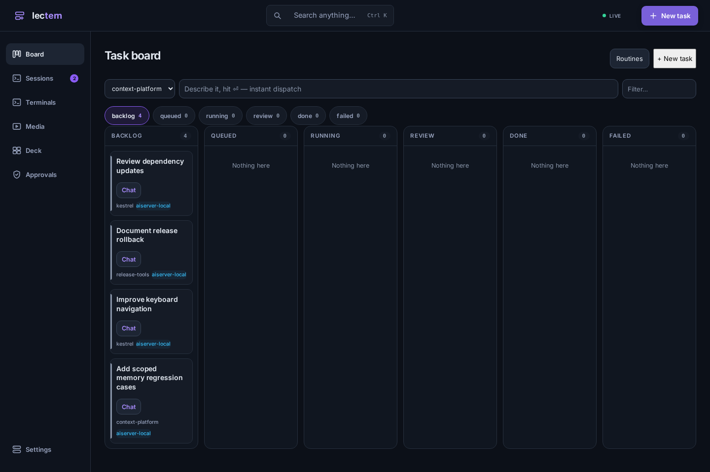
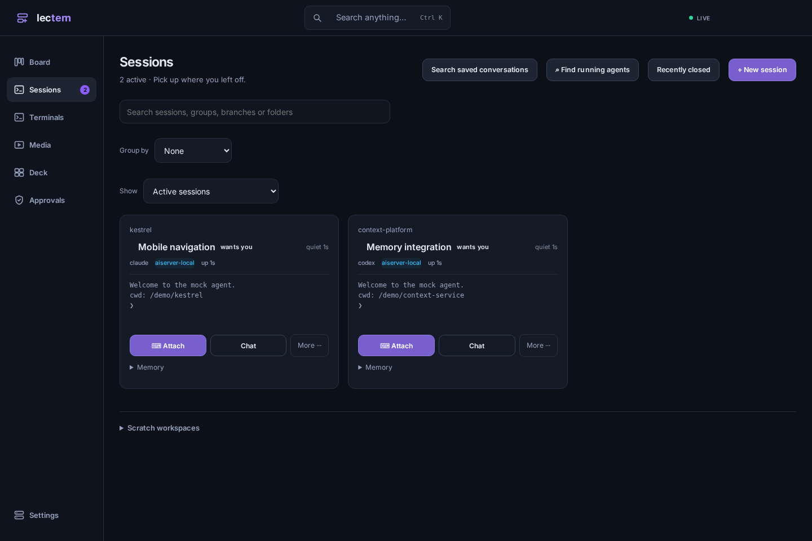
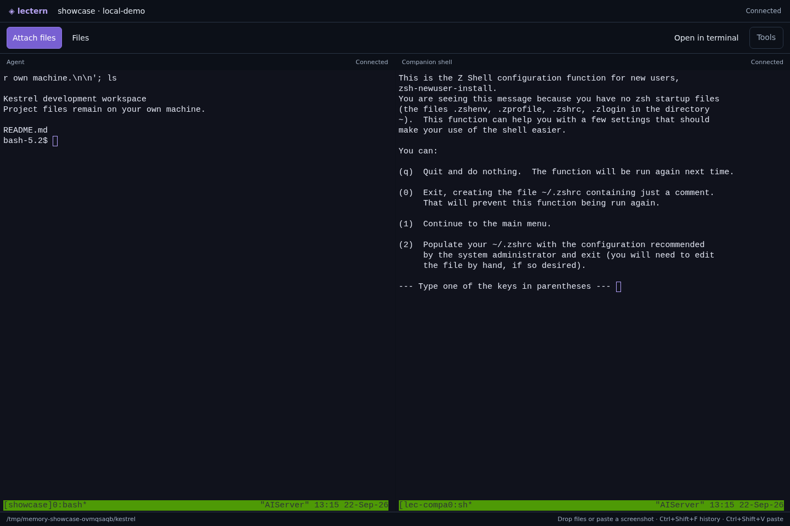
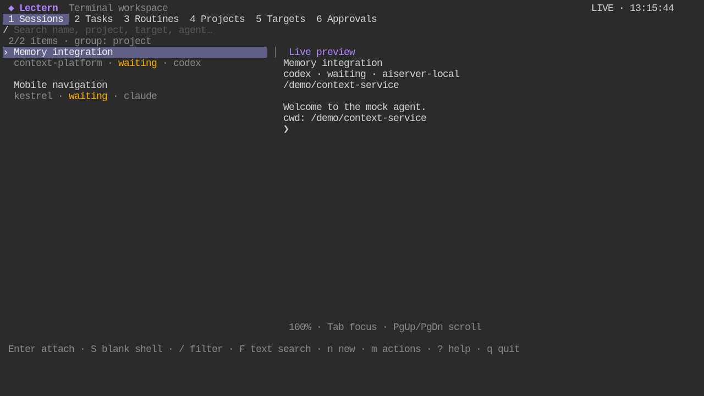
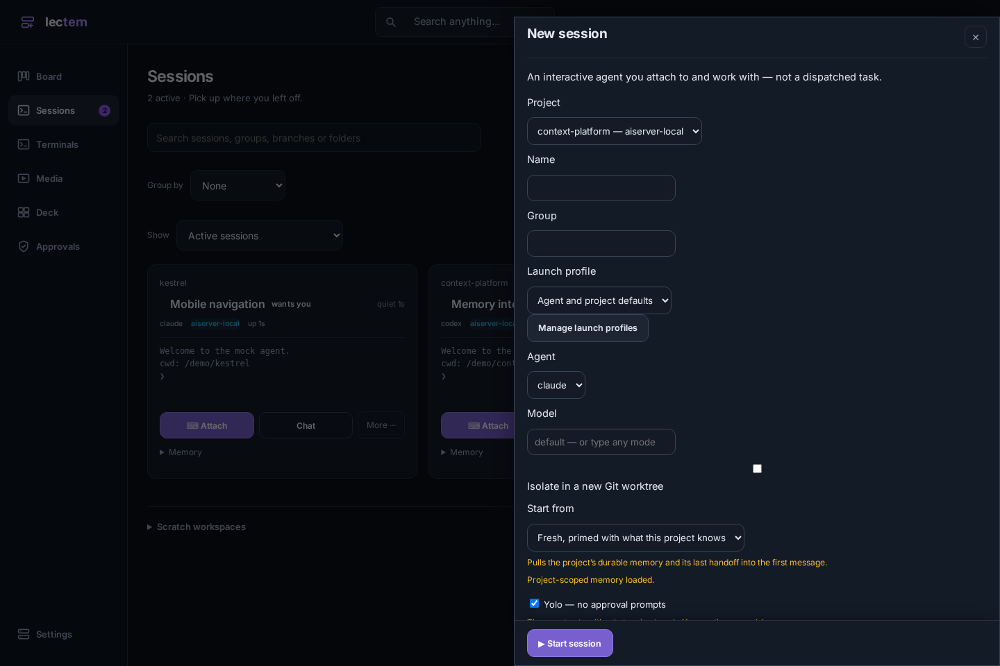

<div align="center">

# Lectern

**Mission control for AI coding agents — on your own infrastructure.**
Describe a task from your phone. An agent picks it up on a box you own, works in an
isolated git worktree inside tmux, streams every step live, pings you for approvals,
and hands you a reviewable diff.

<!-- badges -->




</div>

Lectern is a self-hosted kanban board that dispatches AI coding agents onto
**your** machines — anything you can SSH into, from a spare laptop or a VPS to a
Raspberry Pi or a Proxmox cluster. Every task runs in its own git
worktree, streams a live timeline to a mobile-first PWA, and gates risky tool
calls behind approvals that hit your phone. Bring your own agent and your own
model. The control plane is self-hosted; your chosen agent and model provider
determine where prompts and code are processed. A git worktree isolates changes,
not operating-system access; use target and permission policies accordingly.

> **Lectern was AgentDeck until v2.3.** A lectern is the stand the grimoire lies
> open on: the place you stand to work the book. That is what this is for
> [Grimoire](https://github.com/JeremiahM37/grimoire), the memory it pairs with.
> Everything installed under the old name keeps working: `AGENTDECK_*` settings
> are read under their `LECTERN_*` names (the server says so once at startup),
> running sessions keep their identity, and a project's `.agentdeck/` files are
> still ignored. Rename them when convenient; nothing forces it.

---

## Why it's different

**One binary, no runtime.** The control plane is a single static Go binary with
the PWA and the agent-side hook scripts embedded. Copy it to a box and run it.

**Tasks *and* sessions.** A task is work you hand off — dispatch, walk away,
review a diff. A **session** is an agent you work *with*, for days: it lives in
tmux, lectern watches its status and screen. Tap **Chat** for a large-text live
reader and multiline composer on your phone. When its context fills up, ask it
to write a handoff and hand the thread to a fresh one. It will also *discover and adopt* the Claude
and Codex sessions you started yourself, without disturbing them.

**Runs on your hardware.** A target is any box with SSH — or the machine
Lectern itself runs on. Proxmox users get native extras (`pct` targets and
ephemeral `sandbox` containers cloned per task, destroyed after), but nothing
requires Proxmox. You choose where agents execute and which providers they use.

**Built for your phone.** The whole control loop — dispatch, live timeline, mobile
diff review, approve/deny — is designed thumb-first. Approvals arrive as web-push,
Discord, or ntfy notifications (ntfy carries approve/deny buttons inline).

**Attach files from your phone or desktop.** Open a session or task → **Chat** →
**📎 Attach**, or drop files onto the composer / paste an image. PDFs, images,
text, and other documents are accepted (25 MiB per file, up to 10 per message).
Files are copied to the agent's actual machine, including SSH and adopted tmux
sessions. Add your instructions and press **Send**; an attachment by itself can
also be sent. Uploading alone does not send a message. Reading a document uses
that agent's available file tools; Lectern preserves the original bytes.

Uploads live in `.lectern/context/` under the session directory (the project
repository for tasks), with private permissions and a local Git exclusion.
They stay there for later turns. Removing an attachment from the composer removes
its message reference; it does not delete the uploaded file. Draft references
survive reopening Chat on the same browser. Disposable sandboxes do not yet
support attachments. If Lectern sits behind nginx, set
`client_max_body_size 26M;` to allow a 25 MiB file plus multipart overhead.

**Keep talking while tasks run.** Open a task and tap **Chat** to read its
conversation, send corrections, and answer approvals. Messages wait for the
current run, or choose **Interrupt and send** to change direction immediately.
Follow-ups reuse the worktree and resume Claude/Codex conversation context.
Messages survive server restarts; drafts stay on your device. Backlog messages
add instructions without dispatching. Ephemeral sandbox tasks queue a fresh
container with the previous result; interruption is unavailable there.

**Any agent, any model — including fully local.** Claude Code, Codex, and
Gemini ship with adapters, and the adapter seam is small enough to add your
own. Point a project's `env` at any Anthropic-compatible endpoint (Ollama,
LiteLLM, vLLM) to drive whatever model you run.

## Install

One command on any of these; every channel ships the same static binary from
the same tagged release.

| | |
|---|---|
| **Linux / macOS** | `curl -fsSL https://raw.githubusercontent.com/JeremiahM37/lectern/main/install.sh \| sh` |
| **Homebrew** (macOS) | `brew install JeremiahM37/tap/lectern` |
| **Windows** (PowerShell) | `irm https://raw.githubusercontent.com/JeremiahM37/lectern/main/install.ps1 \| iex` |
| **Scoop** (Windows) | `scoop bucket add jeremiahm37 https://github.com/JeremiahM37/scoop-bucket && scoop install lectern` |
| **Debian / Ubuntu**, **Fedora / RHEL** | the `.deb` / `.rpm` on the [latest release](https://github.com/JeremiahM37/lectern/releases/latest) |
| **Docker** | `docker run -d -p 9110:9110 -v lectern-data:/data ghcr.io/jeremiahm37/lectern:latest` |
| **Go** | `go install github.com/JeremiahM37/lectern/v2/cmd/lectern@latest` |

The installers verify the archive against the release's `checksums.txt`.
Running agents on a machine needs `git` and `tmux` there; on Windows the
binary is the client (`mcp`, `post`, `sessions`, `tasks`…) for a Lectern
server elsewhere, since the control plane itself needs tmux (use WSL to host
it). Then:

```bash
lectern serve            # → http://localhost:9110
```

## Quick start

```bash
docker compose -f deploy/docker-compose.yml up -d    # → http://localhost:9110
```

For a terminal-only workspace on the same computer as your agent, install the
standalone local command. It needs no hosted server, SSH alias, or Grimoire:

```bash
git clone https://github.com/JeremiahM37/lectern.git
cd lectern
bash tools/install-local.sh
lectern local
```

Use `lectern-local` in that last command if the installer reported that the
existing remote `lectern` launcher was kept.

See [Standalone local Lectern](docs/local.md) for Linux, macOS, and WSL
installation and the difference between local and remote operation.

Project-specific optional Spec Kit and Maestro workflows are documented in
[Project workflows](docs/workflows.md).

<details>
<summary>…or build the binary</summary>

```bash
npm ci --prefix frontend                  # Node 24 at build time
npm run build --prefix frontend
python3 frontend/scripts/stage.py
go build -o lectern ./cmd/lectern
./lectern serve                          # → http://<host>:9110
# In an interactive terminal, a bare `lectern` opens the terminal dashboard.
```

One static binary with the PWA, the agent-side hook scripts and a pure-Go SQLite
driver embedded in it. Nothing to install alongside, nothing to `pip` at deploy
time — copy the file and run it.
</details>

Kick the tires with **zero setup** — mock mode ships a full demo board with fake
agents (no git/tmux/claude needed):

```bash
LECTERN_MOCK=1 ./lectern serve
```

Then register a target + project in the **Targets** tab (or `POST /api/targets` /
`POST /api/projects`) and dispatch from the board. A real target needs only SSH
reachability, `git`, `tmux`, `python3`, and your agent's CLI.

## A quick tour

These captures use the current React UI with disposable sample projects. The
memory walkthrough connects real Lectern and Grimoire servers; the terminal
workspace uses real tmux and ttyd. No production notes or credentials appear.

### Browser workspace



Switch between tasks and long-lived sessions, read conversations, send files,
review patches, and respond to approvals. Tasks have their own worktrees;
sessions can share an existing repository or use managed workspaces.

### A real terminal, not just a transcript



Attach to the running process with keyboard input, terminal search, retained
scrollback, file browsing, upload/download, diff review, and a split shell.
Open multiple terminal tabs without stopping the agents when you switch away.

On a phone, the key row keeps Esc, Tab, Ctrl and the arrows within reach, with a
keyboard toggle beside Tools. Use **Tools → Write or paste text** for a longer
prompt; **Insert** pastes the text and **Send** also presses
Enter. Pinch changes text size, long press selects output, and **Live** returns
from retained scrollback. See the [mobile testing guide](docs/testing/mobile-terminal.md)
for the Android emulator audit and its coverage limits.

**A hung agent is caught where it happens.** An agent's TUI can deadlock while
its process stays alive: it keeps reading keystrokes and never draws them, so
the board says idle and the connection says connected. The terminal notices —
several keys with nothing back — and says so, with one button: **Restart agent,
keep conversation** (`POST /api/sessions/{id}/revive`) stops the process and
resumes the session's own saved conversation, so nothing said is lost.



Use `lectern console` with an explicit `LECTERN_API` for the hosted
dashboard, or `lectern local` for a private runtime on your own computer.
The terminal dashboard manages sessions, tasks, projects, targets, agents,
skills, and routines through the same API. Native tmux attachment preserves the
agent's real terminal rather than reconstructing it from logs.

### Project memory before the first prompt



Inspect the project brief before launch. New projects get their own Grimoire
memory location automatically when the integration is enabled; renaming a
project does not lose its memory.

Reproduce these screenshots and the real provisioning/scope checks:

```bash
go build -o /tmp/lectern-showcase ./cmd/lectern
.venv/bin/python tools/capture_memory_showcase.py \
  --grimoire-root /path/to/grimoire \
  --lectern-bin /tmp/lectern-showcase
```

Build Grimoire's server and frontend first. The capture tool needs Python
Playwright/Chromium, git, tmux, and ttyd. Everything runs on loopback with
temporary databases, a separate vault, and a private tmux socket.

## Features

- **Context continuity** — Grimoire briefs retain source, trust, and human/agent
  authority. Session setup distinguishes unavailable memory, partial retrieval,
  and a successful search with no relevant notes; starting work stays available.
- **Completed handoffs** — a fresh agent starts only after its predecessor
  publishes a complete handoff with a marker unique to that request. Partial or
  stale files cannot retire the old session.
- **Running build** — Targets shows the serving binary's version, commit, and
  whether it includes local changes. Missing build metadata is shown as unknown.

- **Board** — kanban (mobile PWA + desktop), quick-dispatch bar, drag-to-dispatch,
  live SSE timeline, mobile diff review, and a desktop **Deck** multi-pane cockpit.
- **Sessions** — long-lived interactive agents, grouped by project. Live status
  (working / wants you / idle) derived from the pane itself, uptime and idle time
  taken from tmux's own clock, a preview of what is on screen, one-tap terminal
  attach, send-a-message and interrupt from your phone, **discovery + adoption**
  of agents you started by hand, and **handoff**: the agent writes a wrap for its
  successor, which starts primed with it. The project outlives the context window.
- **Blank rooms** — start any agent CLI in a throwaway git repository with no
  project attached, for work that does not have a name yet. When it turns into
  something, promote it: the directory it has been working in becomes the
  project's repository, so nothing moves, the tmux session keeps running, and
  the project is immediately dispatchable.
- **Import** — point it at where your code lives; it registers everything that
  looks like a project (git repo, build manifest, or a HANDOFF.md).
- **Targets** — `local` and `ssh` cover any machine; Proxmox users also get
  `pct` (no SSH needed) and `sandbox` (ephemeral container: clone → run →
  capture → destroy). Deep credentials probe included. A per-target
  `command_prefix` handles hosts whose SSH lands somewhere other than the work —
  `wsl -e bash -lc "echo {b64} | base64 -d | bash"` makes a Windows box with its
  toolchain in WSL an ordinary target.
- **Agents** — Claude Code, Codex and Gemini ship built in. Sessions take **any
  CLI**, and tasks/routines can use any configured CLI with a declared batch
  `task` definition: define it in `PUT /api/agents` with its commands, output
  mode, permission mappings and provider env, and it appears in the picker —
  the board holds no opinion about which binary runs. Local models use the
  CLI's compatible endpoint variables through a project's `env`. See
  [docs/agents.md](docs/agents.md).
- **Control loop** — hook-gated approvals with web-push + Discord/ntfy sinks, an
  always-allow policy engine, follow-ups, auto-verify, reviewer gates, A/B parallel
  attempts, agents that file their own task cards, and shared project memory.
- **Context parity** — staged context files, per-project MCP servers, and
  permission rules, so an agent on a remote target knows and can do what one on
  your own machine does ([docs/context-parity.md](docs/context-parity.md)).
- **Ops** — worktree janitor, cost stats, task templates, one-click ttyd terminal
  attach, and an **MCP server** so any MCP client can file and steer tasks.

## Terminal workflows

### Rich terminal workspace

**Attach** opens the actual agent terminal with file drop, screenshot paste,
searchable tmux history, saved appearance settings, and an optional persistent
shell alongside it. A file drawer previews text, images and PDFs and downloads
artifacts. Uploads insert the path on the agent's machine without pressing Enter.

**Open in terminal** opens your device's default terminal on the same session,
keeping the browser attached; either view can remain open and both use the same
tmux process. Connection setup is available under Tools. The installed client
opens the terminal dashboard when run without a subcommand; use `lectern serve`
for the control-plane process.
The shared tmux screen fits the smaller connected terminal, so a larger native
window cannot crop the browser into a blank view. Attachments open as tabs inside
Lectern; **Pop out** remains available.

Middle-click inside the terminal, then move the pointer up or down to autoscroll;
move farther from the starting point to scroll faster. Escape, another click,
or typing stops it. Slim scrollbars remain available for terminal scrollback
and retained history. Returning to the bottom resumes live output automatically.
See [Terminal workspace](docs/terminal-workspace.md).

### Terminal-only management

Run `lectern console` on your server to manage sessions, tasks, routines,
projects, targets, approvals and settings. Install the client on your computer
to run `lectern` directly from your terminal. In the live dashboard, use
arrow keys to select a session and Enter to attach; `m` opens actions and `?`
shows shortcuts. Use `lectern console --plain` for the line-oriented menu.
Press **Ctrl+B**, then **D** to detach and return to the menu without stopping
the session. Skip the menus with `lectern attach session ID`.

For a fast command prompt, run `lectern shell [MACHINE]`. It chooses a
configured machine (with a searchable picker when omitted), creates a tracked
blank persistent shell, and attaches immediately. There is no project, agent,
or model setup; run any commands or model CLI in the shell. Ctrl+B then D
detaches without stopping it. The dashboard provides the same action with `S`
or Actions → Open blank shell.

Remote CLI attachments automatically use a portable `xterm-256color` terminal
type for SSH, so a server without your terminal emulator's terminfo can still
attach. This applies to both the menu and direct command; no manual `TERM`
override or local terminal configuration change is needed. After updating the
client, quit and reopen any running CLI menu to use the new version.

The CLI also includes PDF/file uploads, downloads, and a scriptable API:

```sh
lectern api GET /sessions
lectern api POST /tasks/12/takeover '{}'
lectern upload session 4 ./requirements.pdf
lectern attach session 4
```

[Client installation and commands](docs/terminal-client.md) ·
[Workspace navigation](docs/workspace-ui.md) ·
[Routine takeover](docs/routine-takeover.md)

### Terminal dashboard

Run `lectern` in a terminal for a live session dashboard with project/target
groups, fuzzy search, status filters, previews, one-key attachment, and keyboard
forms. Tasks, routines, targets, approvals, context uploads and worktree diff
review are available without opening the browser. Ctrl-b then d returns from an
attached session. Use `lectern serve` to run the server explicitly, or
`lectern console --plain` for the line-oriented client.
See [terminal client](docs/terminal-client.md) for installation and shortcuts,
and the [bounded terminal experience comparison](docs/terminal-experience-review.md)
for the current evidence ledger.


## Lectern + Grimoire: work and memory stay separate

**Lectern owns execution:** projects, targets, tasks, approvals, worktrees,
terminal sessions, and recovery. **[Grimoire](https://github.com/JeremiahM37/grimoire)
owns durable knowledge:** Markdown notes, accepted facts, source provenance,
correction history, retrieval, and optional credential brokering. Neither
requires the other.

```bash
LECTERN_GRIMOIRE_URL=http://127.0.0.1:9111
LECTERN_GRIMOIRE_CONTEXT_MODE=project
```

Supply these in your service environment; configure the provider credential
there if your Grimoire instance requires one. Use HTTPS for a remote instance.

1. **Create, import, or promote a project.** Lectern records a unique memory
   topic and creates its note in Grimoire. The association survives renaming.
2. **Launch or dispatch.** Only that project's memory is consulted by default;
   unassigned scratch sessions do not get automatic project memory.
3. **Keep working.** Messages sent through Deck get relevant, deduplicated
   context. Retrieval uses no language or embedding model and is bounded to
   2,400 bytes by default. A short destination hint tells the agent where to
   store durable facts; raw conversations are not automatically saved.
4. **Correct and continue.** Grimoire retains provenance and protects recognized
   human corrections. Requested handoffs write to the same project topic, so
   knowledge can outlive the agent session.

Choose `manual`/`off` for no automatic lookup, `project` for assigned-project
scope, or explicitly opt into `all`. Per-project path and budget overrides are
available. Setup failures appear in `memory_status` and the brief preview; retry
`POST /api/projects/{id}/memory` without overwriting existing notes.

Direct typing into an attached terminal bypasses Deck's send API. Grimoire's
optional native prompt hook covers that path when installed with the same
scope. It is not silently installed, and Deck never passes its administrative
credential into the agent. See [automatic memory](docs/AUTOMATIC_MEMORY.md)
for configuration, legacy-project mappings, and limitations.

## Using local / alternative models

Set a project's `env` to route its agent at any Anthropic-compatible API:

```bash
curl -X POST .../api/projects -d '{
  "name":"myrepo","target_id":1,"repo_path":"/srv/myrepo",
  "env":{"ANTHROPIC_BASE_URL":"http://ollama-host:11434",
         "ANTHROPIC_AUTH_TOKEN":"ollama"}}'
# then dispatch with "model":"qwen3.5:35b-a3b" (or any served model)
```

> Driving *agentic* coding (tool calls, edits) needs a capable model — small local
> models often reply conversationally instead of acting. The transport works with
> any model; results depend on the model.

## Delegated builds (optional)

**Off by default.** Turn it on and a lead session plans a substantial change
and reviews the result, while a cheaper worker agent builds it as a Lectern
task in its own worktree. Settings shows it as one banner above the tabs with
the state in large type; the switch refuses to turn on until a runnable worker
is chosen, and a preset installs Codex-on-DeepSeek-Flash as a worker by flags
alone. The lead's side is three MCP tools (`delegate_build`, `wait_build`,
`accept_build`) plus the existing `task_diff` and `request_changes`, and a
bundled `lectern-delegate` skill adapted from
[astra-flash-orchestrator](https://github.com/ethanplusai/astra-flash-orchestrator).
Details: [docs/DELEGATED_BUILDS.md](docs/DELEGATED_BUILDS.md).

**Orchestrate from the board.** Once it is on, the quick bar at the top of the
Task board has two modes, **⚡ Dispatch** and **✦ Orchestrate**. In Orchestrate,
type what you want and press ⏎: Lectern files a task whose attempt is the
*lead*. It reads the repository, writes the design and the brief, calls
`delegate_build`, reviews the worker's diff and report, sends at most the
configured number of correction cycles, then integrates the result into its
own worktree and runs the project's checks, so the finished work is that
task's diff, reviewed on the board like any other. The lead is launched with
the `lectern` MCP server attached automatically; nothing has to be registered
for it. The same switch is at the top of the **New task** sheet when you want
to pick the lead, its model, permissions or priority, and `create_task` on the
MCP server takes `orchestrate: true`.

Measured on four real tasks in three repositories, two runs each, graded by
hidden acceptance tests and the repositories' own suites
([full write-up](docs/benchmarks/delegated-builds-2026-09-22.md)):

| Arm | Accept | Suite | Mean wall | Mean Astra input (cached) | Mean Astra output | Mean Flash in / out | Est. $ / task |
|---|---:|---:|---:|---:|---:|---:|---:|
| Lead alone (Astra) | 8/8 | 8/8 | 181 s | 338k (301k) | 4,568 | – | 0.91 |
| astra-flash-orchestrator, native subagent via codex-router | 8/8 | 8/8 | 337 s | 493k (451k) | 2,365 | 4.5M / 28k | 1.06 |
| **Lectern delegated build** | 8/8 | 8/8 | 329 s | 591k (551k) | 2,385 | 2.9M / 41k | 1.15 |

Quality was equal across the board. Against the upstream workflow run as
designed, Lectern ties on the lead's output and on wall time, uses 36% fewer
worker tokens, and uses 20% more lead input (an MCP round trip is a full
sample of the lead's context; a native child shares the parent's cached
prefix), for an estimated 8% more per task. Against the lead working alone,
*neither* delegating workflow was cheaper or faster at this size (120–190-line
diffs): delegation halves the lead's output but adds to its input, because the
lead still reads the repository to write the brief and the diff to review it.
On the upstream README's own metric the native workflow cut Astra input per
1,000 lines by 18% here, not 98.9%; that figure comes from a 48,000-line build
and a baseline that included non-code work. What delegation buys at any size
is the lead's attention and a reviewable unit of work; read the write-up
before turning this on to save money.

## Tests

```bash
ADK_ISOLATION_REVIEWED=1 ADK_TEST_MODE=go tools/run-isolated-tests.sh .
ADK_ISOLATION_REVIEWED=1 ADK_TEST_MODE=e2e tools/run-isolated-tests.sh .
```

Read the isolation runner before setting its acknowledgement variable. It uses
bubblewrap with private process/network namespaces and tmux state so tests
cannot attach to or alter your real agents. Most tests use a mock executor —
no git, tmux or agent binary — so
they are fast and hermetic. A handful deliberately do not: `e2e_real_test.go`
dispatches into a real git worktree, starts a real tmux session, runs a real
process and reads back its real diff and exit code, and `restart_test.go` runs
two App lifetimes over one database file. Those are the tests that catch what
mocks accept: argv that a real shell truncates, a launch race that only exists
once a process starts, a base branch that `git init` did not create. They skip
themselves if `git` or `tmux` is missing.


## Layout

```
cmd/lectern/       the binary
internal/api/        REST + hook endpoints, SSE streams, embedded PWA
internal/scheduler/  promotes queued attempts, tails running ones, finalises
internal/executor/   local | ssh | pct | sandbox | mock target executors
internal/agents/     per-agent launch commands and stream parsers
internal/hooks/      PreToolUse approval hook + agent kit (stdlib Python, embedded)
internal/store/      SQLite schema and typed row accessors
frontend/            React + TypeScript browser and terminal workspaces
web/                 generated assets embedded in the Go binary
e2e/                 Playwright browser tests
DESIGN.md            full design doc — architecture, feature catalog, roadmap
```

Config via env: `LECTERN_PORT` (9110), `LECTERN_DB`, `LECTERN_BASE_URL`
(URL targets use to reach this server for approval callbacks), `LECTERN_AUTH_TOKEN`
(optional bearer), `LECTERN_VAPID_PUBLIC`/`_PRIVATE` (web push), `LECTERN_MOCK`.

---

<div align="center">
<sub>MIT licensed · self-hosted control plane · your choice of agents and models.</sub>
</div>
