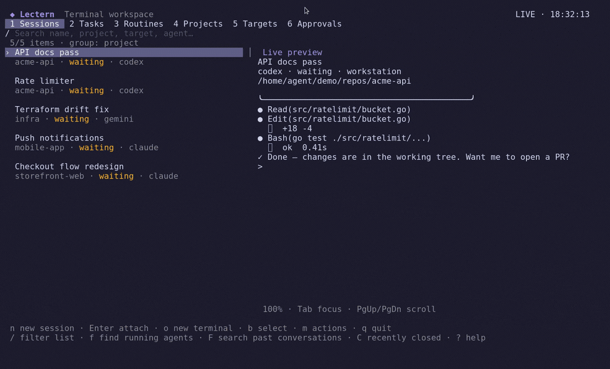
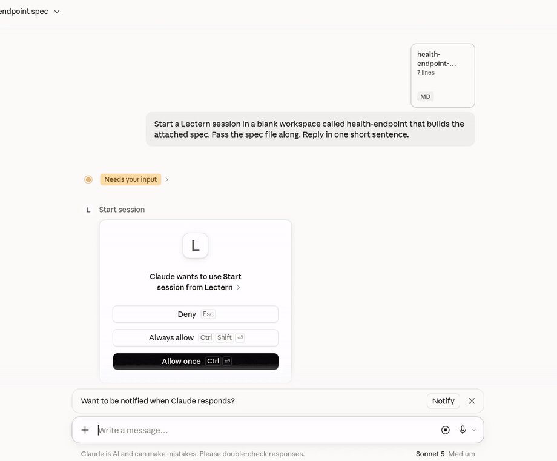
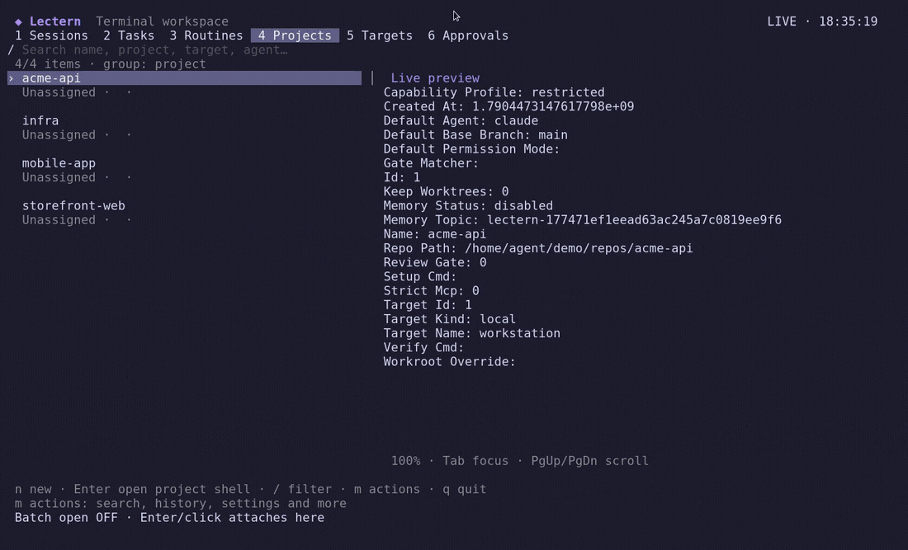
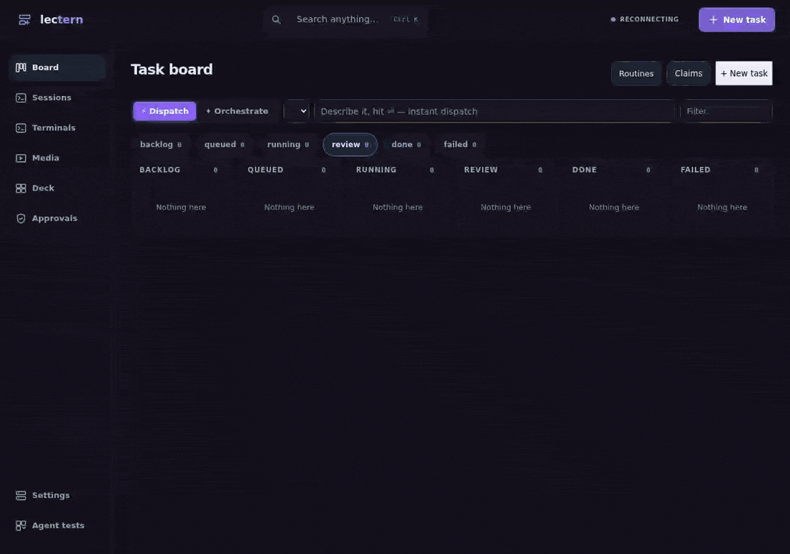
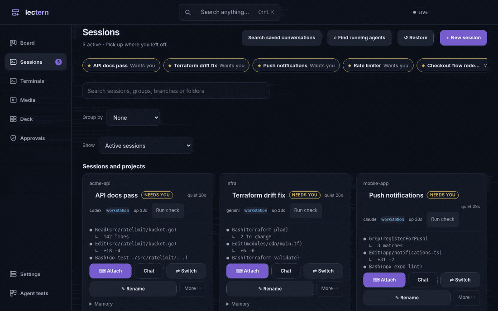
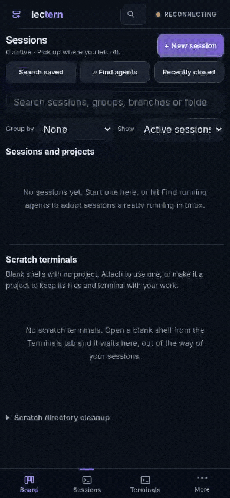

<div align="center">

# Lectern

**Run every coding agent you use — Claude Code, Codex, Gemini, OpenCode, Aider, Cursor and more —
on machines you own, and drive them from your terminal, your phone, or a claude.ai chat.**




</div>

```bash
curl -fsSL https://raw.githubusercontent.com/JeremiahM37/lectern/main/install.sh | sh
lectern up          # starts Lectern, finds your agent CLIs, opens the dashboard
lectern claude      # or: lectern codex, lectern opencode, … in any folder
```

## What makes Lectern different

### Start work from an ordinary chat

Brainstorm in **claude.ai** (web, desktop or phone). Then say *"start a Lectern
session that builds this"* or *"give my session fixing checkout this PDF"*. The
design you worked out arrives as context, and uploaded files arrive as the real
file. Your agent starts on your machine, and *"end that session"* archives it
when you're done. ChatGPT works the same way with Developer mode. You approve
the connection yourself, and a chat can never approve an agent's actions.
→ [Use Lectern from claude.ai and ChatGPT](docs/use-from-chat.md)



### Every session one keystroke away

Type `lectern` for a live dashboard of every agent on every machine.

- **Click** a session to jump in.
- **Right-click** it to open it in a new terminal window while the list stays put.
- Press **`b`**, tick several sessions, and open them all at once.
- Open **Projects** to get a shell in any repository instantly.

`lectern claude` in any folder starts, or reuses, a tracked session there and
drops you in. In an attached session, **`Ctrl+\`** sends a file to the agent.
→ [Terminal client](docs/terminal-client.md)



### Any agent, without cluttered menus

Claude Code, Codex and Gemini are built in. Settings → Agents adds OpenCode,
Aider, Goose, Amp, Cursor Agent, Copilot CLI, Qwen Code, Crush, Kimi or Cline in
one click, or any CLI as a custom agent. Only the agents you pick appear in
menus, and the rest sit under **More agents…**. Resume, fork, models, approvals,
tasks and `lectern <agent>` work with each agent as far as its CLI allows.
Lectern tells you plainly when a CLI can't do something.
→ [Agents](docs/agents.md)


**Switch a live session to another agent or model** without losing the thread:



### Nothing gets lost

- **Restore** brings back anything that ended: closed, archived, crashed, or
  cut off by a reboot, with its conversation when one was saved. Ending a
  session offers **Undo**, an agent that exits shows **Revive**, and
  `lectern restore` does the same from any terminal.
- Sessions stay grouped by project and machine.
- Lectern finds and adopts Claude and Codex sessions you started outside it.
- Every saved Claude and Codex conversation on your machines is searchable,
  including ones Lectern never launched.



### Your phone is the remote

The same control loop runs in an installable phone app:

- Sessions that need you are flagged on their cards.
- Chat shows tool calls as cards, with real diffs.
- Approvals offer **allow once**, **allow `npm …` this session**, or **deny with
  feedback**, from the app or straight from the notification.
- **Voice mode** lets you talk to your agent and approve out loud, using only
  the browser's free speech engine.
- No Tailscale? Run **`lectern relay`** on any small server and pair a phone
  by QR code. Traffic is **end-to-end encrypted** (Noise, the protocol behind
  WireGuard); the relay only passes sealed frames and never serves app code.
- An **Android app** (prototype, build from source) bundles the same web app,
  keeps the relay key in Keystore, and takes Approve / Deny / Reply from the
  notification with no Lectern screen open, via UnifiedPush and ntfy.

→ [Mobile sessions](docs/mobile-sessions.md) · [Relay](docs/relay.md) · [Remote access](docs/remote-access.md) · [Android app](docs/android.md)



### More than a launcher

- **A board of tasks:** dispatch work to any machine, each task in its own git
  worktree, and review the diff or open a PR when it's done.
- **CI loop:** when a PR's checks fail, Lectern sends the failing jobs and a
  trimmed log back to the agent that wrote the code, up to 3 tries, and pings
  your phone when it goes green. → [CI loop](docs/ci-loop.md)
- **Usage limits:** when Claude, Codex or Gemini hits its limit, the card and
  your phone show when it resets. Lectern can resume the same agent after the
  reset, or hand the work to another agent in the same workspace.
  → [Rate limits](docs/rate-limits.md)
- **Best-of-N with a judge, and delegated builds:** a cheap worker builds and a
  lead reviews and integrates.
- **Replay evals:** find out which agent or model is best *for your repo*,
  scored against what actually shipped.
- **Agents that know about each other:** each session sees what its peers are
  editing in the same repo, plus a claim board for who's doing what.
- **Memory:** pairs with [Grimoire](https://github.com/JeremiahM37/grimoire), so
  a new session starts with the project's knowledge.
- **Budgets, usage and quota** at a glance, and checks that run when an agent
  stops.
- **Runs anywhere:** your laptop, anything reachable over SSH, a Proxmox
  container, or an ephemeral sandbox. One static binary, MIT licensed.
- **Scales:** one Lectern process ran 250 concurrent sessions across 4
  targets with 65 MB of memory; approvals round-trip in about 7 ms.
  → [Benchmark](docs/benchmarks/scale.md)

## How it compares

✓ yes · ◐ partly · ✗ no · ? couldn't verify. Every cell is checked against each
project's own docs or source, with sources in [docs/comparison.md](docs/comparison.md).
Corrections are welcome.

| | Lectern | Orca | HAPI | Agent Orchestrator | Agent of Empires | Happy | Vibe Kanban | Conductor |
|---|:-:|:-:|:-:|:-:|:-:|:-:|:-:|:-:|
| Start and manage sessions from a claude.ai or ChatGPT chat | ✓ | ✗ | ✗ | ✗ | ✗ | ✗ | ✗ | ✓ |
| Terminal dashboard across machines, open many at once | ✓ | ◐ | ◐ | ✗ | ◐ | ? | ✗ | ✗ |
| Switch a live session to another agent, keeping context | ✓ | ? | ? | ✓ | ◐ | ◐ | ✗ | ? |
| Agents on your own machines: SSH, Proxmox, sandboxes | ✓ | ◐ | ◐ | ◐ | ◐ | ✗ | ✗ | ◐ |
| Approve, deny or reply from the phone notification | ✓ | ◐ | ✓ | ◐ | ◐ | ◐ | ✗ | ◐ |
| Allow once / for this session / deny with feedback | ✓ | ◐ | ✓ | ◐ | ◐ | ◐ | ◐ | ◐ |
| Free voice mode with spoken approvals | ✓ | ◐ | ◐ paid | ◐ | ◐ | ◐ paid | ? | ? |
| End-to-end encrypted relay, no VPN needed | ✓ | ✓ | ✓ | ◐ | ◐ | ✓ | ◐ | ? |
| Task board with worktrees, diff review and PRs | ✓ | ✓ | ◐ | ✓ | ◐ | ◐ | ✓ | ◐ |
| Best-of-N with a judge, and delegated builds | ✓ | ◐ | ◐ | ◐ | ◐ | ✗ | ? | ? |
| Evals replayed from your own merged PRs | ✓ | ? | ? | ? | ? | ? | ? | ✗ |
| Agents aware of each other (claim board) | ✓ | ◐ | ✓ | ◐ | ? | ✗ | ? | ✗ |
| Adopts agent sessions you started elsewhere | ✓ | ◐ | ◐ | ◐ | ◐ | ◐ | ? | ? |
| MCP server so other agents can drive it | ✓ | ✗ | ◐ | ✗ | ✗ | ◐ | ✓ | ✓ |
| Native iOS / Android apps | ✗ | ✓ | ✓ | ✓ | ✗ | ✓ | ✗ | ✓ |
| Self-hosted and open source | ✓ MIT | ✓ MIT | ✓ AGPL | ✓ Apache | ✓ MIT | ✓ MIT | ✓ Apache | ✗ |

**Where others are ahead:**
- Orca, HAPI, Agent Orchestrator and Happy ship native phone apps. Lectern is an
  installable web app plus an unpublished Android prototype; on iPhone that
  means no Approve/Deny buttons on the notification itself.
- Orca (30+), Agent Orchestrator (28) and Agent of Empires (about 20) list more
  agents out of the box. Lectern has 3 built in, a catalog of 10 more, and any
  CLI as a custom agent.
- Orca swaps to another account when one hits its usage limit. Lectern waits
  for the reset or hands off to a different agent.
- Agent of Empires has a plugin system and a multi-user edition with SSO.
- Conductor, which is hosted and proprietary, also drives sessions from
  claude.ai and ChatGPT.

## Install

| | |
|---|---|
| **Linux / macOS** | `curl -fsSL https://raw.githubusercontent.com/JeremiahM37/lectern/main/install.sh \| sh` |
| **Homebrew** | `brew install JeremiahM37/tap/lectern` |
| **Windows** | `irm https://raw.githubusercontent.com/JeremiahM37/lectern/main/install.ps1 \| iex` (client; host the server in WSL) |
| **Docker** | `docker run -d -p 127.0.0.1:9110:9110 -v lectern-data:/data ghcr.io/jeremiahm37/lectern:latest` |
| **Go** | `go install github.com/JeremiahM37/lectern/v2/cmd/lectern@latest` |

Agents run on any machine with `git`, `tmux`, `python3` and the agent's own CLI.
`lectern doctor` checks everything and prints a fix next to anything that's
wrong. You can try it with no setup at all, using fake agents:
`LECTERN_MOCK=1 lectern serve`.

## Documentation

| | |
|---|---|
| [Full guide](docs/guide.md) | Everything in depth: sessions, tasks, auth, phone alerts, delegated builds, local models |
| [Use from claude.ai / ChatGPT](docs/use-from-chat.md) | The chat connector: setup, what a chat can do, troubleshooting |
| [Terminal client](docs/terminal-client.md) | Dashboard keys, multi-window, `lectern claude`, send-file |
| [Agents](docs/agents.md) | Catalog, capabilities per agent, custom agents |
| [Mobile sessions](docs/mobile-sessions.md) | Chat cards, approvals, voice mode |
| [Remote access](docs/remote-access.md) | Phone pairing and tunnels without Tailscale |
| [Local / Docker](docs/local.md) · [Docker](docs/docker.md) | Standalone and container setups |

Lectern was called AgentDeck until v2.3. Old `AGENTDECK_*` settings still work.

MIT © Jeremiah Mackey
