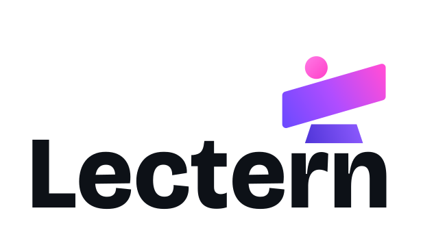
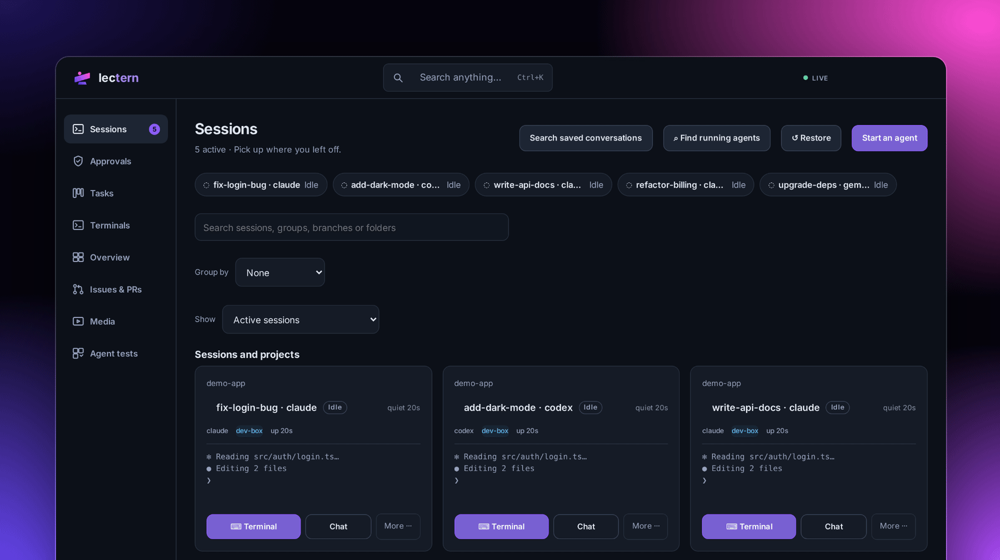
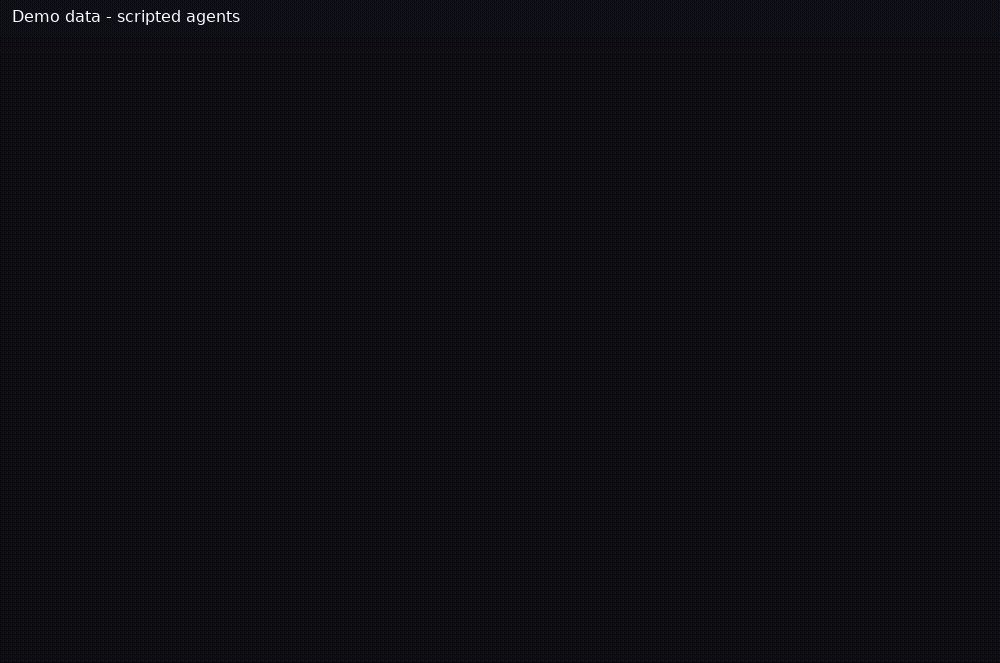
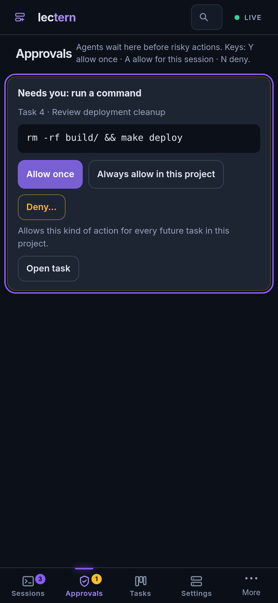
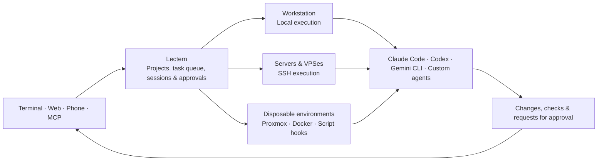
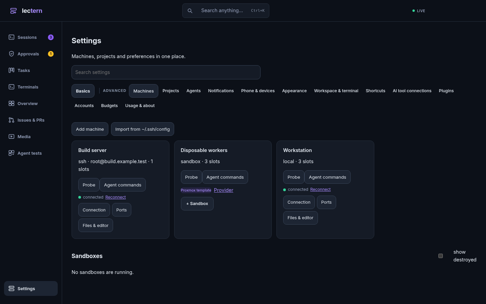

<p align="center">
  <picture>
    <source media="(prefers-color-scheme: dark)" srcset="docs/brand/lectern-dark.svg">
    
  </picture>
</p>

<h3 align="center">Mission control for AI coding agents.</h3>

<p align="center">
  <a href="https://github.com/JeremiahM37/lectern/releases/latest"></a>
  
  
  
  <a href="docs/android.md"></a>
</p>

<p align="center">
  <a href="#quick-start">Quickstart</a> ·
  <a href="docs/getting-started.md">Docs</a> ·
  <a href="docs/media/control-plane/README.md">Screenshots</a> ·
  <a href="docs/android.md">Android</a> ·
  <a href="https://github.com/JeremiahM37/lectern/releases">Releases</a>
</p>

<p align="center"></p>

<p align="center">
Lectern runs coding agents such as Claude Code, Codex and Gemini CLI on your<br>
own computer, and lets you follow them, approve what they do and review their<br>
changes from your terminal, browser or phone.
</p>

</div>

```sh
curl -fsSL https://raw.githubusercontent.com/JeremiahM37/lectern/main/install.sh | sh
lectern claude    # start an agent in this folder, then: lectern up (browser) · lectern phone (QR)
```

Other platforms and the full walkthrough are in [Quick start](#quick-start).

## Quick start

You need [Git](https://git-scm.com/downloads) and, for real work, an agent CLI
such as Claude Code, Codex or Gemini CLI. Without one you can still try Lectern
with its built-in demo agent.

**macOS and Linux**

```sh
curl -fsSL https://raw.githubusercontent.com/JeremiahM37/lectern/main/install.sh | sh
```

Or on macOS with Homebrew: `brew install JeremiahM37/tap/lectern`

**Windows** (PowerShell, with [Git for Windows](https://git-scm.com/download/win) installed)

```powershell
irm https://raw.githubusercontent.com/JeremiahM37/lectern/main/install.ps1 | iex
```

Or with Scoop: `scoop bucket add jeremiahm37 https://github.com/JeremiahM37/scoop-bucket && scoop install lectern`

**Then, in a project folder:**

```sh
cd ~/myapp
lectern claude    # start your first agent here (or: lectern codex, lectern gemini)
lectern up        # open the web dashboard in your browser
lectern phone     # show a QR code to pair a phone on the same Wi-Fi
```

The agent keeps running when you leave the terminal (**Ctrl+]** then **d**),
and the same session shows up in the browser and on your phone. On a new
install the agent asks before risky actions, such as running a command or
editing a file, and you can answer from any of them.

**New to Lectern?** [Getting started](docs/getting-started.md) walks through
your first session: install, start an agent, approve from the browser and the
phone, then review and commit the change.

`lectern doctor` checks your setup and prints a fix for anything missing.
`lectern update` installs a new release. `lectern help` lists every command.



[Watch the one-minute walkthrough](docs/media/control-plane/control-plane.mp4) · [Screenshots](docs/media/control-plane/README.md)

*Demo projects with scripted agent responses.*

## What you can do

- **Watch and talk to agents.** Every session has a terminal and a chat view.
  See which sessions are working, idle or waiting for you.
- **Approve or deny.** A pending request shows the command or the diff, with
  **Allow once**, **Allow for this session** or **Deny**, on the desktop and
  on the phone.
- **Review and commit.** **Review & merge** shows what the agent changed. Leave
  comments for the agent, stage what you want and commit. On your main branch
  it offers a new branch first.
- **Use your phone.** The phone layout is installable as an app, with
  notifications when an agent needs you. On Android there is also a
  [native app](docs/android.md) (the APK is on each release) that approves
  from the notification and updates itself.



[Terminal client](docs/terminal-client.md) · [Phone supervision](docs/mobile-sessions.md) · [Review](docs/review.md)

## Going further

Everything above runs on one computer. Lectern can also manage agents across
several machines.

### Run work where it belongs

A coding task needs somewhere to run, a workspace of its own, and a way to
bring you back when it needs a decision. Lectern connects those pieces across
the machines you already use.

1. **Choose the machine and project.** Work locally, on a server over SSH,
   in an existing Proxmox LXC, or in a fresh sandbox for each task attempt.
2. **Dispatch to your agent of choice.** Queue work with per-machine concurrency
   limits. Task attempts get separate git worktrees; race agents on the same
   problem or use a lead agent to review delegated work.
3. **Supervise and review from anywhere.** Return to the terminal, inspect
   changes, answer an approval on your phone, or continue the conversation
   with another agent.


```mermaid
flowchart LR
    U["Terminal · Web · Phone · MCP"] --> L["Lectern<br/>Projects, task queue, sessions & approvals"]
    L --> W["Workstation<br/>Local execution"]
    L --> S["Servers & VPSes<br/>SSH execution"]
    L --> E["Disposable environments<br/>Proxmox · Docker · Script hooks"]
    W & S & E --> A["Claude Code · Codex · Gemini CLI · Custom agents"]
    A --> R["Changes, checks & requests for approval"]
    R --> U
```

**Today, placement is explicit:** a project selects its machine and the scheduler
runs its queued tasks there. Automatic placement by GPU, RAM or OS requirements
is a future direction, not a current feature. Worktrees separate changes;
use a sandbox when you also need execution isolation.

| Execution environment | What Lectern does |
|---|---|
| **Your workstation** | Runs the installed agent CLIs locally, with persistent terminals on Linux, macOS and Windows. |
| **SSH server or VPS** | Runs agents and manages workspaces remotely. Import SSH aliases, use jump hosts, and reconnect to sessions. |
| **Existing Proxmox LXC** | Executes through `pct` from the Proxmox host. |
| **Disposable sandbox** | Creates a Proxmox template clone, Docker container, or environment supplied by trusted script hooks for each attempt. Saves results before configured cleanup. |

[Run a shared server](docs/quickstart.md) · [SSH machines](docs/ssh.md) · [Sandbox providers and lifecycle](docs/sandboxes.md) · [Isolation options and limits](docs/isolation.md)



### Keep the agent choice yours

Claude Code, Codex and Gemini CLI are built in. Add OpenCode, Aider, Goose,
Cursor and other runners from the catalog, or configure a custom CLI. Agent
capabilities vary; Lectern exposes what each runner supports.

Switch a session to another agent with a saved handoff. Adopt Claude and Codex
sessions started outside Lectern, search saved conversations, and restore
ended sessions when the agent has resumable history.

[Agent catalog and capabilities](docs/agents.md) · [Delegated builds](docs/DELEGATED_BUILDS.md) · [Replay evals](docs/replay-evals.md)

### Reach it from anywhere

Phone pairing on the same Wi-Fi needs nothing extra. Away from home, use
Tailscale, a public tunnel with device pairing, or the optional end-to-end
encrypted relay.

Start work from a claude.ai or supported ChatGPT connector, too: send a design
or attachment into a session on your machine. Chat connectors cannot approve
agent actions.

[Remote access](docs/remote-access.md) · [Relay](docs/relay.md) · [Chat connectors](docs/use-from-chat.md)

### The everyday details

- **Files travel with the work.** Open a remote PDF or file path an agent prints;
  the native client opens it locally, while the web app has a built-in viewer.
  Drop files into the web workspace or upload them to a session.
  [Files](docs/files.md) · [Paths and links](docs/terminal-client.md#paths-and-links-the-agent-prints)
- **Review and follow-through.** Inspect diffs, run checks, open PRs, and send
  failed CI results back to the agent. [Review](docs/review.md) · [CI loop](docs/ci-loop.md)
- **Continuity.** Restore sessions, handle provider rate limits, track usage and
  budgets, and bring project knowledge through optional Grimoire integration.
  [Rate limits](docs/rate-limits.md) · [Budgets](docs/budgets.md) · [Memory](docs/AUTOMATIC_MEMORY.md)
- **A browser beside the work.** Watch the agent's browser, take over, or send
  a page element's context back to the agent. [Browser tools](docs/browser.md)

[More screenshots and file demonstrations](docs/media/control-plane/README.md) · [Full guide](docs/guide.md)

## Other ways to install

| | |
|---|---|
| **Docker** | `docker run -d -p 127.0.0.1:9110:9110 -e LECTERN_INSECURE_LISTEN=1 -v lectern-data:/data ghcr.io/jeremiahm37/lectern:latest` |
| **Go** | `go install github.com/JeremiahM37/lectern/v2/cmd/lectern@latest` |
| **deb / rpm** | Packages are attached to each [release](https://github.com/JeremiahM37/lectern/releases/latest). |

On the machine that runs Lectern, agents need only `git` and the agent's own
CLI: Lectern keeps their terminals alive itself, on Linux, macOS and Windows
([how](docs/ptyhost.md)). Other machines reached over SSH need the `lectern`
binary installed, or `tmux` and `python3`. The web terminal is built in.
To try it with fake agents and no setup: `LECTERN_MOCK=1 lectern serve` (it
listens on 127.0.0.1 only).

## Documentation

| | |
|---|---|
| [Getting started](docs/getting-started.md) | Install, first agent, approvals on the web and phone, review and commit |
| [Full guide](docs/guide.md) | Everything in depth: sessions, tasks, auth, phone alerts, delegated builds, local models |
| [Use from claude.ai / ChatGPT](docs/use-from-chat.md) | The chat connector: setup, what a chat can do, troubleshooting |
| [Terminal client](docs/terminal-client.md) | Dashboard keys, multi-window, `lectern claude`, send-file |
| [Agents](docs/agents.md) | Catalog, capabilities per agent, custom agents |
| [Mobile sessions](docs/mobile-sessions.md) | Chat cards, approvals, voice mode |
| [Browser](docs/browser.md) | Browser pane, Design Mode, agent browser tools, computer use |
| [Remote access](docs/remote-access.md) | Phone pairing and tunnels without Tailscale |
| [Local runtime](docs/local.md) · [Shared server](docs/quickstart.md) · [Docker](docs/docker.md) | How the private runtime works, building from source, a server for several machines, containers |

Lectern was called AgentDeck until v2.3. Old `AGENTDECK_*` settings still work.

MIT © Jeremiah Mackey
