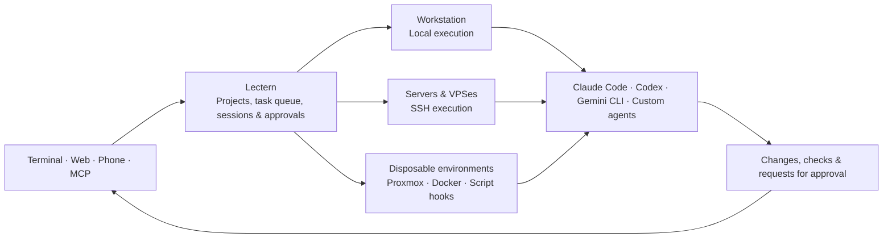

<div align="center">

# Lectern

**The self-hosted control plane for coding agents.**

Run Claude Code, Codex, Gemini CLI and other agents across your workstation,
SSH servers and disposable sandboxes. Dispatch work, choose where it runs,
and supervise it from your terminal or phone.


</div>

```bash
curl -fsSL https://raw.githubusercontent.com/JeremiahM37/lectern/main/install.sh | sh
lectern up
```

[Linux](docs/getting-started-linux.md) · [macOS](docs/getting-started-macos.md) · [Windows](docs/getting-started-windows.md)


[Watch the walkthrough](docs/media/control-plane/control-plane.mp4) · [Screenshots and recording details](docs/media/control-plane/README.md)

*Recorded from the current app with disposable demo projects and scripted agents.
The recording demonstrates the control workflow, not model performance or a live cluster.*

## Your agents. Your machines. One place to run the work.

A coding task needs somewhere to run, a workspace of its own, and a way to
bring you back when it needs a decision. Lectern connects those pieces across
the machines you already use.

1. **Choose the machine and project.** Work locally, on a server over SSH,
   in an existing Proxmox LXC, or in a fresh sandbox for each task attempt.
2. **Dispatch to your agent of choice.** Queue work with per-machine concurrency
   limits. Task attempts get separate git worktrees; race agents on the same
   problem or use a lead agent to review delegated work.
3. **Supervise and review from anywhere.** Return to the terminal, inspect
   changes, answer an approval on your phone, or continue the conversation
   with another agent.


```mermaid
flowchart LR
    U["Terminal · Web · Phone · MCP"] --> L["Lectern<br/>Projects, task queue, sessions & approvals"]
    L --> W["Workstation<br/>Local execution"]
    L --> S["Servers & VPSes<br/>SSH execution"]
    L --> E["Disposable environments<br/>Proxmox · Docker · Script hooks"]
    W & S & E --> A["Claude Code · Codex · Gemini CLI · Custom agents"]
    A --> R["Changes, checks & requests for approval"]
    R --> U
```

**Today, placement is explicit:** a project selects its machine and the scheduler
runs its queued tasks there. Automatic placement by GPU, RAM or OS requirements
is a future direction, not a current feature. Worktrees separate changes;
use a sandbox when you also need execution isolation.

## Run work where it belongs

| Execution environment | What Lectern does |
|---|---|
| **Your workstation** | Runs the installed agent CLIs locally, with persistent terminals on Linux, macOS and Windows. |
| **SSH server or VPS** | Runs agents and manages workspaces remotely. Import SSH aliases, use jump hosts, and reconnect to sessions. |
| **Existing Proxmox LXC** | Executes through `pct` from the Proxmox host. |
| **Disposable sandbox** | Creates a Proxmox template clone, Docker container, or environment supplied by trusted script hooks for each attempt. Saves results before configured cleanup. |

[SSH machines](docs/ssh.md) · [Sandbox providers and lifecycle](docs/sandboxes.md) · [Isolation options and limits](docs/isolation.md)


## Keep the agent choice yours

Claude Code, Codex and Gemini CLI are built in. Add OpenCode, Aider, Goose,
Cursor and other runners from the catalog, or configure a custom CLI. Agent
capabilities vary; Lectern exposes what each runner supports.

Switch a session to another agent with a saved handoff. Adopt Claude and Codex
sessions started outside Lectern, search saved conversations, and restore
ended sessions when the agent has resumable history.

[Agent catalog and capabilities](docs/agents.md) · [Delegated builds](docs/DELEGATED_BUILDS.md) · [Replay evals](docs/replay-evals.md)

## Stay in control from your desk or phone

The terminal dashboard, desktop web app and installable phone PWA look at the
same work. See which sessions need you, read tool calls and diffs, and approve
or deny requests. Phone pairing and an optional encrypted relay support access
without requiring Tailscale.


Start work from a claude.ai or supported ChatGPT connector, too: send a design
or attachment into a session on your machine. Chat connectors cannot approve
agent actions.

[Terminal client](docs/terminal-client.md) · [Phone supervision](docs/mobile-sessions.md) · [Remote access](docs/remote-access.md) · [Chat connectors](docs/use-from-chat.md)

## The everyday details are here, too

- **Files travel with the work.** Open a remote PDF or file path an agent prints;
  the native client opens it locally, while the web app has a built-in viewer.
  Drop files into the web workspace or upload them to a session.
  [Files](docs/files.md) · [Paths and links](docs/terminal-client.md#paths-and-links-the-agent-prints)
- **Review and follow-through.** Inspect diffs, run checks, open PRs, and send
  failed CI results back to the agent. [Review](docs/review.md) · [CI loop](docs/ci-loop.md)
- **Continuity.** Restore sessions, handle provider rate limits, track usage and
  budgets, and bring project knowledge through optional Grimoire integration.
  [Rate limits](docs/rate-limits.md) · [Budgets](docs/budgets.md) · [Memory](docs/AUTOMATIC_MEMORY.md)
- **A browser beside the work.** Watch the agent's browser, take over, or send
  a page element's context back to the agent. [Browser tools](docs/browser.md)

[More screenshots and file demonstrations](docs/media/control-plane/README.md) · [Full guide](docs/guide.md)

## Install

| | |
|---|---|
| **Linux / macOS** | `curl -fsSL https://raw.githubusercontent.com/JeremiahM37/lectern/main/install.sh \| sh` |
| **Homebrew** | `brew install JeremiahM37/tap/lectern` |
| **Windows** | `irm https://raw.githubusercontent.com/JeremiahM37/lectern/main/install.ps1 \| iex` (needs [Git for Windows](https://git-scm.com/download/win)) |
| **Docker** | `docker run -d -p 127.0.0.1:9110:9110 -e LECTERN_INSECURE_LISTEN=1 -v lectern-data:/data ghcr.io/jeremiahm37/lectern:latest` |
| **Go** | `go install github.com/JeremiahM37/lectern/v2/cmd/lectern@latest` |

On the machine that runs Lectern, agents need only `git` and the agent's own
CLI: Lectern keeps their terminals alive itself, on Linux, macOS and Windows
([how](docs/ptyhost.md)). Other machines reached over SSH need the `lectern`
binary installed, or `tmux` and `python3`. The web terminal is built in too;
nothing else to install.
`lectern doctor` checks everything and prints a fix next to anything that's
wrong, and `lectern update` installs a new release. You can try it with no
setup at all, using fake agents: `LECTERN_MOCK=1 lectern serve` (it listens on
127.0.0.1 only).

## Documentation

| | |
|---|---|
| [Full guide](docs/guide.md) | Everything in depth: sessions, tasks, auth, phone alerts, delegated builds, local models |
| [Use from claude.ai / ChatGPT](docs/use-from-chat.md) | The chat connector: setup, what a chat can do, troubleshooting |
| [Terminal client](docs/terminal-client.md) | Dashboard keys, multi-window, `lectern claude`, send-file |
| [Agents](docs/agents.md) | Catalog, capabilities per agent, custom agents |
| [Mobile sessions](docs/mobile-sessions.md) | Chat cards, approvals, voice mode |
| [Browser](docs/browser.md) | Browser pane, Design Mode, agent browser tools, computer use |
| [Remote access](docs/remote-access.md) | Phone pairing and tunnels without Tailscale |
| [Local / Docker](docs/local.md) · [Docker](docs/docker.md) | Standalone and container setups |

Lectern was called AgentDeck until v2.3. Old `AGENTDECK_*` settings still work.

MIT © Jeremiah Mackey
