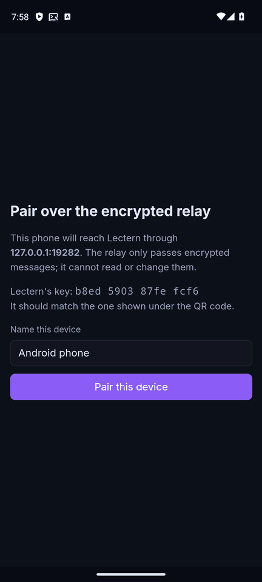
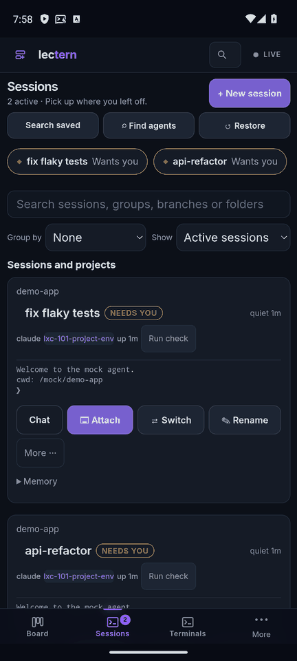
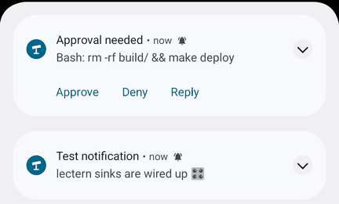
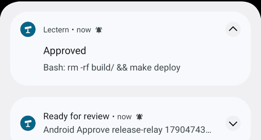
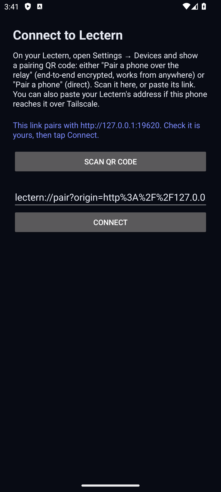
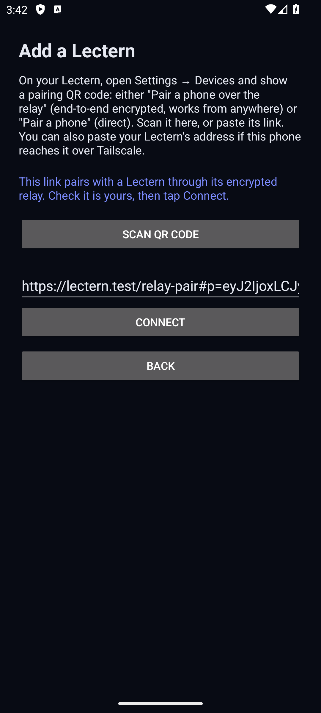
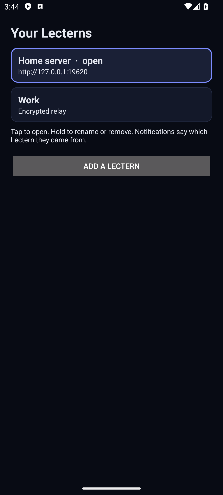
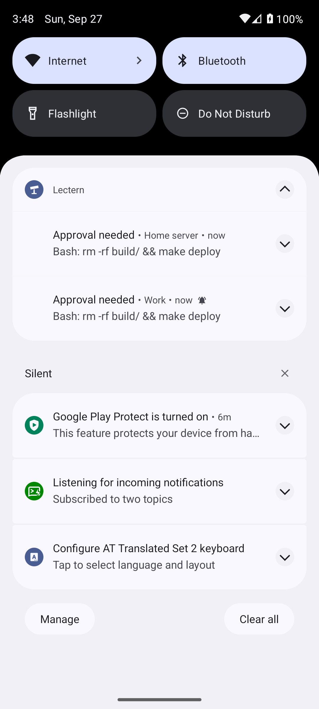
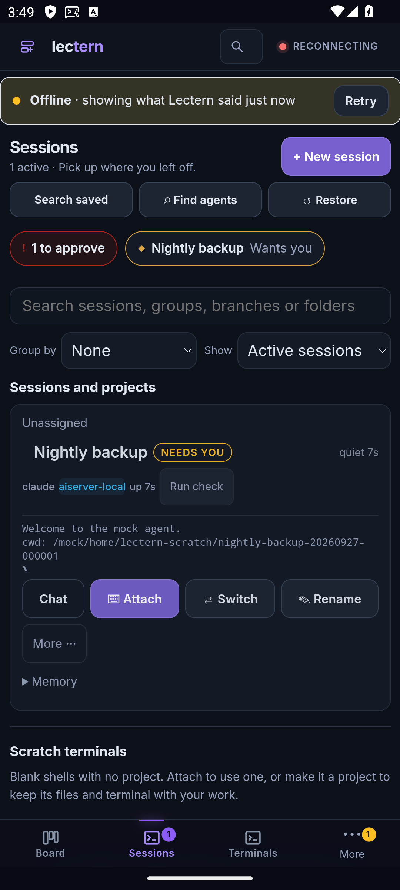

# Android app

A native Android app for Lectern. From 2.8.0 the app carries Lectern's own
version, and every release has its signed APK attached:
[lectern-android-<version>.apk on the latest release](https://github.com/JeremiahM37/lectern/releases/latest).
It is signed with the same key as every earlier build (0.1.0, 0.2.1), so it
installs over them and keeps their pairing. After that, the app updates itself
(see [Updates](#updates)).
If notifications don't arrive, open ntfy once and turn off battery optimisation for it.
See "Tested" and "Limits" below before using it.

It runs the **same web app** as the browser (`frontend/`, staged into `web/`),
bundled and signed inside the APK, and adds what a web page cannot do:

| | Installed web app (PWA) | Android app |
|---|---|---|
| Approve / Deny / Reply on a notification | Needs a Lectern tab open when paired over the relay | Works with no Lectern screen open, over the relay or directly |
| Where the app code comes from | Your host or an install origin, then pinned by the service worker | The signed APK. No relay or install origin ever serves code |
| Relay device key | Raw bytes in the browser's IndexedDB | X25519 key in Android Keystore, not extractable |
| Push | Web Push through the browser vendor (Google for Chrome) | UnifiedPush: ntfy (self-hosted or ntfy.sh) or any distributor, no Google |
| Installing | Browser "Add to Home screen" | Install an APK |
| Several Lecterns | One per browser origin | A list of paired Lecterns; switch, each notification labelled |
| Pairing links | The https link opens the pairing page | `lectern://pair?…` (and https App Links in your own build) open the app |
| Dictation | Browser speech recognition, or your Lectern (whisper.cpp) | Your Lectern (whisper.cpp); the WebView has no speech recognition |

<p>


</p>
<p>

<br>

</p>

## Build

Needs the Android SDK (platform 36, build-tools 34+) and JDK 17 or newer.

```sh
(cd frontend && npm ci && npm run build && python3 scripts/stage.py)   # only if the frontend changed
mobile/build-android.sh            # debug APK: mobile/android/app/build/outputs/apk/debug/
mobile/build-android.sh test       # JVM unit tests
LECTERN_ANDROID_SIGNING=/path/to/signing.properties mobile/build-android.sh release
```

`LECTERN_APP_LINK_HOSTS=lectern.example.com` (comma-separated; or the Gradle
property `lecternAppLinkHosts`) makes the build claim
`https://lectern.example.com/pair` and `/relay-pair` as Android App Links; see
[Pairing links](#pairing-links-and-several-lecterns).

`signing.properties` holds `storeFile`, `storePassword`, `keyAlias` and
`keyPassword`. It and the keystore stay outside the repository; without it the
release APK is unsigned. Sizes at the time of writing: debug 14 MB (the web
app itself is about 25 MB uncompressed, mostly the file editor, Monaco, its
language services and the diagram renderer; see [files.md](files.md)). The
release APK was 3.3 MB before the file editor was added.

**Signing in CI**: keep the keystore as a base64 secret, decode it to a temp
file in the job, write `signing.properties` from secrets, set
`LECTERN_ANDROID_SIGNING`, build, then delete both. Keep the same key forever:
Android refuses an update signed with a different key, and the key is what
proves an update came from you. For stronger protection, build unsigned in CI
and sign on a machine that holds the key (`apksigner sign`).

## Install and connect

1. Install the APK (`adb install app-release.apk`, or open it on the phone
   after allowing installs from your file manager).
2. Open **Lectern**. It asks for a pairing QR code or link. On your Lectern,
   open **Settings → Phone & devices** and either:
   - **Pair a phone over the relay** (end-to-end encrypted, works from
     anywhere; see [relay.md](relay.md)), or
   - **Pair a phone** (device pairing, when the phone reaches Lectern
     directly; see [remote-access.md](remote-access.md)).
3. Tap **Scan QR code**, or paste the link. You can also paste just your
   Lectern's address (for example `https://host.tailnet.ts.net:8443`) when the
   phone is on the same tailnet: Lectern then knows it by its Tailscale
   identity and no pairing is needed.
4. Name the device and pair. The app opens Lectern.

The relay pairing page is the same `/relay-pair` page the browser uses, with
the same host key fingerprint to compare. The pairing link's own origin is
ignored: the app never loads code from it.

To remove a Lectern: **Your Lecterns** (below) → hold it → **Remove**, or on
the Lectern's own pages **Settings → Phone & devices → Encrypted relay → Forget this
pairing** (relay) or **Disconnect this app** (direct). The owner can revoke the
device from Settings on the host as usual.

## Pairing links and several Lecterns

<p>



</p>
<p>



</p>

**Links.** A pairing link sent by message or email opens the app's pairing
screen, filled in, whether the app was running or not. The screen says where
the link leads (an address, or "a Lectern through its encrypted relay", whose
key fingerprint the pairing page then shows); nothing is paired until you tap
**Connect**, and adding a Lectern never changes the ones already paired.

- `lectern://pair?p=…` (relay) and `lectern://pair?origin=…&code=…` (direct)
  work with the published app. Settings → Phone & devices shows them as **Open in
  Android app** beside **Copy link** and **Share…**, and the pairing page,
  opened in a phone browser, offers them too.
- **App Links.** Android lets an app open ordinary https links only for host
  names it names at build time, and each Lectern has its own address, so the
  published APK claims none. Build with `LECTERN_APP_LINK_HOSTS=<your host>`
  and add your build's certificate to the host with
  `LECTERN_ANDROID_APP_LINKS=io.github.jeremiahm37.lectern=<SHA-256>`; every
  Lectern serves `/.well-known/assetlinks.json`, which already names the
  published app's signing certificate. Android then verifies the claim and your
  QR code's https link opens the app directly.

**Several Lecterns.** Each pairing becomes an entry in **Your Lecterns**,
reached from **Settings → Phone & devices → Add or manage Lecterns…** in the app, and
from **Switch Lectern** on the launcher icon's long-press menu. Tap one to open
it, hold one to rename or remove it, or **Add a Lectern**. Settings → Phone & devices
also lists them with a **Switch** button. Each Lectern keeps its own device key
(a separate Keystore alias, so two Lecterns cannot tell they share a phone), its
own sealed tokens, its own UnifiedPush registration, and, over the relay, its
own private page origin, so settings and the offline cache never mix.
Notifications name the Lectern they came from once there is more than one, and
their buttons act on that Lectern whichever one is on screen; tapping one opens
it. An app updated from 0.1.0 keeps its pairing as the first entry, unchanged.

**The back key** closes what is open over the page first (a menu or sheet,
a dialog such as Chat, the review workspace, a maximized pane, the floating
terminal), then returns to the views visited before, and leaves the app only
from the first one.

**Withdrawn notifications.** When an approval is decided anywhere else (the
desk, another phone, the terminal, or it expires), the host pushes a
withdrawal and the app removes that notification.

**Offline, haptics, dictation.** The app has no service worker, so the web
app's own cache (docs/mobile-sessions.md, "Gestures, offline and haptics")
keeps each Lectern's last lists and shows them with an **Offline** marker when
it cannot be reached. Gestures that commit give a short haptic tick through the
view (no vibration permission). The 🎙 buttons record in the page and transcribe
on your Lectern (whisper.cpp); the app asks for the microphone the first time,
only for its own Lectern's pages. Android 12+ shows the lectern mark on the
app's dark background while it starts, and Android 13 themed icons get a
monochrome variant.

## Updates

When a newer Lectern release has an app, the app says so in a bar at the top
of the page (**Update** / **Later**), and **Settings → Phone & devices → App
updates** shows the installed version with **Check for updates**. It checks
when it opens, at most every six hours, and needs no Google service.

- Every release carries `lectern-android.json`:
  `{"version", "versionCode", "apk", "sha256", "size"}`. The app reads it from
  `https://github.com/JeremiahM37/lectern/releases/latest/download/lectern-android.json`,
  which always names the newest release, so there is no API call and no rate
  limit.
- **Update** downloads the APK, which must come from this repository's
  release downloads, checks it against the manifest's SHA-256, and hands it
  to Android's installer. Android shows **Do you want to update this app?**
  and refuses any APK not signed with the installed app's key, so a forged
  manifest can at most name an update that will not install.
- The first time, Android asks to **Allow from this source** for Lectern;
  the update carries on when you come back from that setting.
- Pairings, keys, tokens and push registrations are kept; Android restarts
  the app as the new version.

Releasing: after `release.yml` has published a tag, check the tag out and run
`LECTERN_ANDROID_SIGNING=… tools/publish-android.sh vX.Y.Z`. It runs the unit
tests, builds and signs the APK, checks the signing certificate, uploads the
APK, its `.sha256` and `lectern-android.json`, and reads back what installed
apps will see. The app's version comes from `internal/version/version.go`
(`versionCode` = major×10000 + minor×100 + patch).

Tested on an Android 15 emulator: a signed 2.8.0 offered a locally served
stand-in 2.8.1 (built with `LECTERN_ANDROID_VERSION=2.8.1`,
`LECTERN_UPDATE_MANIFEST` and `LECTERN_UPDATE_APK_PREFIX` pointing at it),
went through Allow from this source and Android's confirmation, and came
back as 2.8.1, still paired.

## Push notifications (UnifiedPush and ntfy)

The app receives push through [UnifiedPush](https://unifiedpush.org), so no
Google service is involved. You need a distributor app; **ntfy** is the usual
one.

1. Install ntfy on the phone (F-Droid or Play). Open it once.
2. To use your own server instead of ntfy.sh, set it in ntfy's **Settings →
   Default server** before step 3. Lectern must be able to reach that server:
   it POSTs each notification to it.
3. In Lectern, tap **Enable phone alerts** (on the Sessions screen, or
   Settings → Notifications). Allow notifications when Android asks.

The distributor gives the app a Web Push endpoint and keys, and the app
registers them with Lectern's existing `/api/push/subscribe`, exactly like a
browser. Lectern encrypts every notification to the app's keys (RFC 8291), so
**ntfy only ever sees ciphertext**. Nothing on the host changes and nothing
needs configuring there; this is separate from Lectern's own `ntfy_topic`
setting, which sends plaintext notifications to a topic you read in the ntfy
app itself.

Notification buttons:

| Notification | Buttons | What they do |
|---|---|---|
| An approval | **Approve**, **Deny**, **Reply** | Decide the approval. Reply denies it with your text as the note, which the agent receives as its feedback |
| A session waiting for input or permission | **Reply** | Sends your text to the session |
| Anything else | (tap) | Opens that screen in the app |

A button press is handled in the background: the notification changes to
"Approving…" and then to the result ("Approved", or the error Lectern
returned). The call goes out the same way the app is connected: directly with
the paired device's own token, or through the encrypted relay. With the relay,
the app loads its own copy of the web app in an invisible WebView, so the
Noise and tunnel code are the same code the browser runs.

**Who may decide.** Nothing new is trusted. The decision reaches Lectern as
the paired device (`device` or `relay-device`), which carries the identity of
the owner who paired it, exactly like the browser. Lectern's existing rule
still applies: local processes and agents on the host cannot decide
approvals, and a revoked device gets a 401.

## How it works

- **A small Kotlin shell** around a WebView (`mobile/android`), not Capacitor.
  The app needs a handful of native pieces (Keystore, UnifiedPush, background
  work, a QR scanner) and no plugin system; a lean shell keeps the APK at
  3.3 MB, has no Google dependencies (so it can go to F-Droid) and keeps the
  whole native surface reviewable in about 1,300 lines of Kotlin.
- **The web app comes from the APK.** The build copies `web/index.html` and
  `web/static` into the APK. In relay mode the WebView uses the private origin
  `https://app.lectern.invalid`, which never touches the network. In direct
  mode the page's origin is your Lectern's address, so API calls, SSE and
  terminals are ordinary same-origin requests, but every app file is still
  answered from the APK. The service worker is not installed in the app.
- **The screen's edges.** Android 15 draws apps under the status bar, the
  camera cutout and the gesture bar. The WebView sits in a frame padded by
  those insets (and the keyboard's), whose colour follows the page's theme
  (`LecternNative.barColors`), so nothing the page draws is under them.
- **`window.LecternNative`** (`frontend/src/native/bridge.ts`) is how the page
  reaches the native side. It refuses calls from any origin but the connected
  one, and the WebView opens every other link in the phone's browser.
- **Keys.** The relay device key is generated in Android Keystore (Android 13
  and later) and never leaves it; the page gets its public key and a DH
  function. On older Android, or a Keystore without X25519, the app uses a
  software key sealed with a Keystore AES key. The route token and a direct
  device token are sealed with that AES key too. Nothing is included in
  backups.
- **Direct-mode credential.** A device paired directly gets the usual device
  token. The app stores it sealed, gives it to the WebView as a session cookie
  at each start, and uses it as a bearer token for notification buttons.

## Tested

In an Android 14 emulator against an isolated Lectern (its own port, database,
home and tmux directory, token auth, mock agents), a local `lectern relay`,
and a local ntfy server, with the app's process killed before each push:

- Pairing over the relay: the device key was created in Keystore
  (`LecternNative.version()` reports `"key":"keystore"`), `/api/whoami` over
  the tunnel is `relay-device`, human.
- Direct device pairing over `http://10.0.2.2`: `/api/whoami` is `device`,
  human; afterwards the token is an HttpOnly cookie, not readable by page
  scripts (the pairing page itself sees it once, as in a browser).
- UnifiedPush registration through ntfy; the message ntfy stored was
  ciphertext.
- A real gated approval (`[mock:approval]` task): the notification arrived
  with the app not running; **Approve**, **Deny** and **Reply** each decided
  it through the relay (`decided_by=user`, the Reply text as the note) and the
  agent continued or stopped accordingly. **Approve** also worked directly.
- The same approval round trip with the signed, minified release APK.

To re-run it: boot an emulator, install ntfy and the APK, point ntfy's
default server at `http://127.0.0.1:19281`, then use the scripts in
`mobile/android/e2e/` (`start-stack.sh`, `pair-relay.sh`, `approve-flow.sh
<label> Approve|Deny|Reply [text]`), with `adb reverse` for ports 19210,
19281 and 19282 so the emulator and host share the same addresses. They
drive the phone through `adb` and `uiautomator`; `pair-relay.sh` taps the pair
button by screen position (Pixel 7 profile).

App 0.2.0, on a fresh Android 14 emulator with two isolated Lecterns ("Home
server": direct pairing, token auth; "Work": relay only, with a stand-in
whisper.cpp) and a local ntfy:

- `lectern://pair?origin=…&code=…` opened with the app not running (cold
  start) filled in the pairing screen; Connect paired it (`/api/pair/devices`
  lists it).
- `https://lectern.test/relay-pair#p=…` opened as an App Link (debug build
  with `LECTERN_APP_LINK_HOSTS=lectern.test`, domain approved with `pm
  set-app-links-user-selection`, since the test host has no public
  certificate) while the app was showing Home server (warm start); Connect
  paired Work over the relay, and Home server stayed paired.
- Your Lecterns listed both; rename and switch worked; Work's page origin was
  its own `https://h3.app.lectern.invalid`.
- Each Lectern got its own UnifiedPush endpoint. With the app process killed,
  approvals on both arrived labelled "Home server" and "Work"; deciding Work's
  at the host removed its notification from the phone; **Approve** on Home
  server's decided it on Home server (`decided_by=user`).
- With Home server unreachable (`adb reverse` removed) a restarted app showed
  its sessions from the cache under the Offline marker, and cleared the marker
  when it came back.
- Pull to refresh and the bottom-sheet menu, with real touch input.
- The back key closed, in turn, a card's menu, Chat, and the review
  workspace, then walked back through Settings and Board, and left the app
  from the first view.
- Dictation asked for the microphone permission and the page received it, but
  the emulator had no working audio input ("Could not start audio source"), so
  recording and transcription in the app were not exercised there; the same
  code recorded and transcribed end to end in Chromium (e2e/test_mobile_parity.py).

The scripts in `mobile/android/e2e/` accept `STACK`, `LECTERN_E2E_PORT`,
`LECTERN_E2E_RELAY_PORT`, `LECTERN_E2E_RELAY=0` and `LECTERN_E2E_ENV` for a
second Lectern, and `CDP_PORT` for `cdp.py`.

Not tested end to end: **Reply** on a waiting session notification (unit
tested only), the QR camera scanner (the emulator has no real camera; links
were pasted or opened with `am start`), a verified App Link on a real https
host, physical devices, and Android versions other than 14.

## Limits

- **Web app updates arrive with the APK.** The app runs the web app it was
  built with. A host much newer or older than the app can differ in API; keep
  the app updated (it offers each release) along with the host.
- **Media over the relay.** Images, video and downloads that the web app loads
  by URL rather than `fetch` (the browser's service worker handles those) do
  not load in relay mode yet.
- **A UnifiedPush distributor is required** for notifications. If none is
  installed, Enable phone alerts says so.
- **Keystore strength varies.** On the emulator the key is in software
  Keystore; on phones with a TEE or StrongBox it is in hardware. Anyone who
  can use the unlocked phone can use the app; revoke a lost phone from
  Settings.
- **Plain http is allowed**, because the address is yours to choose (a
  tailnet address is already encrypted). Use https or the relay on untrusted
  networks.

## Distribution

The signed `lectern-android-0.1.0-prototype.apk` and its SHA-256 checksum are
published on the [v2.4.1 release](https://github.com/JeremiahM37/lectern/releases/tag/v2.4.1).
The APK was built from that tag; JVM unit tests, the signed/minified release
build, signature verification and installation/launch on an isolated Android
emulator passed. The downloaded public artifact was checked against the local
SHA-256. This does not extend the physical-device or QR-camera claims above.

Signing certificate SHA-256:
`cc438ac9a8c58b582e69b320fbd85038082bad56c37a41f9b6db04d0f2aeba56`.

There is no store listing yet. Future distribution options:

- **F-Droid**: the app has no proprietary dependencies (UnifiedPush connector,
  Tink, ZXing, AndroidX). F-Droid builds from source, so it needs a tagged
  release, fastlane metadata (`fastlane/metadata/android/…`: descriptions,
  screenshots, changelogs), a merge request to `fdroiddata`, and a build recipe
  that runs the frontend build first (or relies on the committed `web/`).
  Reproducible builds would let F-Droid ship the APK signed with your key.
- **Google Play**: a developer account, an app bundle (`bundleRelease`) signed
  with an upload key (Play App Signing), a privacy policy, the Data safety
  form, and a target SDK within Play's current requirement. UnifiedPush works
  on Play, but Play users may expect FCM; the connector can embed an FCM
  distributor if that is ever wanted.
- **iOS**: UnifiedPush does not exist there; notifications must go through
  APNs, which needs an Apple developer account and a small push gateway (the
  host cannot send to APNs without Apple credentials). Notification buttons
  would use a Notification Service/Content extension plus background URLSession
  work. The same shell design carries over (WKWebView serving the bundled web
  app from a custom scheme, Keychain/Secure Enclave for keys, although the
  Secure Enclave has no X25519, so the relay key would be sealed rather than
  hardware-held). Distribution is via the App Store or TestFlight only.
