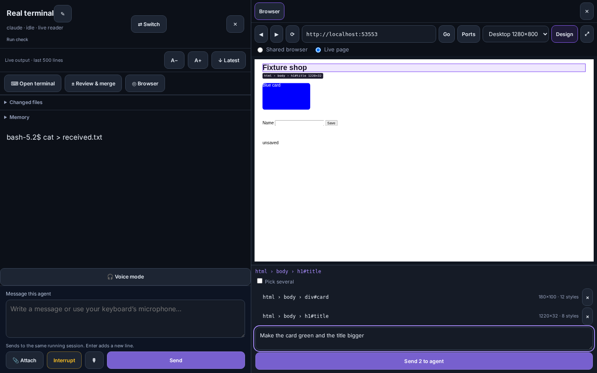
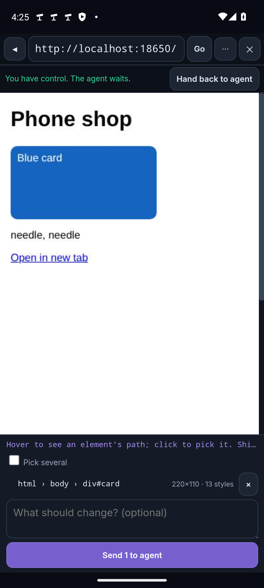
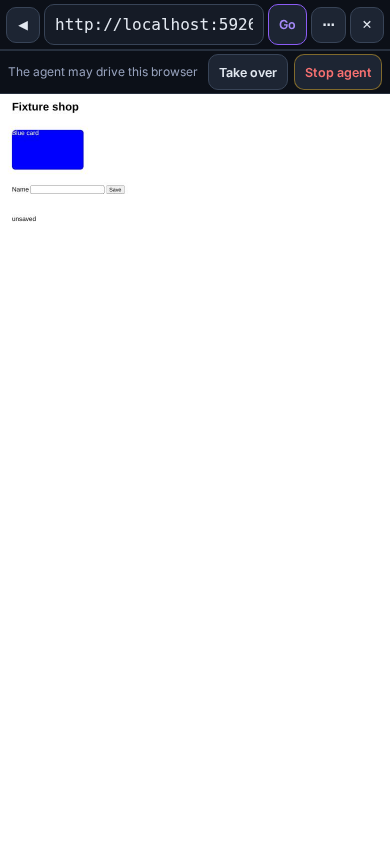
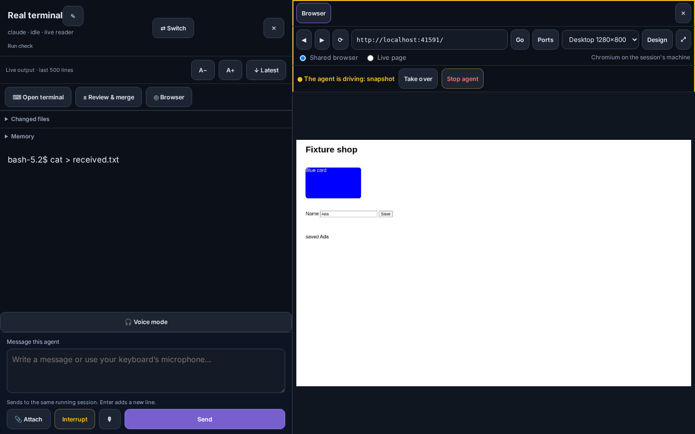
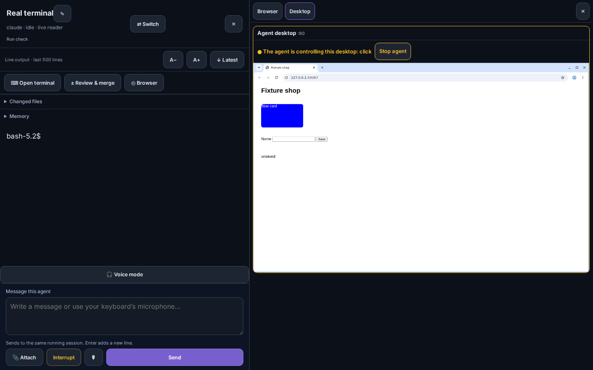

# Browser pane, Design Mode and agent browser tools

Every session can have a browser next to it. It shows the app the agent is
building, the agent can drive it through its tools while you watch, and
Design Mode turns "this button, but bigger" into something the agent can act
on: click an element and it receives the markup, the CSS and a cropped
screenshot as real files.



## Opening it

Open a session's chat and press **◎ Browser**. On a wide screen the pane sits
beside the conversation; on a phone it takes the whole screen, with one row of
controls (back, address, Go, **⋯** for everything else, close) so the page
keeps nearly all of it.

- **Ports** lists what is listening on the session's machine. Ports opened by
  a process in the session's workspace are marked *this workspace* and come
  first, then other ports that answer HTTP. **All ports** shows the rest.
- The **address bar** takes a full URL, `localhost:5173`, `:5173/settings`, or
  just `5173`.
- **Back**, **forward** and **reload**, a **device size** (phone 390×844,
  tablet 820×1180, desktop 1280×800) and **⤢** to open the page in its own tab.
- **Tabs** (shared browser): a strip of the browser's tabs with **+** and ×.
  A link that opens a new window becomes a tab, and a page that closes itself
  leaves the strip.
- **Find** steps through matches in the page and counts them (**Enter** next,
  **Shift+Enter** previous). In a live page use your own browser's find,
  which searches the frame too.
- **Downloads** land in the session's workspace under `.lectern/downloads`
  (excluded from git, like attachments) with their own names, and show on a
  shelf under the page with **Save** to fetch one to this device.

The pane can show a page in two ways:

| | Shared browser | Live page |
|---|---|---|
| What it is | A real headless Chromium on the session's machine, streamed to the pane | The dev server itself, framed through a Lectern view |
| The agent sees it too | Yes, it is the browser the agent's tools drive | No |
| Scrolling and typing | Sent to the page as input | Native |
| Over the encrypted relay | Yes | No (a frame cannot use the tunnel) |
| Needs | Chromium or Chrome on that machine (or on the Lectern host, see below) | `LECTERN_LIVE=1` on the server |

Both see the session machine's own `localhost`, so a dev server bound to
`127.0.0.1` works without exposing anything. The pane also works inside the
Android app, paired over the relay (tested on the emulator: tabs, taps that
take over, Design Mode and Send to agent).



## Profiles and cookies

A session in a project uses that project's own **persistent profile** by
default, so a login made there is still there for the project's next session
and is never seen by another project's browser. **Profile → New profile…**
adds named ones beside it (a test user, an admin). **temporary** is cleared
when the browser closes, and is the default for a session with no project.
Profiles live in `~/.lectern/browser-profiles` on the session's machine; one
open in a browser is refused to a second browser rather than corrupted.

**Cookies** signs the current profile in without typing a password into the
agent's browser:

- **From a cookies file**: a Netscape `cookies.txt` or a JSON export
  (browser extensions, Playwright `storageState`). It is sent to the machine
  the browser runs on, read there, and deleted.
- **From Chrome**: a Chrome, Chromium, Brave or Edge profile directory on the
  session's machine (`auto` finds one in `~/.config`). Its cookie database is
  copied and decrypted on that machine: the `v10` key Chromium uses without a
  desktop keyring, or the keyring's key through `secret-tool` when there is
  one. Cookies it cannot decrypt are counted and skipped.
- **Only these sites** limits either import to the domains you list.

Either way a script on that machine hands the cookies to the browser over its
loopback DevTools port, so cookie values never pass through Lectern or the
network; the pane is told only how many were imported and skipped. When the
browser runs on the Lectern host instead (the session's machine has no
Chromium), importing from a Chrome profile on the session's machine is
refused, because it would carry the cookies off it; a cookies file still
works.



*A phone paired over the encrypted relay: the frames, taps and Design Mode all
travel inside the tunnel.*

## Design Mode

Press **Design**. Hovering an element outlines it and shows its DOM path
(`html › body › main › button.primary`); clicking picks it instead of
clicking the page. **Shift**-click (or **Pick several**) adds more, up to
eight, and **Escape** clears the pick. Add a note if you like and press
**Send to agent**.

The agent receives files, staged into `.lectern/context/<random>/` in its
workspace through the same path as any attachment (excluded from git), and one
message typed into the session that names them:

- `design.md`: for each element, the page URL as the agent knows it
  (`http://localhost:5173/...`, not Lectern's address), the viewport, the
  selector, the DOM path, its box, the source file and line when a dev build
  exposes them (React's debug info, Vue's component file, Svelte's location,
  or inspector `data-*` attributes), the computed CSS that differs from that
  element's defaults, the stylesheet rules that match it, and its parent's
  markup cut to two levels.
- `element-N.html`: the element's markup, trimmed: scripts and SVG paths
  removed, long text and attributes cut, deep subtrees summarised, event
  handlers dropped and password fields blanked.
- `element-N.png`: a screenshot cropped to the element.

[Example `design.md`](media/browser/design-example.md) ·
[its screenshot](media/browser/element-1.png)

Where the screenshot comes from, in order, and `design.md` says which one
was used:

1. **Shared browser:** the live page itself, through DevTools. What you see is
   what the agent gets, including state such as an open menu.
2. **Live page:** a fresh headless render of the same URL at the same viewport
   and pixel ratio, in a separate tab of the session's browser, cropped to the
   element. A fresh render does not have in-page state the frame had (an open
   dialog, typed text); pick in the shared browser when that matters.
3. If no headless browser can run, the pane draws the element itself
   (an approximation: images from other origins and some fonts are missing).

## Agent browser tools

Any agent that uses Lectern's MCP server gets these tools; agents without MCP
use `lectern browser` with the same actions. Both find their session from the
environment Lectern launched them with, or take `--session ID`.

| MCP tool | CLI | Does |
|---|---|---|
| `browser_navigate` | `lectern browser open URL` | Load a page; starts the session's browser if needed |
| `browser_snapshot` | `lectern browser snapshot [--screenshot FILE]` | The page as an accessibility outline, with `[ref=N]` on everything actionable, plus a screenshot |
| `browser_click` | `lectern browser click REF \| --selector S \| --at X,Y` | Click like a person: scroll into view, press, release |
| `browser_fill` | `lectern browser fill REF TEXT` | Replace a field's value or choose a select option |
| `browser_press` | `lectern browser press KEY` | `Enter`, `Tab`, `Control+a`, … |
| `browser_evaluate` | `lectern browser eval EXPR` | Read-only JavaScript |
| `browser_console`, `browser_network` | `lectern browser console`, `network` | Recent console messages, exceptions and requests |
| `browser_screenshot` | `lectern browser screenshot FILE [--selector S]` | Viewport or one element |
| `browser_history`, `browser_resize`, `browser_close` | `back`, `forward`, `reload`, `resize 390x844 --mobile`, `close` | |
| `browser_tabs` | `tabs`, `tab new [URL]`, `tab select ID`, `tab close ID` | List, open, switch, close tabs |
| `browser_find` | `find TEXT [--backwards]` | Find in page |
| `browser_downloads` | `downloads` | What the browser downloaded, and where |

Every tool that acts on a page takes an optional `tab` (`--tab ID`); without
it, the active tab. An agent can read one tab while you watch another.

Snapshots and screenshots come back to MCP clients as images. `evaluate` runs
with DevTools' side-effect check, so anything that would change the page is
refused, and so are some reads it cannot prove harmless, such as measuring
layout (`getBoundingClientRect`). Use `click`, `fill` and `press` to act.

### Watching and taking over

While the agent drives, the pane shows **● The agent is driving: click ref 12**
and an amber outline.



- **Take over**, or just click, type or scroll in the picture: the agent's
  next action is refused with "the operator has taken over this browser"
  until you press **Hand back to agent**. Moving the pointer alone does not
  take over.
- **Stop agent** refuses its actions until you **Allow agent** again.

## Computer use

For things that are not web pages, an agent can operate a live desktop: the
one it starts with `open_live_view` or `lectern live` (see
[Live views](terminal-client.md#live-views-a-machines-localhost-and-a-desktop-on-it)).

| MCP tool | CLI |
|---|---|
| `computer_snapshot` (accessibility tree with refs) | `lectern computer snapshot` |
| `computer_screenshot` | `lectern computer screenshot FILE` |
| `computer_windows` (names and rectangles) | `lectern computer windows` |
| `computer_click` (a ref, or X Y; left, right, double) | `lectern computer click REF`, `click X Y [--right\|--double]` |
| `computer_type` (into a ref, or whatever has focus) | `lectern computer type [--ref N] TEXT` |
| `computer_key` (xdotool names: `Return`, `ctrl+l`) | `lectern computer key KEY` |
| `computer_scroll` | `lectern computer scroll X Y down` |

Like the browser, it works by element first: `computer_snapshot` reads the
desktop's accessibility tree over AT-SPI (every app, window and control, with
a `[ref=N]` and its screen rectangle), and a click or typing on a ref uses the
control's own accessible action or text, falling back to its middle. Each
live desktop starts its own accessibility bus for this. Apps appear in the
tree when started with `ACCESSIBILITY_ENABLED=1` (the desktop's own browser
is); Chromium also needs `--force-renderer-accessibility` for page content.
The machine needs `at-spi2-core`, `dbus`, `x11-utils` and `python3-gi` with
`gir1.2-atspi-2.0`; without them snapshots say so and coordinates still work.

It is **off by default**. Turn it on for a project in **Settings → Projects →
Let agents operate live desktops**, or for one desktop with **Allow agent
control** on the pane's **Desktop** tab. That tab shows the desktop, says when
the agent is in control, and has **Stop agent**. The desktop's machine needs
`xdotool` and a screen grabber (`scrot`, ImageMagick `import` or `ffmpeg`).



## Security

- **Who decides.** Turning computer use on, handing control back to an agent,
  opening a live page and sending a Design Mode selection all need a person:
  the same rule as deciding an approval. A process on the Lectern host (an
  agent included) can take control away but never give it back. With
  `LECTERN_AUTH=none` everyone is the operator, as for approvals.
- **Live pages** are served on their own port so the app runs unmodified, but
  are not open doors: the pane opens a view with a single-use ticket that is
  exchanged for a cookie bound to that view, and every request without it is
  refused. Lectern's own cookies are removed before a request reaches the dev
  server. Views are listed per session, close when the session ends, and are
  off unless the server runs with `LECTERN_LIVE=1`. Where Lectern serves the
  tailnet over TLS, views answer HTTPS on the same port with the same
  certificate, so a secure page can frame them.
- **Injection** happens only in Design Mode, only into a successful,
  uncompressed HTML document requested as a page or frame from the same site,
  and it is one `<script src="/__lectern/design.js">` served by the view
  itself. HTML documents a view serves are sent `no-store`, so turning Design
  Mode on never shows a cached copy without the picker; scripts, styles and
  images cache as the app says. Scripts, styles, `fetch()` responses, downloads, error pages and
  navigations from other sites pass through byte for byte. The view only ever
  talks to its one port on the session machine's loopback; a redirect to
  another origin leaves the view and is never proxied. The pane accepts the
  picker's messages only from that frame's window and that view's origin, and
  only in the picker's shapes.
- **The shared browser** runs as the same user as the agent, with its state in
  `/tmp/lectern-browser-*` and its profile there (temporary) or under
  `~/.lectern/browser-profiles` (mode 700), and its DevTools port bound to
  that machine's loopback. Anything running as that user can reach that port,
  as it can the profile itself. Only `http(s)` addresses load. It stops when its
  session ends or after 30 minutes nobody has watched or driven it. Inside a
  container without user namespaces Chromium's own sandbox cannot start;
  Lectern then starts it without that sandbox.
- **A machine with no browser.** When the session's machine has no Chromium,
  Lectern starts one on its own host and routes that browser's `localhost`
  requests to the session machine through a proxy on the host's loopback,
  which accepts connections only from Lectern's own user.
- The browser and computer-use tools are not offered to claude.ai or ChatGPT
  through the web connector: they belong to the session's own agent.

## How it works

```
Browser pane (web app, PWA)      Lectern                        session machine
  shared browser:                  CDP client  ── dial ──────►   headless Chromium
     frames  ◄── API WS ──    (screencast, input,           (DevTools on 127.0.0.1)
    input events  ──►               snapshots, design)
  live page:
    <iframe>      ◄── view port ── view proxy  ── dial ──────►   dev server, e.g. :5173
  Design Mode send ── POST ──────► render, crop, stage ──────►   .lectern/context/…
                                   type one message ─────────►   the agent's terminal
agent (MCP or `lectern browser`) ── POST /api/browser, /api/computer ─┘
```

- `internal/browser` speaks the Chrome DevTools Protocol directly: no
  Playwright or Node on the target, just a Chromium binary (a system one,
  or the one Playwright downloads).
- Connections to the browser and the dev server ride the executor's dialer,
  the same one live port forwards use. Local and SSH targets dial directly.
  Proxmox `pct` containers and SSH targets with a command wrapper dial
  through a small `python3` relay started with the executor's own command
  path, which carries the connection over its stdin and stdout; a wrapper
  that does not pass input through (`docker exec` without `-i`) is refused
  with a message saying so. This was checked against a real container.
- Screencast frames are JPEG, at most 1.5× the viewport, so they fit the
  relay's message size.
