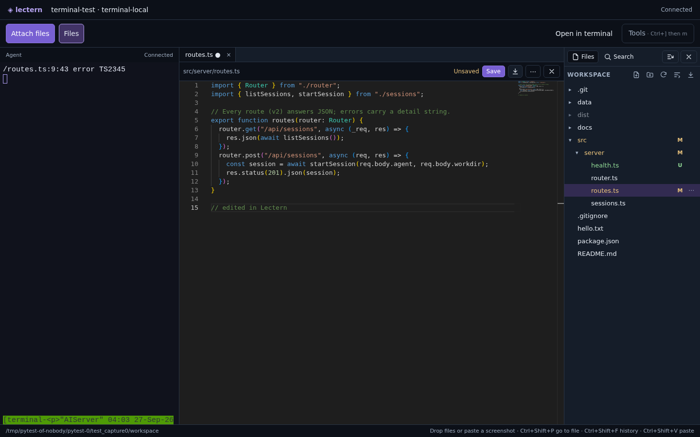
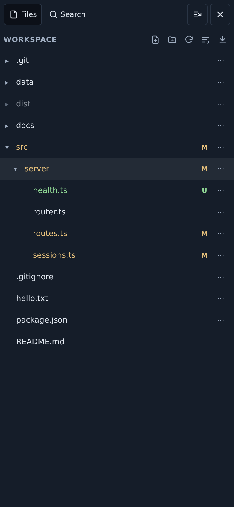
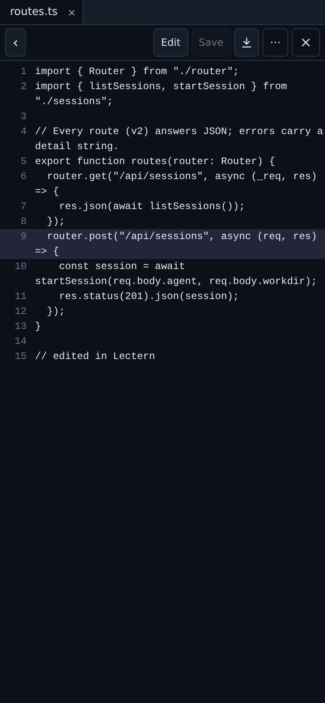
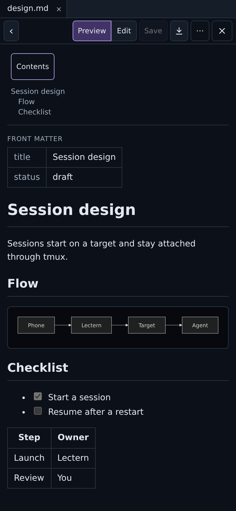
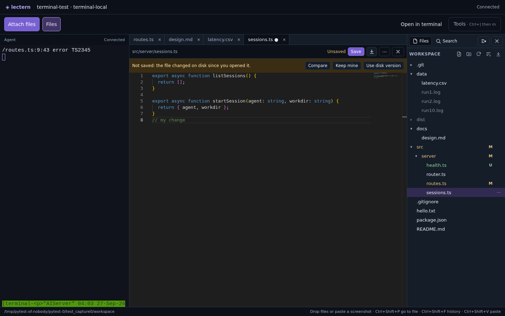
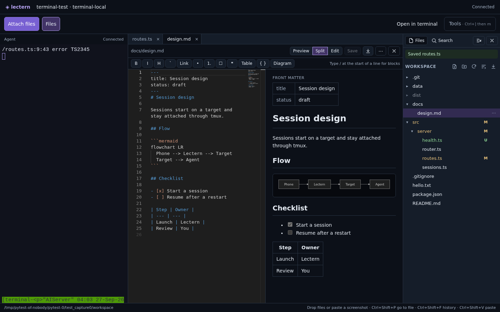
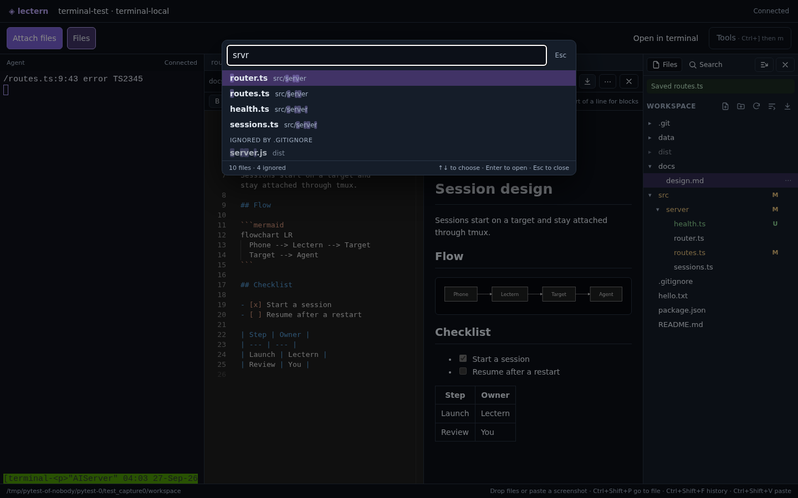
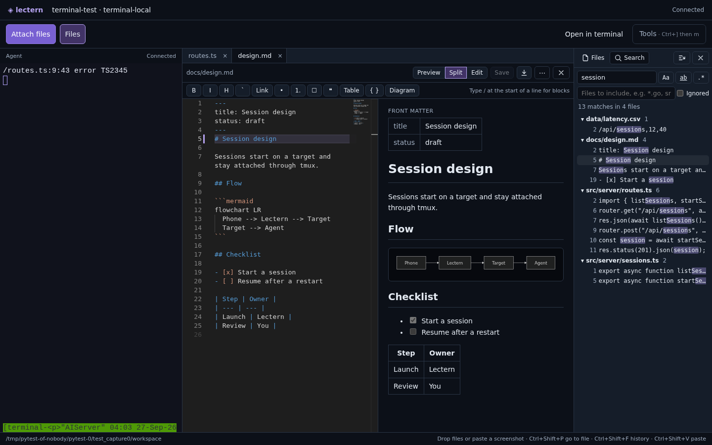

# Workspace files

Every terminal page (session, task attempt or project shell) has the workspace's
files beside it: an explorer, an editor, viewers for common formats, Go to file
and project-wide search. Everything is read and written on the session's own
target (local, SSH or Proxmox `pct`) through the target executor, so it works
the same for a laptop, a remote server and a phone paired over the relay.
Sandboxed tasks have no file access.

Open it with **Files** in the terminal toolbar (also in **Tools**, with **Go to
file** and **Search in files**), or by clicking a file path in the terminal.

## Layout

- **Desktop:** the explorer docks on the right. An open file sits between the
  explorer and the terminal, so the agent's output stays visible while you read
  or edit. Drag either edge to resize (remembered per device). **Expand editor
  over the terminal** in the file menu covers the terminal without resizing it.
- **Phone** (up to 900 px wide): the explorer and each file open full screen
  over the terminal, which keeps its size. Back returns to the explorer, Close
  to the terminal.

| Phone explorer | Phone reader at a line | Phone Markdown |
|---|---|---|
|  |  |  |

## Explorer

- Folders first, then natural order (`file2` before `file10`).
- Git colours: modified or renamed amber `M`, added or untracked green (`A`, `U`),
  deleted red, conflicts pink `!`, ignored dimmed. A folder shows the most
  important change inside it.
- **Live:** open folders and git status refresh every 3 to 5 seconds while the
  explorer is on screen, and at once when the page regains focus. This is
  polling through the executor, not a filesystem watch on the target.
- **New file / New folder** (in the selected item's folder), **Rename** (F2),
  **Move to…**, dragging an entry onto a folder, and **Delete** (with a
  confirmation; folders are removed with their contents). Every change is
  checked on disk by the target, and none can leave the workspace.
- **Download** a file, a folder as a `.zip`, or the whole workspace.
- Drag an entry onto the terminal to paste its quoted path without pressing
  Enter; **Insert path in terminal** does the same on a phone. Drop files from
  your computer onto a folder to save them there; dropped on the terminal they
  are still uploaded as attachments, as before.

## Editor

On desktop, files open in Monaco, the editor component of VS Code. It loads on
the first file you open; the terminal page and a phone's first visit never
download it, and the service worker does not precache it.

- **Ctrl+S** saves. **Autosave** (file menu) saves one second after you stop
  typing.
- Multi-cursor (Alt+click, Ctrl+D for the next match), find and replace (Ctrl+F,
  Ctrl+H), go to line (Ctrl+G), minimap, word wrap, folding and the command
  palette (F1).
- Language services for TypeScript, JavaScript, JSON, CSS and HTML: completion,
  hover, go to definition and rename within the file. Diagnostics are off
  because a single file cannot see the rest of the project. Other languages get
  syntax colouring and word completion.
- **Conflict detection.** The editor remembers the SHA-256 of the file it
  opened and sends it with each save. If the file changed on disk (an agent
  wrote it), the save is refused and nothing is overwritten. **Compare** shows
  both versions side by side; **Keep mine** or **Use disk version** decides. An
  open file you have not edited reloads by itself when it changes on disk.
- Files over 10 MiB open read-only, showing the first MiB.

On a phone, files open in a light reader with line numbers (it wraps long
lines). **Edit** turns it into a plain text area with **Save**. **Use the full
editor** in the file menu loads Monaco on a phone too.

## Markdown

Markdown opens rendered, with **Preview**, **Split** (desktop) and **Edit**
modes.

- Rendered with GitHub-style tables, task lists and fenced code, Mermaid
  diagrams, a table of contents (a **Contents** button on phones) and front
  matter shown as a table.
- Relative links and `[[wiki links]]` open workspace files; relative images
  load from the workspace.
- **Split** shows the source and a live preview that follows your scrolling.
  Click a block in the preview to jump to its source line.
- A formatting toolbar (bold, italic, heading, code, link, lists, task, quote,
  table, code block, diagram), and a **/** block menu at the start of a line.

This is source editing with a live preview, not typing into the rendered page.

## Viewers

| File | View |
|---|---|
| `.md`, `.markdown`, `.mdx` | Rendered Markdown, as above |
| `.html`, `.htm` | Rendered in a sandboxed frame with an opaque origin. Scripts are off; **Allow scripts (no network)** enables them under a content policy that blocks every request, so a page cannot reach Lectern's API or the internet. Relative resources do not load. |
| `.mmd`, `.mermaid` | The diagram (Mermaid with its strict security level, sanitised) |
| `.csv`, `.tsv` | A table with sortable columns and a row filter (first 5,000 rows) |
| `.ipynb` | Markdown cells, code cells with prompts, text/error/image/HTML/Markdown outputs (HTML is sanitised) |
| Images, including SVG | Fit, 100%, zoom buttons, Ctrl+wheel and pinch. SVG renders as an image, never as a document |
| `.pdf` | Page by page with zoom; reopening returns to the page, zoom and scroll you left |
| Anything else | The editor, or a download for binary files |

Every rendered view has a source mode.

## Go to file

**Ctrl+P** (Cmd+P on a Mac) opens Go to file. While the terminal has focus,
Ctrl+P still reaches the shell (it is readline's previous-line key), so use
**Ctrl+Shift+P** or Cmd+P there. Ctrl+P also works from the Lectern page around
an in-app terminal tab.

- The file list comes from `git ls-files` (tracked and untracked files), then
  ripgrep's `--files`, then a directory walk. Gitignored files are a second
  section; files inside an ignored folder are listed up to 5,000 per folder.
- Matching runs in the browser against a cached list, fetched shortly after the
  terminal loads and refreshed in the background, so typing never waits for the
  target. Measured: listing 5,000 files on a local target takes about 40 ms;
  with the list cached, keypress to rendered result took 9 to 11 ms in the
  browser test.
- Ranking follows fzy's scoring: word starts, path separators and consecutive
  letters count most, a match in the file name beats one in its folders, and an
  exact name wins. Spaces separate terms that must all match.
- `name:42` or `name:42:7` opens at that line.

## Search in files

**Search** in the file panel (or **Ctrl+Shift+F** inside the file panel) runs on
the target with ripgrep when it is installed, else `git grep`, else a plain
scan. Options: match case, whole word, regular expression, files to include
(globs, comma-separated) and **Ignored** to include gitignored files. Results
are grouped by file, capped at 2,000 lines, and open the file at the matching
line and column.

## Links from the terminal and to a line

- Paths in terminal output open the file at the line: `src/app.ts:12:5`,
  `./main.go:40`, `Button.tsx(8,14)`, `at fn (/abs/workspace/lib/x.js:3:9)` and
  Python's `File "x.py", line 9`. Click on desktop, tap on a phone. Web
  addresses open in a new tab. Paths outside the workspace are not links.
- The page address follows the open file: `?open=src/app.ts#L42`. `#L42C5`
  points at a column and `#L10-L20` at a range. Clicking a line number sets it
  (Shift-click for a range), and **Copy link** in the file menu copies it.
  Opening such an address shows the file at that line.

## Rules and limits

- The server resolves the workspace root from its own records; a client names
  only a path inside it. Symlinks are resolved on the target and anything that
  lands outside the workspace is refused, for reads, writes, renames, deletes,
  downloads and search. Deleting a symlink removes the link, not its target.
  The workspace root and its `.git` folder cannot be deleted or moved.
- Saving goes through the executor's file transfer to a private temporary file
  on the target, then a checked, atomic replace that keeps the file's mode.
- **Writes need a person.** Saving, creating, renaming, moving and deleting use
  the same rule as deciding an approval: with Tailscale sign-in, a process on
  the Lectern machine (an agent) is refused; a signed-in owner, a token holder
  or a paired device may write. With `LECTERN_AUTH=none` everyone may. Reading
  follows the ordinary API rule.
- Limits: 25 MiB to read, download or save a file; 10 MiB to edit; folder
  downloads 50 MiB compressed (200 MiB of files); 2,000 search results with
  lines cut to 400 characters; 50,000 files in the Go to file list; 2,000
  entries per folder in the explorer.

## API

All under `/api/term/{kind}/{id}` (`kind` is `session`, `attempt` or `project`):

| Method | Path | Purpose |
|---|---|---|
| GET | `files?path=` | List a folder |
| GET | `file?path=` | File bytes; `X-Lectern-Sha256` carries the hash |
| PUT | `file?path=` | Save; `X-Lectern-Base` is the hash you started from, `absent` to create, or `any` to overwrite. 409 with the current hash on conflict |
| GET | `stat?path=` | Hash, size and time, for change detection |
| POST | `fileops` | `{"op": "mkdir"\|"create"\|"rename"\|"delete", "path", "to"}` |
| GET | `archive?path=` | A folder as a zip |
| GET | `index` | Files and ignored files for Go to file |
| GET | `git-status` | Git status per path |
| GET | `search?q=&regex=&case=&word=&include=&ignored=` | Project search |

## Tests

- `internal/api/workspace_files_test.go`: a real local target and filesystem.
  Save with conflict detection and mode preservation; path traversal, absolute
  paths and symlink escapes for writes and every operation; the size cap;
  create, rename, move, recursive delete and folder download; index, git status
  and search options with and without git; 5,000 files; the human-only rule and
  token gating.
- `frontend/src/files/files.test.ts`: Quick Open ranking (and 5,000 paths well
  inside the budget), natural sort, terminal link detection, deep links, CSV,
  notebooks, front matter and headings.
- `e2e/test_files_workbench.py`: real ttyd, tmux and files. Explorer → open →
  edit → save → bytes on disk; conflict and autosave; create, rename, drag-move,
  delete and folder download; drag a path onto the terminal; Quick Open timing
  on 5,000 files and the ignored section; search options; every viewer; a
  clicked terminal path and a deep link; and on a phone, a tapped path, the
  reader, simple editing and Markdown contents.
