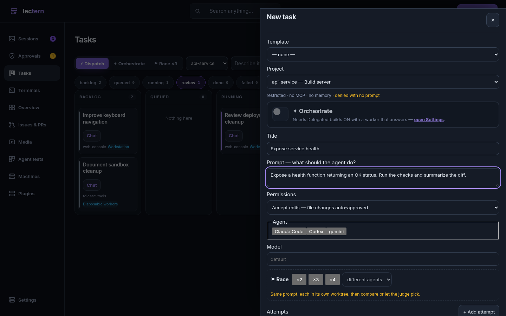
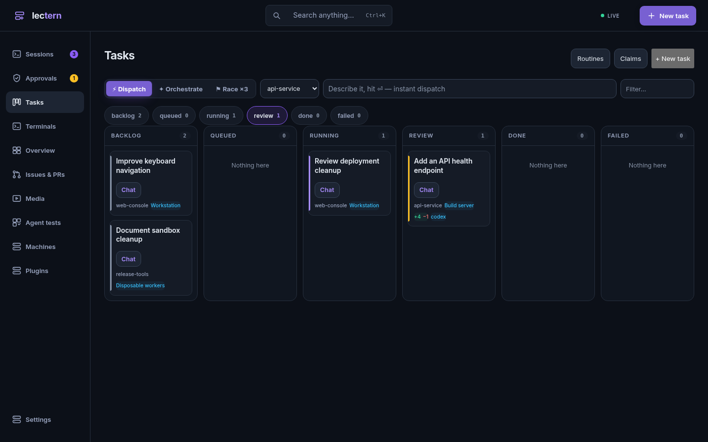
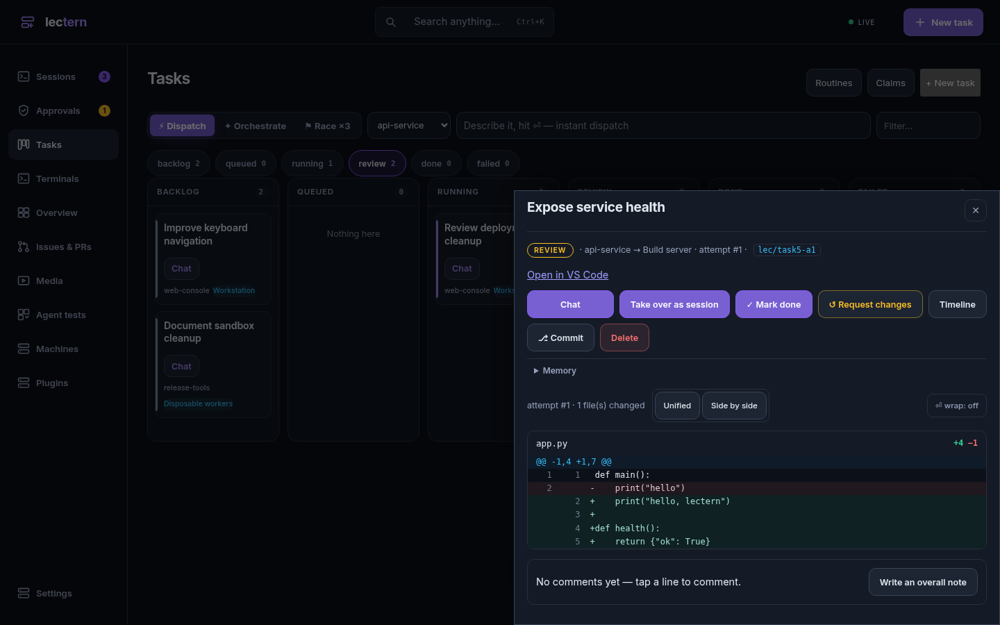
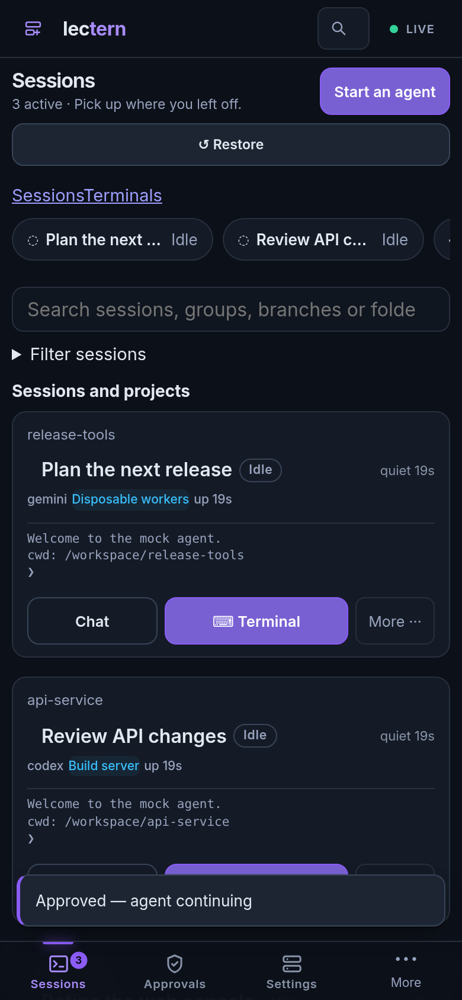
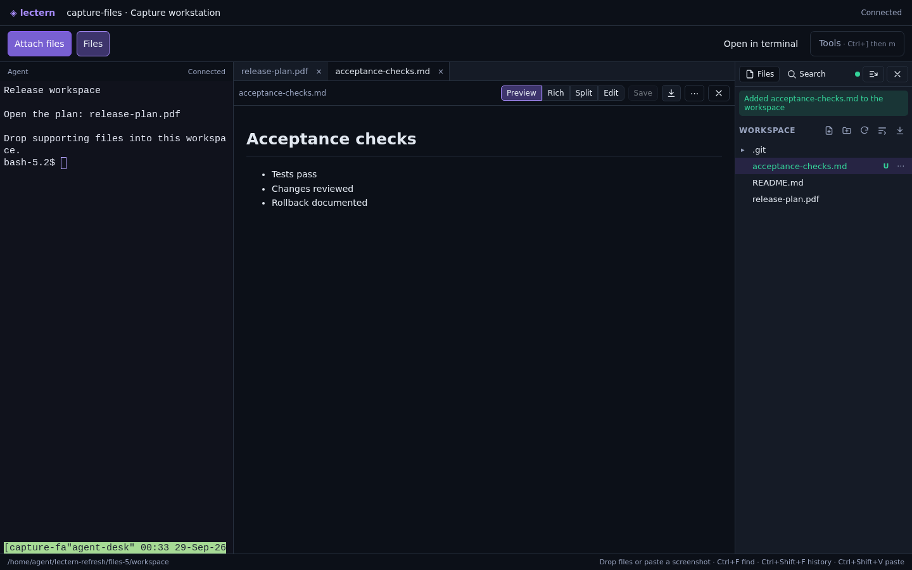

# Lectern: dispatch, supervise, review

These captures show the current desktop navigation and phone layout from build
`2.6.2+bf174ed420d3`, the application code included in the next release.

## Start with the whole workflow

[Watch the 14-second walkthrough](control-plane.mp4)


The video opens on the available execution environments, dispatches a task to
its project's selected machine, and opens the resulting diff for review.
The GIF is a sped-up excerpt; the MP4 preserves the recorded interaction timing.

**Demo disclosure:** this overview uses disposable projects and Lectern's
scripted mock executor. Machine names and execution environments are examples,
not a real connected cluster. The UI, queue, API, diff view and approval
transitions run through the real application. Agent output and machine probes
are simulated. This demonstrates the workflow, not model quality, execution
speed, physical-device coverage or provisioning a real sandbox.

| Machines | Dispatch |
|---|---|
|  |  |

| Tasks across projects | Review the result |
|---|---|
|  |  |


## Supervise from a phone

[Watch a phone approval](phone-approval.mp4). The approval is submitted through
the real UI and the capture checks that the waiting mock task reaches review.
This is Chromium's phone viewport, not a recording of a physical phone.




## Files support the work

[Watch PDF preview and a file drop](files.mp4).

This separate recording uses a **real local execution target** on the isolated
capture host, a real terminal, and a sample PDF. Clicking the terminal path
opens the PDF in Lectern's viewer. An HTML5 File/DataTransfer drop uploads a
Markdown checklist into the workspace; its bytes are verified on disk before
the capture succeeds. No agent or file API responses are mocked here.

This clip shows the browser workflow. It does not demonstrate an SSH transfer
or opening a PDF in a native desktop viewer; those are distinct supported paths
documented in the [terminal guide](../../terminal-client.md#paths-and-links-the-agent-prints).




## Native terminal client


Captured in a real Kitty terminal on a private X display on the agent desk.
The target is the same disposable workspace used for the file demo.

## Reproduce

Run on a disposable Linux capture host with the current Lectern binary,
Chromium, Node, `playwright-core` 1.58.2 and FFmpeg installed. The file capture
also needs git, tmux, Xvfb, Openbox and Kitty. Use empty output directories.
Ports 9502/9503 and X display :98 must be free. No production database,
credentials or existing tmux socket is used.

```sh
node tools/capture-control-plane.cjs /path/to/lectern /tmp/control-capture
node tools/capture-file-workflow.cjs /path/to/lectern /tmp/file-capture
```

The scripts start and stop their own servers and browser processes. A separate
X display keeps the shared logged-in desktop untouched. Only screenshots,
finished video/GIF files and sanitized capture reports belong in this directory;
raw recordings and databases stay outside the repository.

- [Workflow capture checks](capture-report.json)
- [File capture checks](file-report.json)
- [Social preview image](social-preview.png)
