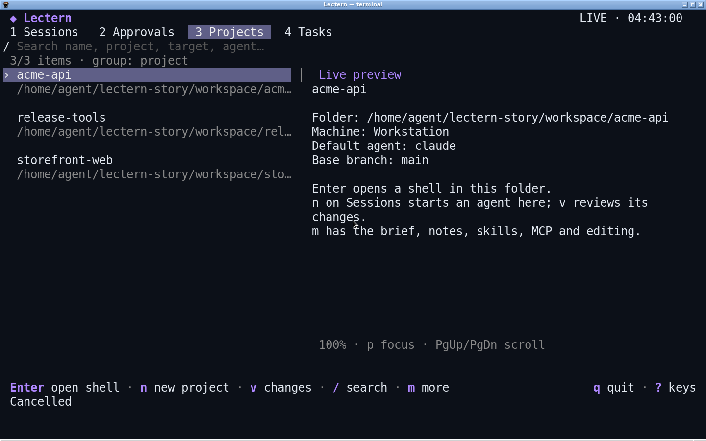
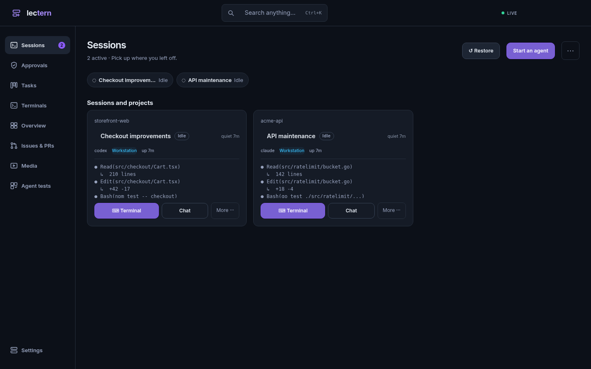
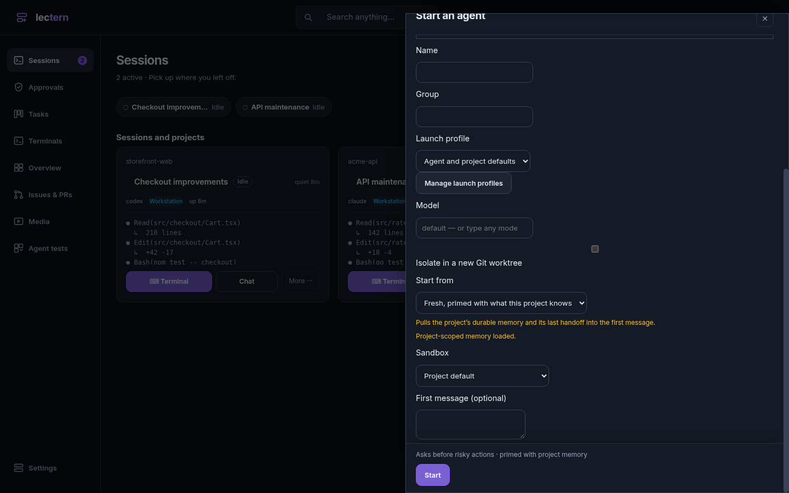
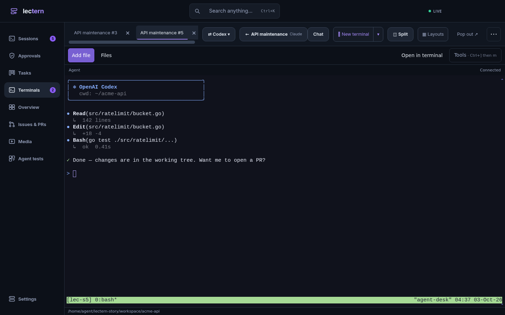
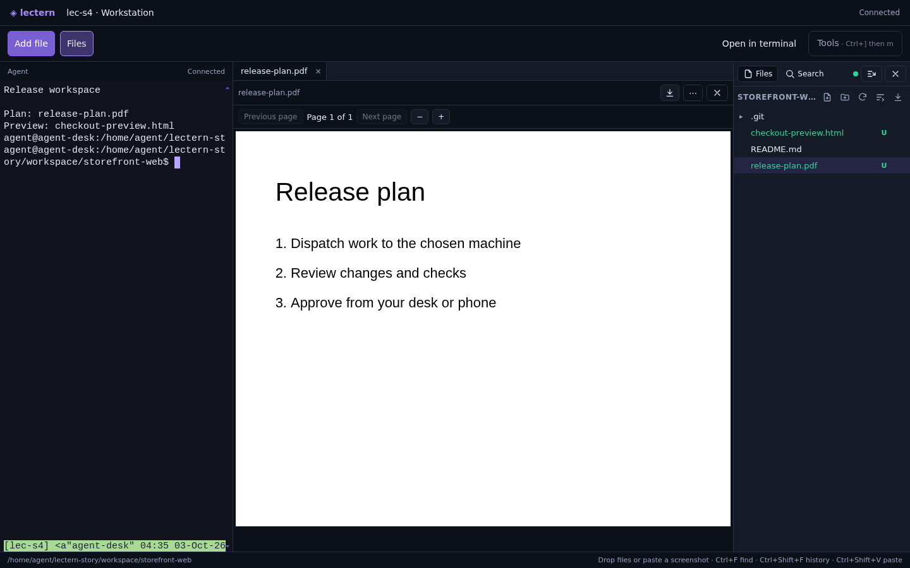
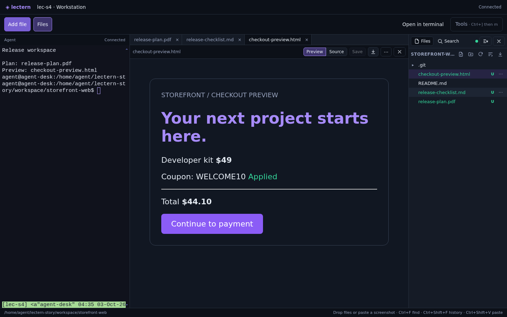

# Lectern in action

[Terminal and browser walkthrough](control-plane.mp4) · [Phone approval](phone-approval.mp4) · [Files and web previews](files.mp4)

*Demo projects with scripted agent responses.*

