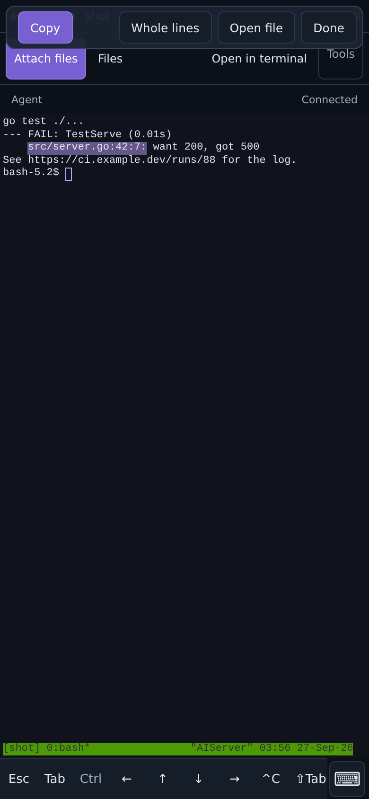
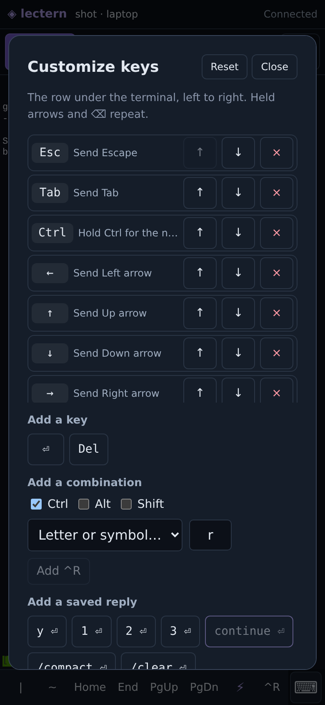
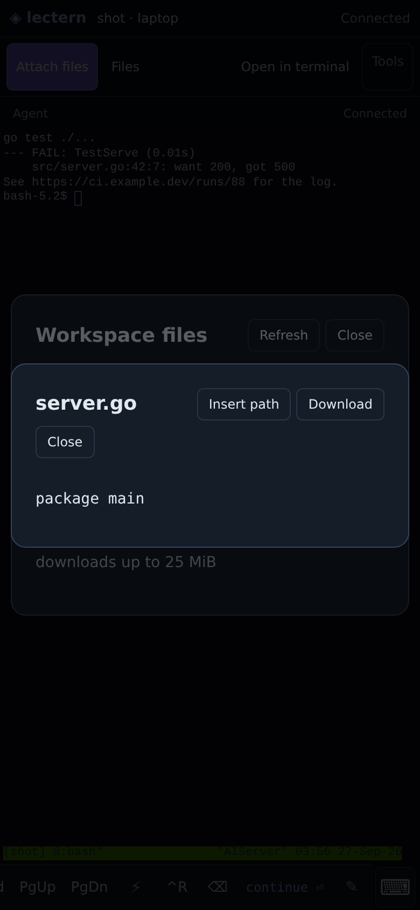
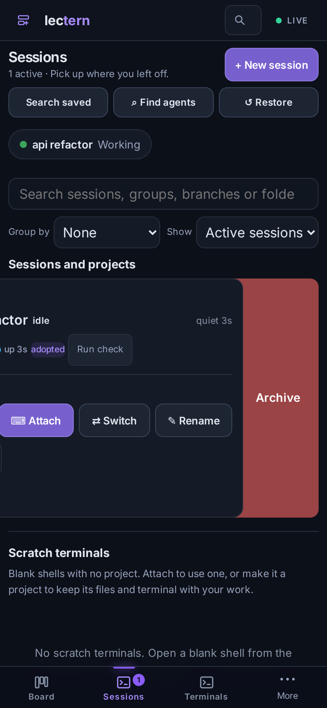
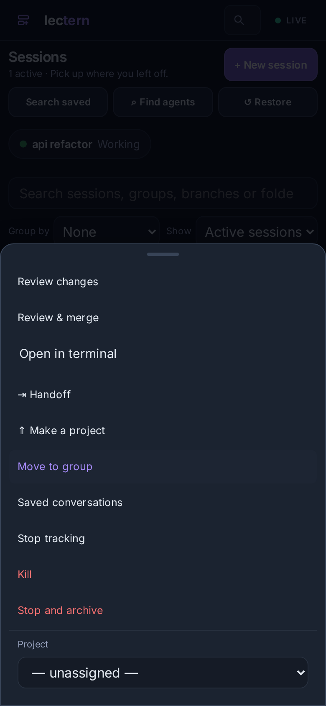
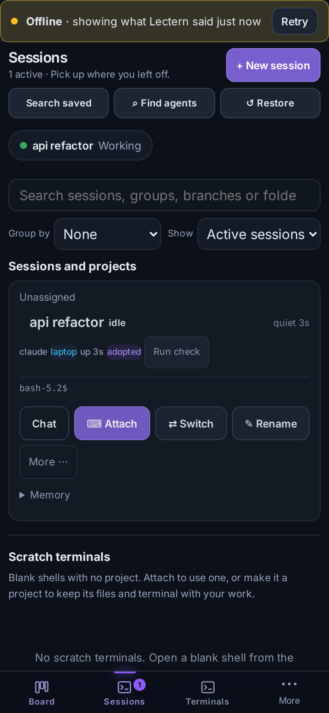
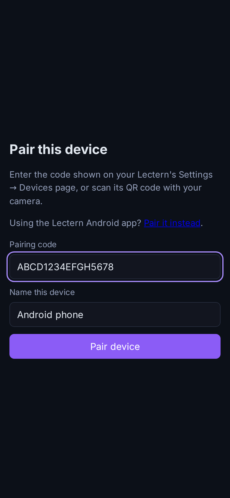
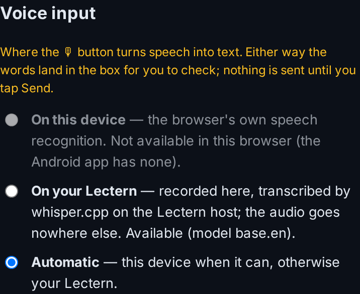
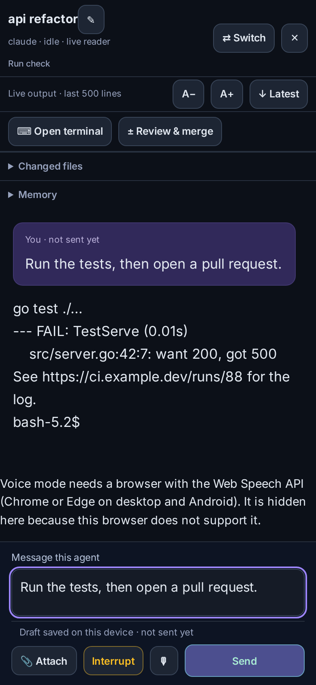

# Using sessions on a phone

Every device opens on Sessions, the home page; an explicit URL still wins. The
bottom bar is **Sessions · Approvals · Tasks · Settings · More** (Terminals joins
it while a terminal is open), and Approvals carries the count of what is waiting
for you. Session status uses four words everywhere — **Working**, **Needs you**,
**Idle**, **Ended** — and "Needs you" means an approval or permission prompt,
never an agent quietly at its prompt.
Blank shells with no project sit under their own **Scratch terminals** heading,
apart from **Sessions and projects**, and both lists keep the search, scope and
grouping controls. **Make a project** on a scratch card promotes it without
moving its files or restarting its terminal. Agent cards put **Chat** first.

**Start an agent** opens with a **Folder**, an **Agent** and one toggle, **Ask
before risky actions** (on for a new install), and one **Start** button; the
name, group, launch profile, model, worktree isolation, sandbox, start mode and
first message wait behind **More options**. **Choose…** browses the machine's
folders; starting in a folder that is not a project yet adds it to your
projects. Only agents found on that machine are offered, the rest under **More
agents…**; with none installed, **Try a demo agent** runs a scripted stand-in.
The chosen folder and machine are spelled out beneath the picker, and the launch
summary next to Start says whether the agent will ask. This browser remembers
the project you picked last (a deliberate **new empty folder** included) and
lists recently opened projects first, in Start an agent and in Terminal's
new-terminal menu. A creation that fails is not remembered as recent.

Two quick shells never read the same: each scratch card is titled with its own
scratch folder, shows that full path so it can be read or copied, and keeps
**✎ Rename** for a name you recognize. Renaming changes the card only — the
folder, its files and the terminal stay where they are — and the name survives a
reload. Cards nobody renamed are titled from their folder; stored rows are never
rewritten behind your back.
**Terminal** remains one tap away. Chat preserves
an unsent draft on the device, shows connection state, and offers working-file
changes. **Needs you** collects pending approvals, setup/task failures and work
ready for review. A failed refresh is shown explicitly. The chat box sends on
Enter (Shift+Enter adds a line); on a touch-only phone Enter adds a line and the
Send button sends — Settings → Basics → **Enter in chat** changes either.

In Terminal, session names have their own full-width row. The switcher, new
terminal, search, menu and navigation controls use a separate row. Swipe sideways
on the terminal body to move between open terminals, including full-screen apps
that enable terminal mouse reporting. Vertical drags still scroll; long press
selects text (see [The phone terminal](#the-phone-terminal)) and pinch changes
text size. The terminal fits the visible viewport
when the phone keyboard opens, including browsers that overlay the layout.

**↺ Restore** lists closed, archived, exited and restart-interrupted sessions,
grouped by project with a search box. Each row shows why it closed, its last
message and what one tap will do — usually **Resume**, which continues the saved
conversation. **Other agent…** continues it with a different agent or model.
Ending a session from its card shows an **Undo** toast for ten seconds, and
sessions a restart interrupted get a banner that restores them in one tap.
Sessions a restart brought back on their own are listed in a dismissible
**Relaunched N sessions** notice. A card whose agent quit to a shell prompt says
**agent exited** and offers **↻ Revive**; the terminal view shows the same
prompt. See
[Restoring sessions](terminal-client.md#restoring-sessions).

**Switch agent or model** offers discovered models, saved provider profiles and
favorites. Switching saves a fresh handoff and starts the destination with that
context. It keeps the original session running. The progress display distinguishes
saving from starting, reports failures, and lets you retry. If the new session
already exists but its terminal cannot open, **Open new session** retries only the
attachment. **Go back** opens the predecessor; it does not restart it. This is a
context handoff between agents, not a claim that their native conversation formats
are interchangeable.

Favorites are saved per browser. A favorite for a deleted provider is marked
unavailable; editing a saved provider uses its current configuration. Keep API
keys in a protected server-side credential source or launcher, never in model
names, command arguments or browser storage. A launcher profile is specific to
the targets where its command and credentials are installed.

## The phone terminal

- **Select while it runs.** Hold a finger on the output: the word under it is
  selected in the live terminal, and the same finger drags the selection
  further (the view scrolls at the top and bottom edges). The agent keeps
  running and output keeps arriving. The bar at the top offers **Copy**,
  **Whole lines**, **Open file** / **Open link** when the selection is one,
  and **Done**; a tap anywhere clears it. **Tools → Pause view** still turns the
  whole buffer into native selectable text.
- **Tap to open.** A tap on a web address opens it in the browser (the phone's
  own browser in the Android app); a tap on a workspace path, including
  `path:line:col` as compilers and test runners print it, opens it in the file
  viewer. OSC 8 hyperlinks work the same way (web addresses, and `file://` links
  into the workspace). Paths outside the workspace are not offered.
- **Your key row.** **✎** at the end of the row (or **Tools → Customize key
  row**) reorders and removes keys, adds the ones not shown (⏎, ⌫, Del, ⌕ find,
  …), any Ctrl/Alt/Shift combination (Ctrl-R, Alt-B, Ctrl-←, Shift-Tab …), and
  your quick commands as one-tap keys. A quick-command key points at the
  command itself (stored on your Lectern, the same list as ⚡ and Settings), so
  editing the command changes the key on every device, and a project's
  commands only appear in that project's terminals. Holding an arrow, ⌫, Del or Page Up/Down
  repeats it; a drag along the row scrolls it without pressing anything. The
  arrangement is stored on the device; **Reset** restores the default.

## Gestures, offline and haptics

- **Pull to refresh** at the top of Sessions or Tasks fetches everything
  again (not the whole page).
- **Swipe a session card** right to approve what it is waiting on, left to
  archive it (a live session asks first, since archiving stops it). Every
  archive gets the usual **Undo** toast. A short swipe springs back; a mouse
  never swipes, and the same actions stay on the card's buttons.
- **Menus are bottom sheets** on a phone: a card's **More** opens from the
  bottom edge within thumb reach, over a dimmed page that closes it.
- **Offline.** The lists every home screen starts from (sessions, tasks,
  projects, machines, pending approvals, live views) are kept on the device
  after each successful load. Opening the app with no network, or with the
  relay unreachable, shows them at once under **Offline · showing what Lectern
  said N min ago**; the marker goes as soon as a request gets through, and
  **Retry** asks again. The copy lives in the page's own storage for that
  Lectern, so it works the same in a browser, the installed web app and the
  Android app (which has no service worker); a 401 or forgetting a pairing
  clears it. Actions still need the connection.
- **Haptics.** A committed swipe, a pull that will refresh, a long-press
  selection and the start of a key repeat give a short tick: natively in the
  Android app, through the Vibration API in browsers that allow it.

## Pairing links

Under each pairing QR code (Settings → Phone & devices), **Copy link** and **Share…**
send the same one-time link by message or email instead of scanning it. The
https link works in any browser and in the installed web app. **Open in
Android app** is its `lectern://pair?…` twin, and the pairing page itself, opened
in a phone browser on Android, offers the app too. The app only fills in its
pairing screen from a link; nothing is paired until you tap **Connect**. See
[android.md](android.md#pairing-links-and-several-lecterns).

## Dictation on your Lectern

The 🎙 buttons can transcribe on the Lectern host with
[whisper.cpp](https://github.com/ggml-org/whisper.cpp) instead of the browser's
own speech recognition. It is the only option in the Android app (its WebView
has no speech recognition) and a choice anywhere else for keeping audio off a
browser vendor's service. The phone records 16 kHz mono WAV, sends it to your
Lectern only (through the relay when paired over it), and the text lands in the
box for you to check; nothing is sent on your behalf.

Setup on the host: install whisper.cpp so `whisper-cli` (or `whisper-cpp`) is on
PATH, and put a ggml model where its download script puts them (for example
`~/.local/share/whisper.cpp/models/ggml-base.en.bin`), or set
`LECTERN_WHISPER_BIN` and `LECTERN_WHISPER_MODEL`. `LECTERN_WHISPER_LANG`
(default `auto`) and `LECTERN_WHISPER_THREADS` are optional. Nothing is
downloaded for you. Choose the engine in **Settings → Notifications → Voice
input**; **Automatic** uses the device when it can. Transcription needs a
signed-in person (like deciding an approval), runs one recording at a time, and
takes up to five minutes of audio (three minutes per recording from the app).
Voice mode's continuous conversation still uses the browser's speech
recognition.

## A handled notification leaves every device

When an approval is decided anywhere (another phone, the desk, the terminal,
or it expires) Lectern sends every subscribed device a withdrawal for that
approval's notification. The Android app removes it. A browser closes it too;
because browsers require every push to leave something visible unless the app
is on screen, when it was the last notification showing it is replaced,
silently and under the same tag, by one line saying what happened ("Approved on
another device"). ntfy-topic and Discord messages cannot be withdrawn.

Native keyboard and gesture coverage, limitations, and the nightly audit are
in [Mobile terminal testing](testing/mobile-terminal.md). The Android fixture is
disposable and never types into a person's running agent.

## Chat cards and graduated approvals

Chat for a live session defaults to **structured cards**, not a dump of the
tmux pane. The server locates the session's own Claude JSONL or Codex rollout
file — the same identity-verified reader the saved-conversation picker
already uses, reused rather than reimplemented — and decodes it into typed
turns (assistant/user text as light markdown, a collapsed **Thinking** entry
for private reasoning, and one card per tool call) instead of the flattened
display string the plain-text history reader produces. The phone polls
`GET /sessions/{id}/conversation/live` and only asks for what was appended
since its last look; **Terminal text** is one tap away in the same controls
row, and is what a session falls back to automatically if its log can't be
found (a shell-tracked session, an agent without a reader, or a sandboxed
session) — nothing more to do, the toggle itself simply isn't offered.

Every tool call collapses to a title and, on a phone, one tap away: Read/
Edit/Write/MultiEdit show the file path and, for an edit, a real diff (the
same renderer the session review diff uses); Bash and Codex's `exec_command`
show the command and its output; Grep/Glob show the pattern; WebFetch/
WebSearch show the host or query; TodoWrite renders as a checklist; a
sub-agent `Task` shows its description; an MCP tool's `mcp__server__tool`
wire name becomes "server · tool"; Codex's `apply_patch` gets the same diff
treatment, split per file. A tool this registry doesn't specifically know
still gets a real card — name plus collapsed, pretty-printed arguments —
never a raw JSON blob.

**Approvals are graduated**, and one card shows them everywhere — the session
card, the Approvals page, the chat and Needs you: **Allow once** (key **Y**)
decides just this call; **Allow for this session** (**A**) tells the broker to
stop asking for this same tool, or this Bash command's first word, for the rest
of the session, entirely in memory and forgotten when the session ends (a task
attempt's approval has no session, so there it is **Always allow in this
project**); **Deny…** (**N**) opens a note that is sent back to the agent as
the hook's denial message. The
approval's command or diff renders through the same tool-view registry as a
chat card, never `JSON.stringify(approval.input)`. Claude and Codex
interactive sessions share one PermissionRequest hook path end to end, so
"Allow for this session" behaves identically for both; it has nothing to do
with Codex's separate app-server driver, which only ever backs a scheduled
task attempt, never an interactive chat.

## Glanceable home, voice, badges and richer alerts

A **Now** strip sits at the top of Sessions: one chip per live session (working
/ waiting / done / error) and, when any exist, how many approvals are
waiting — a tap on either jumps straight there. It is the PWA analogue of a
native app's Live Activity, since a browser tab cannot keep one on the lock
screen. The app icon's own **badge** (where the platform supports it) mirrors
the same count — set from the page on every refresh, and bumped by the
service worker itself on a push, so it stays roughly right even between page
loads; it clears the moment nothing needs you.

Wherever there is a text box for a reply — the chat composer and the
Needs-you "deny with reason" field — a mic button appears if the browser
supports the Web Speech API and stays hidden if it does not. Interim words
show up as they are heard and are replaced, never duplicated, once
recognized; nothing is ever sent on your behalf; you still tap Send.

## Voice mode

Below the composer in a live session's Chat view, **🎧 Voice mode** turns the
same free Web Speech API into a hands-free loop instead of just dictation —
no vendor keys, no metered API. Tap it once; nothing listens until you do.

- **Talking to the agent.** While on, it listens continuously and shows the
  live transcript. Pausing for about 1.5 seconds, or ending with "**send
  it**" or "**over**", sends the utterance — after a 2-second **"Sending…
  tap to cancel"** window, so a misheard phrase never reaches the agent
  unreviewed.
- **Hearing it back.** New agent output is read aloud, sentence by sentence,
  as it arrives. Terminal noise (ANSI colors, box-drawing borders) is
  stripped first, and a fenced code block is announced as "Code omitted."
  rather than read character by character. Starting to talk immediately
  interrupts whatever is being spoken (barge-in) — you are never stuck
  waiting for a reply to finish before you can jump in.
- **Spoken approvals.** A pending approval is announced — "Claude wants to
  run \<command\>. Say approve or deny." — and answered by saying **approve**
  / **allow** / **yes** or **deny** / **no** / **stop**, alone or with
  "please" (a sentence that merely mentions the word, like "don't approve
  that yet", is never mistaken for the decision). The decision is always
  echoed back, spoken and on screen ("Approved." / "Denied."), before it
  takes effect.
- **Voice commands**: "**interrupt**" or "**stop that**" sends the same Escape
  key as the composer's Interrupt button; "**read that again**" repeats the
  last thing spoken; "**exit voice mode**" turns it off.
- **Settings** (voice, speaking rate, language, auto-read on/off) are stored
  per device and reached from the ⚙ link in the panel.
- **Fallback and capability handling.** Where continuous background listening
  is not available — notably iOS Safari, including inside an installed PWA
  on some versions — voice mode falls back to **push-to-talk**: hold the mic
  button, speak, release. A browser with neither `SpeechRecognition` nor
  `speechSynthesis` never shows the toggle at all; it explains why in its
  place instead. A screen **Wake Lock** is requested while voice mode is on
  (and tolerated if the browser refuses it), so the screen does not sleep
  mid-conversation.

Notifications for the same session replace each other in the tray instead of
stacking (grouped by session, or by approval, or by kind for a broadcast like
a failed check). A session waiting on you gets **Open terminal** and
**Reply** actions alongside the usual tap-to-open — Reply opens the chat with
the composer already focused. iOS Safari not yet added to the Home Screen
gets explicit numbered steps in Settings → Notifications, not just the one
reason sentence every other unavailable case gets.

The terminal's Tools menu on a phone carries one more, deliberately
low-profile item: **Report keyboard layout**, which captures the exact
viewport/keyboard numbers this device is reporting — for pasting into a bug
report when the phone keyboard covers the prompt in a way no emulator has
reproduced (see the keyboard-coverage history in
[Mobile terminal testing](testing/mobile-terminal.md)).
