# Review

**Review & merge** is where you read what a session changed, tell its agent
what to fix, and commit the result. Open it from a session card
(**More → Review & merge**), from the conversation view, or with **Review
changes** on a session's terminal page. The installed app
and the Android app show the same page, with the phone layout described
below. The terminal page's button opens the workspace for sessions only.
Project shells and task attempts keep the read-only changes view.

Implementation: `frontend/src/review/`, `internal/api/session_review.go`,
`review_git.go`, `review_comments.go`, `review_attribution.go` and the
target-side helper `internal/api/scripts/review_git.py`. Every git command
runs on the session's own target through its executor, so remote targets
behave like local ones.

The panel has four tabs: **Changes**, **Commit**, **Conflicts** (only while a
merge or rebase has conflicts) and **Checks**.

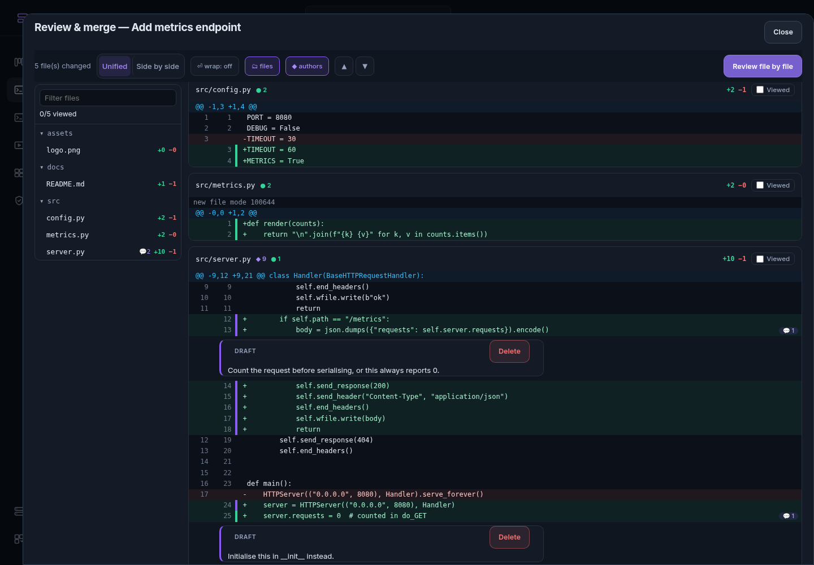

## Changes

The live diff against the merge-base with the base branch, including
uncommitted and untracked files. A grouped workspace shows every repository;
the repository menu narrows it to one.

- **Unified / Side by side.** Both layouts show old and new line numbers.
  The choice is remembered per device, as are word wrap, the file tree and
  the authorship marks.
- **Files.** A tree of changed files with +/− counts, open comments and
  viewed marks. Select a file to jump to it.
- **▲ ▼** move to the previous or next hunk.
- **Viewed.** Marking a file viewed folds it. The mark is stored with a
  fingerprint of the diff you saw, so it clears itself when the file
  changes.
- **Images.** A changed image shows before and after, with **2-up**,
  **Swipe** and **Onion skin** views. Images are sent to the page as data
  URLs, so an SVG never runs script.

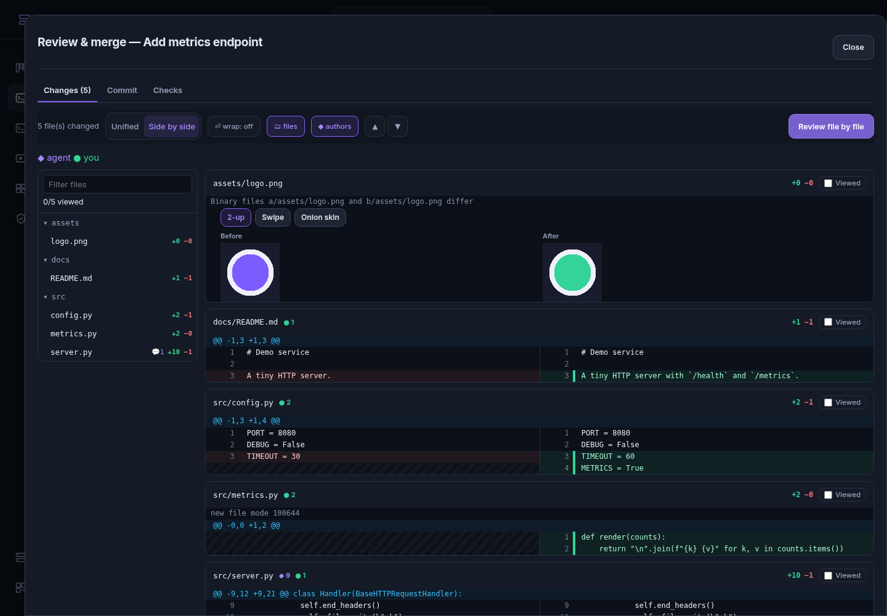
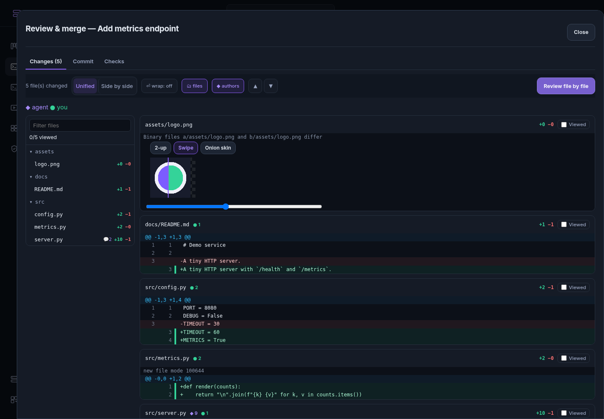

### Who wrote each line

With **◆ authors** on, each added line has a mark in the gutter: purple for
the agent, green for you. The file header counts both.

Lectern works this out from two things it already sees:

1. **The agent's own edit hooks.** A `PostToolUse` hook for Edit, MultiEdit
   or Write (Claude Code's `structuredPatch`, or the edit's new text), or a
   Codex `apply_patch`, reports the lines the agent wrote. Lectern keeps a
   hash of each line per session and file (`agent_line_marks`).
2. **Git history.** A committed line belongs to the agent when the commit
   that last touched it has an agent co-author trailer or an agent author.

Codex's `apply_patch` payload was checked against a real one: codex 0.157
run against a stand-in model server, with no login. The test uses that
payload verbatim.

Lines are matched by content, so a line you edit becomes yours. A line the
agent wrote and you committed stays the agent's. Uncommitted lines are only
marked once the session's agent has reported at least one edit; before that,
Lectern cannot say either way, and leaves them unmarked. Blank lines are
never marked.

`GET /api/sessions/{id}/attribution` returns the line ranges per file.

Marks are pruned so the table does not grow forever. Each attribution request
drops the marks for lines that are no longer anywhere in a changed file, and
every mark for a file that no longer differs from the base. It skips this
when the diff was truncated. Marks of a session that ended more than 14 days
ago are dropped at most once an hour.

## Comments to the agent

Tap or click any line to comment on it. Comments are saved on the server
(`review_comments`), so a phone and a desktop see the same drafts.

**Send to agent** sends every draft in **one** message, so the agent can plan
across all of them. Each comment names its file and line and quotes the code:

```
Code review feedback (2 comments):

1. src/server.py:13 (new side)
   > body = json.dumps({"requests": self.server.requests}).encode()
   Count the request before serialising, or this always reports 0.

2. src/server.py:25 (new side)
   > server.requests = 0  # counted in do_GET
   Initialise this in __init__ instead.

Please address each point above.
```

Each send is a numbered round. A comment remembers its line's code and up to
two lines either side. When the diff changes, Lectern finds the line again
by that content, so a comment stays on its code when the agent adds or
removes lines above it.

After the agent works, each sent comment shows one of:

- **Agent changed this**: the line or the code around it changed, or the
  line is gone.
- **Not changed yet**: the code is exactly as it was.
- **Resolved**: you marked it done.

**Resolve** the ones that are done and **Reopen** the rest. Reopened comments
go out in the next round, marked "raised again". The Sent comments section
has buttons to do this for all of them at once.

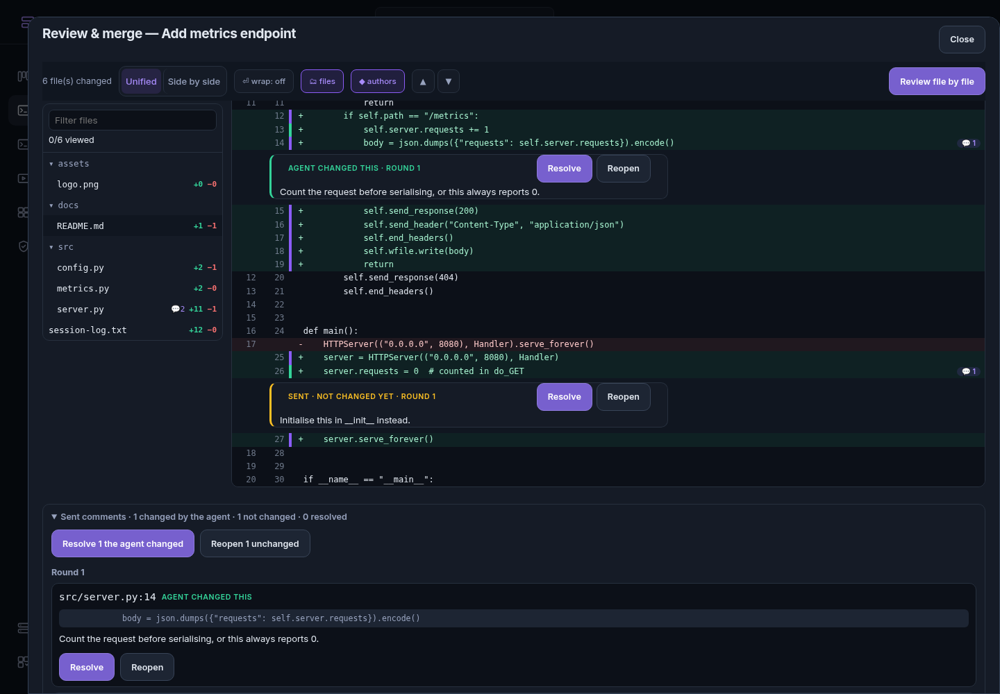

API: `GET /api/sessions/{id}/review/state` lists comments and viewed marks.
Use `POST`, `PATCH` and `DELETE` on `/api/sessions/{id}/review/comments[/{cid}]`
to manage comments, and `PUT /api/sessions/{id}/review/viewed` to set a viewed
mark. `POST /api/sessions/{id}/review` with `comment_ids` sends stored drafts,
and still accepts inline `comments`.

Task reviews (the board's diff view) use the same viewer and send their
comments as request-changes feedback.

## Commit

The **Commit** tab shows the branch, its upstream and ahead/behind counts,
and the working tree split into **Staged** and **Changes**.

- **Stage**, **Unstage** and **Discard** work per file, or for everything at
  once. Open a file to do the same per hunk. A hunk is named by its index and
  a fingerprint of its text, and the server checks both again before
  applying anything. A stale click is refused rather than applied to the
  wrong hunk.
- **Single lines.** Tick added or removed lines in a hunk and the buttons
  become **Stage 2 lines**, **Unstage 2 lines** or **Discard 2 lines**. It
  works like `git add -p` editing: an unticked addition is left out, an
  unticked removal stays as context.
- **New files** can be staged, unstaged and discarded by hunk or by line too.
  Lectern gives the index an empty entry for the file to apply against.
  Discarding every line of a new file deletes it.
- **Discard** asks first, inline. It restores tracked files from the index
  and deletes untracked ones.
- **✨ Write message** asks a cheap model for a commit message. The model
  reads the staged diff, or every change when nothing is staged. It uses the
  `commit_message_agent` and `commit_message_model` settings when set.
  Otherwise it uses the session's own agent (Claude with `haiku`, or Codex
  with the session's model), then the PR-description settings.
- **Commit** commits what is staged. When nothing is staged, it commits every
  change.
- **On the default branch** (every session started without a worktree works
  straight in the project's checkout) Commit asks where to go instead of
  refusing: **Commit on a new branch** (the default) creates a branch named
  from the session — `lectern/fix-login`, with `-2`, `-3`… when taken — and
  commits there; **Commit to main directly** needs a tick box first and a
  signed-in person. API: `new_branch` or `allow_base_branch` on the commit
  request; without either the answer is 409 with `code: "on_base_branch"`.
- A control that cannot be used says why beside it: no commit message, an
  ended session, or — for **Push to origin**, which starts unticked — a
  repository with no remote (`has_remote` in the status).
- **Amend the last commit** is refused when that commit belongs to the base
  branch. When the commit is already on a remote branch, Lectern says so and
  asks before rewriting it.
- **Force push (with lease)** appears when the branch and origin have
  diverged, or right after you amend a pushed commit. It asks for
  confirmation. The push is pinned to the remote commit you were shown, so
  it fails if anyone pushed since.
- **Push to origin** and **Open a PR** work as before, including
  **Generate description** and the CI loop.

When a commit hook rejects the commit, the hook output is shown with
**🛠 Fix with agent**. That sends the output to the session with a few rules:
start with `git status`, don't bypass the hook, and don't commit. Then commit
again yourself.

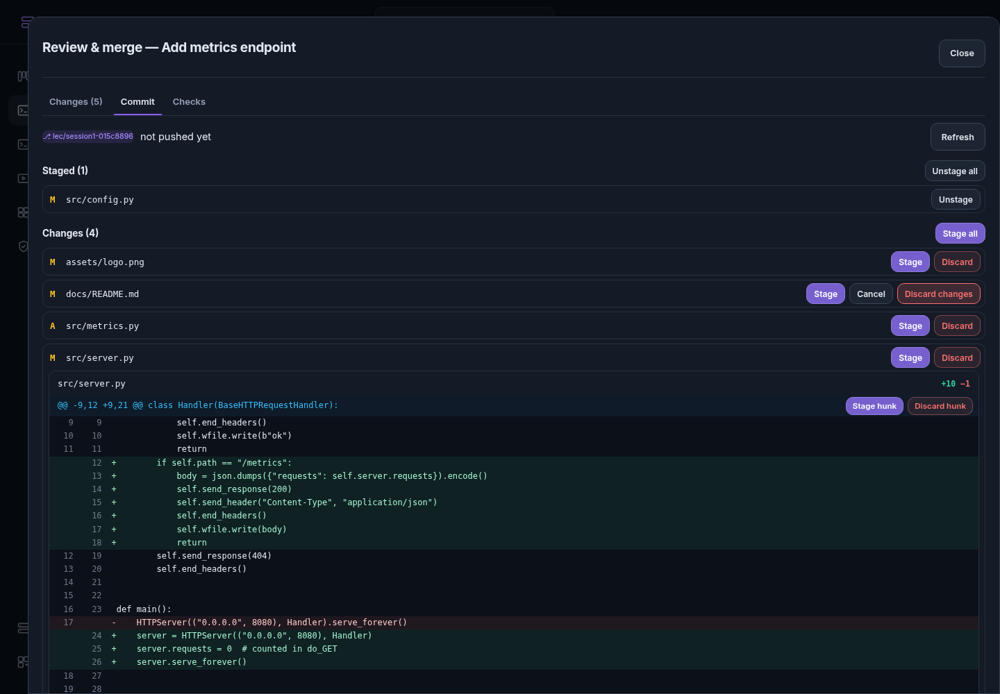
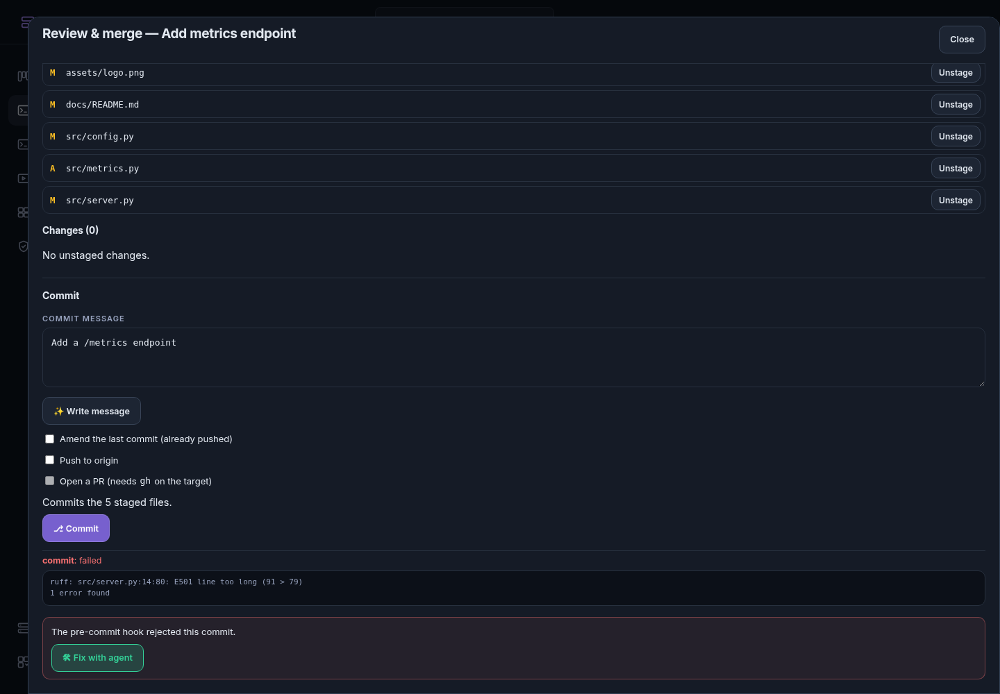
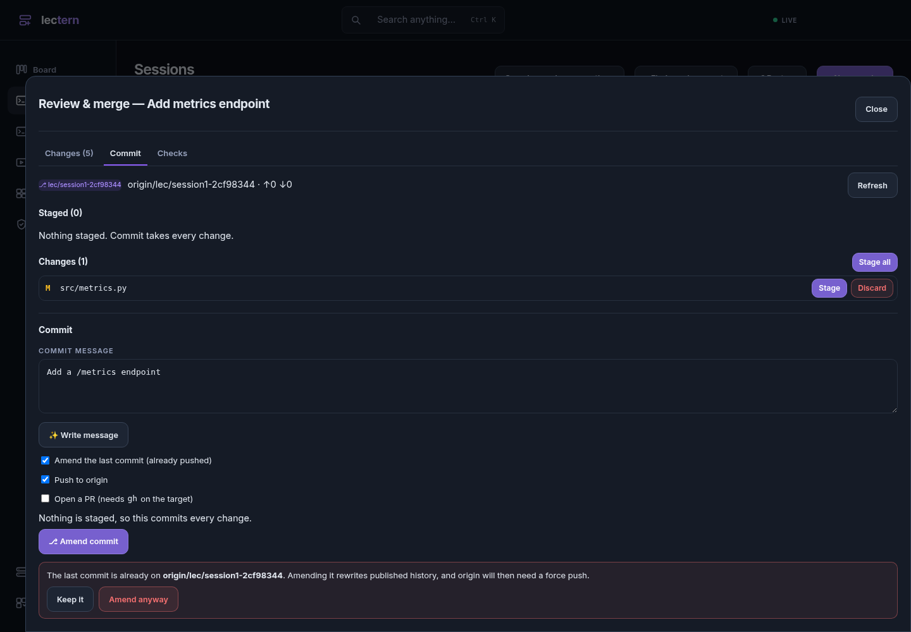
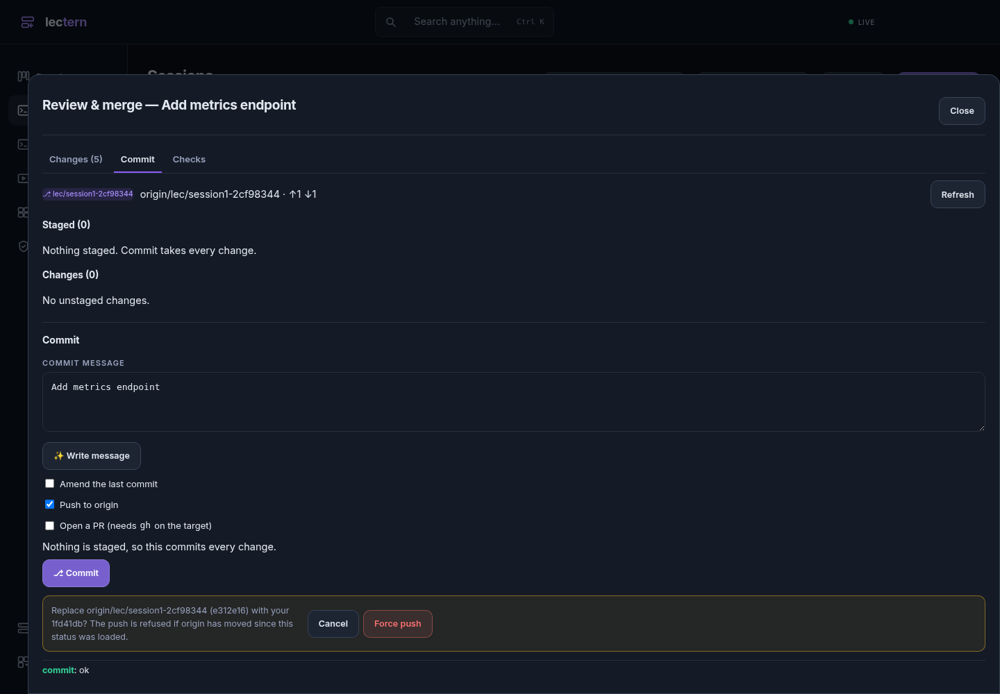

API: `GET /api/sessions/{id}/git` and `POST /api/sessions/{id}/git/`
followed by `stage`, `unstage`, `discard`, `hunk`, `commit`,
`commit-message`, `push` or `fix-hook`.

## Conflicts

During a merge, rebase or cherry-pick, the **Conflicts** tab lists the
conflicted files. For each conflict it shows **ours**, the common
**base** and **theirs** side by side. Git's own three sides are rendered with
diff3 markers, so the base is there even when the checkout wrote two-way
markers.

- **Accept ours**, **Accept theirs** and **Accept both** decide one conflict
  at a time.
- **Result** is the whole file, rebuilt from those choices. You can edit it
  freely.
- **Mark resolved** writes the file on the target and stages it. A result
  that still contains conflict markers is refused unless you confirm.
- **Take ours/theirs for the whole file** is available for binary files and
  for files one side deleted.

When nothing is left in conflict, the Commit tab offers git's merge message.
Committing finishes the merge. **Abort** abandons it.

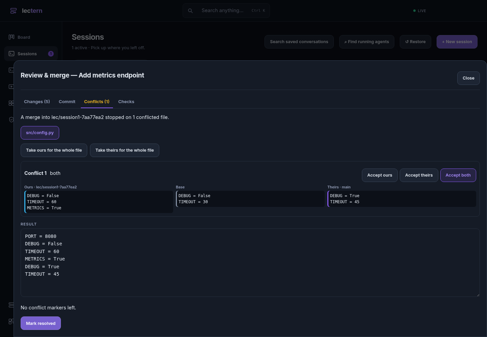

## On a phone

The same panel fills the screen. Two things behave differently to keep the
diff visible: the comment tray folds to a single line, and the toolbar
scrolls away instead of staying pinned. **Review file by file** opens a
full-screen reviewer that shows one file at a time:

- **▲ Prev hunk** and **Next hunk ▼** move through the file, then on to the
  next file.
- **‹ File** and **File ›** move between files.
- **Mark viewed** records the file and moves to the next unviewed one.
- Tap a line to comment. **Send** in the bottom bar sends your drafts.

On a keyboard, `j`/`k` (or `]`/`[`) move between hunks and `v` marks the file
viewed.

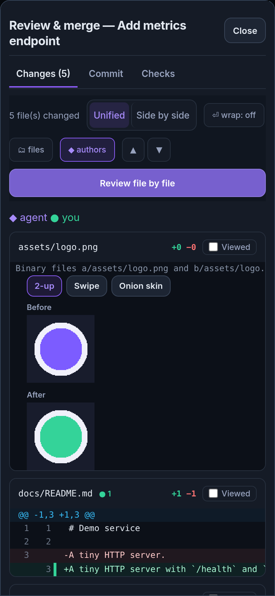
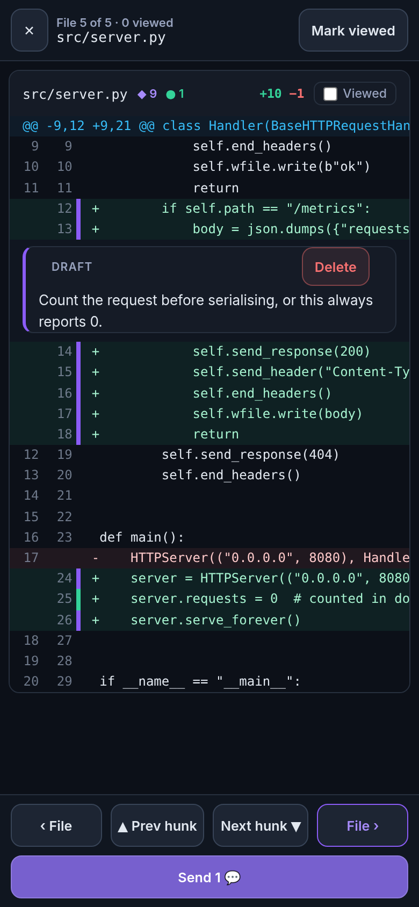
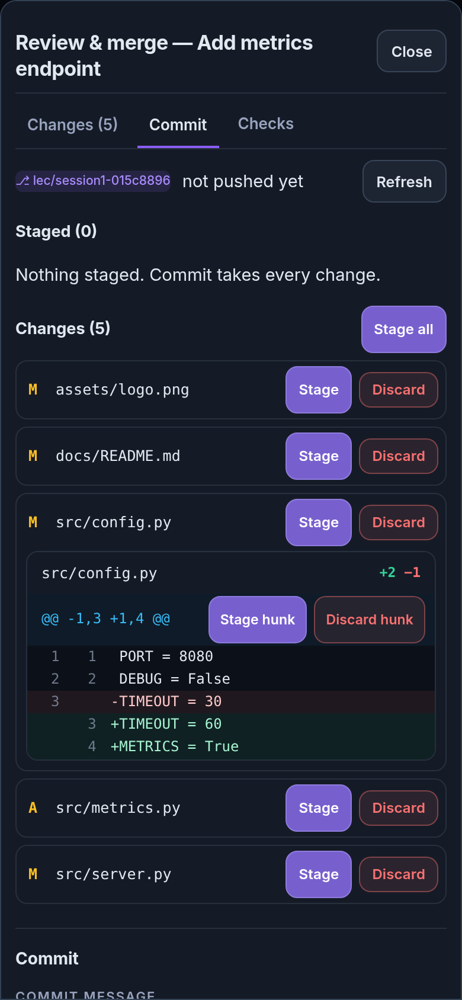
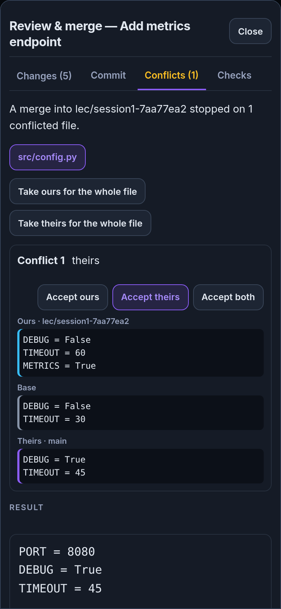

### In the Android app

The Android app shows this same page. It was checked on an Android 14
emulator with the debug APK built from this branch, paired directly, using
real taps and typing:

- comments written with the keyboard up;
- two comments sent as one message;
- file-by-file review moving through the files by hunk;
- one line of a new file staged.

<p>
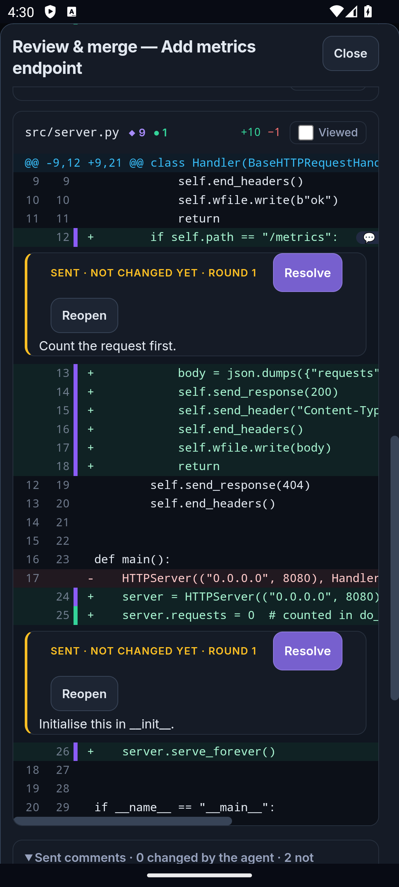
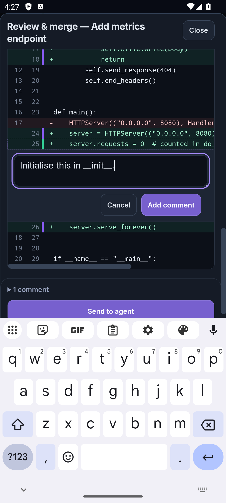
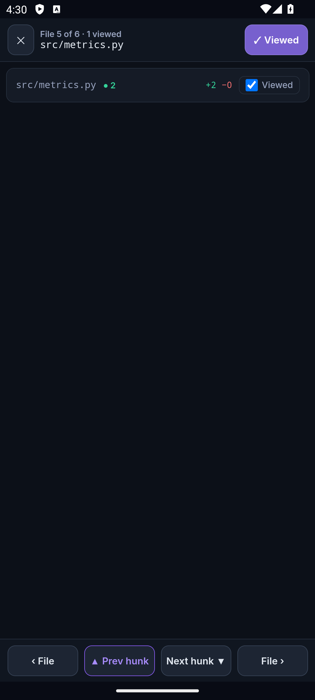
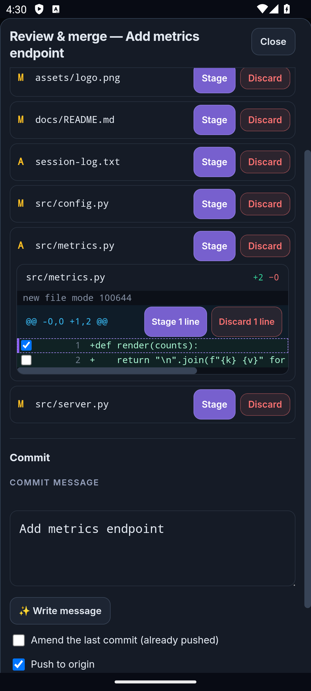
</p>

## Who can do what

Reading, commenting, staging and a plain commit follow the rules the Commit
button always had. The following need a signed-in human (a tailnet login, the
access token or a paired device), the same rule approvals use:

- discarding changes, by file or by hunk;
- resolving or aborting a merge;
- amending a commit that is already pushed;
- force pushing.

An agent or another process on the host cannot do these.

## A fix that came with this

Opening the live diff used to run `git add -A -N`. That also re-added every
conflicted path, so opening **Review & merge** during a merge silently
dropped the conflict. The live diff now marks only untracked files
intent-to-add. **Abort** clears those marks first, because git refuses to
abort while they are present.
