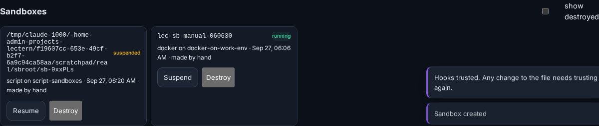

# Sandboxes

A sandbox machine gives every task attempt a fresh environment of its own,
made when the attempt starts and removed when it ends. The sandbox is the
isolation, so agents there may run with permissions bypassed. Three providers:

| Provider | A sandbox is | Suspend / resume |
| --- | --- | --- |
| **Proxmox** (default) | a linked clone of a template LXC on this node (`pct clone`) | `pct suspend` / `pct resume` |
| **Docker** | a container from your image, on this server or on any machine Lectern reaches | `docker pause` / `unpause` |
| **Script** | whatever your hooks make: Fly Machines, Modal, Vercel Sandbox, a VM API, a directory | your hooks, if you write them |

Code: `internal/sandbox/provider.go`, `internal/scheduler/sandboxes.go`,
`internal/api/sandboxes.go`, `frontend/src/remote/Sandboxes.tsx`. Store:
`targets.sandbox_json`, `sandboxes`, `attempt_env`.

## Adding one

Settings → Machines → **Add machine** → *Sandboxes*, then pick a provider. Or:

```bash
curl -X POST /api/targets -d '{"name":"docker-sb","kind":"sandbox","sandbox":true,
  "sandbox_config":{"provider":"docker","image":"ghcr.io/you/dev:latest","machine":"build-box"}}'
```

Projects on a sandbox machine clone their repository into the sandbox when
`repo_path` is a URL, or use a path already in the image or template.

Changing the provider (`PUT /api/targets/{id}/sandbox`), creating, suspending,
resuming and destroying sandboxes, and trusting hooks all need a signed-in
person.

### Docker

- **Image**: needs `bash`, `git`, `tmux`, `python3` (for port forwarding) and
  your agent CLI, like any machine. It is started with `sleep infinity` and the
  agent runs in tmux inside it.
- **Docker runs on**: this server, or any machine: the machine's own executor
  runs the `docker` CLI, over SSH if it is remote. **Docker host** adds `-H`
  (`ssh://`, `tcp://`) for a daemon the CLI reaches itself.
- **Extra run arguments**: e.g. `--memory 4g`, `--cpus 2`, `--network none`.
- Containers are named `lec-sb-<attempt>-…` and labelled `lectern.sandbox=1`.

Terminals into a Docker sandbox work when Docker runs on this server or on an
SSH machine. Forwarding a sandbox's port works when Docker runs on this server.

### Script

A `lectern.sandbox.yaml` with shell hooks. The path is set on the machine;
`{repo}` is the project's repository path, so the file can live in the repo:

```yaml
create: |          # print the sandbox id as the last line of output
  fly machine run registry.fly.io/dev:latest --app my-sandboxes \
    --env ATTEMPT=$LECTERN_ATTEMPT_ID --detach --json | jq -r .id
exec: |            # run $LECTERN_COMMAND in $LECTERN_CWD inside it; pass stdin through
  fly machine exec "$LECTERN_SANDBOX_ID" --app my-sandboxes \
    "bash -c 'cd ${LECTERN_CWD:-.} && $LECTERN_COMMAND'"
suspend: fly machine suspend "$LECTERN_SANDBOX_ID" --app my-sandboxes
resume: fly machine start "$LECTERN_SANDBOX_ID" --app my-sandboxes
destroy: fly machine destroy "$LECTERN_SANDBOX_ID" --app my-sandboxes --force
attach: |          # optional: an interactive terminal running $LECTERN_COMMAND
  fly ssh console --machine "$LECTERN_SANDBOX_ID" --app my-sandboxes -C "$LECTERN_COMMAND"
env:
  FLY_API_TOKEN_FILE: /etc/lectern/fly-token
```

`create`, `exec` and `destroy` are required. Every hook sees
`LECTERN_SANDBOX_ID` (not `create`), `LECTERN_ATTEMPT_ID`,
`LECTERN_SANDBOX_NAME`, the file's `env`, the machine's env and the dispatch's
env. Files move into the sandbox in base64 chunks through `exec`, so a hook
that cannot pass stdin still works; streaming downloads need one that can.
The Fly commands above are an example to adapt, not something Lectern has run.

**Trust.** Hooks run on the Lectern server, and the file may live in a
repository an agent can edit. So Lectern runs them only while the file matches
a sha256 a person trusted: the machine's **Provider** panel shows the file and
a **Trust these hooks** button, and any change needs trusting again
(`GET /api/targets/{id}/sandbox/hooks`, `POST .../sandbox/trust`).

## Lifecycle

Settings → Machines → **Sandboxes** lists every sandbox Lectern made, with
its provider, machine, task and state, and **Suspend**, **Resume** and
**Destroy** where the provider supports them. **+ Sandbox** on a sandbox
machine makes one by hand (to warm a provider, or for a scratch environment).
API: `GET /api/sandboxes[?all=1]`, `POST /api/sandboxes {"target_id":…}`,
`POST /api/sandboxes/{id}/suspend|resume|destroy`.



When an attempt ends the machine's **on finish** setting applies: **destroy**
(the default; the diff, events and check output are already saved), **suspend**
it for later, or **keep** it running. A cancelled attempt's sandbox is always
destroyed, and so is one whose launch failed.

## Environment per workspace

A dispatch can carry its own environment for the attempt's workspace:

```bash
curl -X POST /api/tasks/7/dispatch -d '{"env":{"FEATURE_FLAG":"on"}}'
```

It reaches every attempt of that dispatch, both the sandbox (`docker run -e`,
the hooks' environment) and the agent's own launch, and it wins over the
project's environment. Sandboxes also get `LECTERN_TASK_ID`,
`LECTERN_ATTEMPT_ID` and `LECTERN_PROJECT`.

## Checked for real

- Script provider: `internal/sandbox/provider_test.go` runs every hook on this
  machine with a directory-per-sandbox hooks file.
- Docker: the same test file's `TestDockerProviderAgainstARealDaemon` (opt in
  with `LECTERN_REAL_DOCKER_SSH=user@host LECTERN_REAL_DOCKER_IMAGE=…`) makes,
  uses, pauses, resumes and removes a container through a remote machine's
  Docker over SSH. It was run against Docker 29.2.1. The Lectern server used
  for development has no Docker of its own, so the local-daemon path is
  covered by command tests only.
- Proxmox: the existing lifecycle tests, unchanged.
