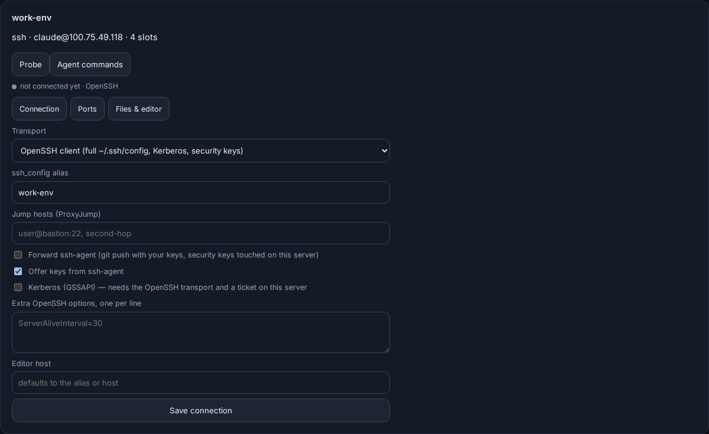
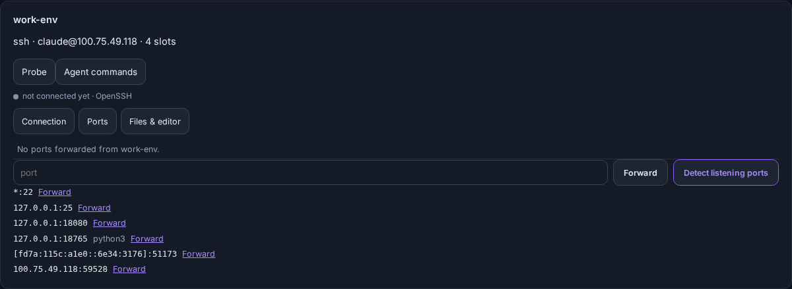

# SSH machines

Any machine Lectern reaches over SSH can run agents. This page covers the SSH
options beyond host, user, port and key: importing hosts from your SSH config,
jump hosts, ssh-agent and security keys, Kerberos, the connection state, port
forwarding, downloads and opening a workspace in your editor.

Code: `internal/executor/{ssh,openssh,sshopts,connstatus}.go`,
`internal/sshconfig`, `internal/api/remote_ssh.go`,
`frontend/src/remote/`. Settings → **Machines**.

## Import from `~/.ssh/config`

Settings → Machines → **Import from ~/.ssh/config** lists every plain `Host`
name in the Lectern server's SSH config (following `Include`), resolved the
way `ssh -G` resolves it, so `Match` blocks, wildcards and defaults apply.
Tick the hosts and press **Import**: each becomes a machine named after its
alias.

When the `ssh` client is installed on the server, imported machines use the
**OpenSSH transport** and connect by alias, so everything the entry says
applies: `ProxyJump`, `ProxyCommand`, certificates, `IdentityAgent`, Kerberos.
Without it they use the built-in client with the resolved host, user, port,
key and jump hosts.

`LECTERN_SSH_CONFIG` points Lectern at another file. The OpenSSH transport and
the web terminal then use it too (`ssh -F`).

API: `GET /api/ssh/hosts`, `POST /api/ssh/import {"aliases": [...],
"transport": "openssh"|"builtin"}`. Both need a signed-in person: they read
the server's own SSH setup.

## Connection options

Each SSH machine has a **Connection** tab (`PUT /api/targets/{id}/ssh`, a
signed-in person only):

| Option | What it does |
| --- | --- |
| Transport | **Built in** (Go SSH client: key files and ssh-agent) or **OpenSSH** (the system `ssh`, with one multiplexed master connection per machine) |
| ssh_config alias | Connect by this `Host` name (OpenSSH transport and terminals) |
| Jump hosts | `ProxyJump`, e.g. `user@bastion:22,second-hop`. Both transports support it; the built-in client authenticates each hop with the same keys |
| Forward ssh-agent | `-A`: the agent is available to commands Lectern runs, e.g. a `git push` over SSH |
| Offer keys from ssh-agent | The built-in client tries the agent's keys after key files (on by default) |
| Kerberos (GSSAPI) | Adds `GSSAPIAuthentication=yes` and `GSSAPIDelegateCredentials=yes` |
| Extra OpenSSH options | `Key=Value` lines from an allowlist |
| Editor host | How your own computer reaches this machine, for editor links |

**Security keys (FIDO2 `sk-` keys).** The built-in client cannot use a
security key file directly, because the private half lives in the hardware.
Either load the key into ssh-agent (`ssh-add ~/.ssh/id_ed25519_sk`) and leave
"Offer keys from ssh-agent" on, or switch the machine to the OpenSSH
transport. Lectern names the problem when it is the only key it finds. The
touch happens on the Lectern server, where the key is plugged in. With the
OpenSSH transport's master connection that is once per connection, not once
per command.

**Kerberos.** Lectern passes the GSSAPI options through to OpenSSH and does no
Kerberos itself. The Lectern server needs a valid ticket (`kinit`) for the user
Lectern runs as, and the OpenSSH transport.

**Options that run commands on the Lectern server are refused** as fields:
`ProxyCommand`, `LocalCommand`, `PermitLocalCommand`, `KnownHostsCommand`,
`PKCS11Provider`, `SecurityKeyProvider`, `Match`, `Include` and the connection
multiplexing options. Put them in `~/.ssh/config` and use the alias: that file
is yours, not a value an API caller can set.

**Agent forwarding lasts as long as each command.** Commands Lectern runs
itself (worktree setup, fetches, the Git panel's push) see the forwarded
agent. A long-running agent in tmux does not: its socket goes away when the
command that started it returns.

## Connection state and reconnecting

Each SSH machine shows its state: **connected** (with when the last command
succeeded), **reconnecting** (the connection dropped and the next command dials
again), **unreachable** (the last dial failed, with the reason) or **not
connected yet**, plus the number of reconnects and the jump host in use. The
page probes every 20 seconds while it is open, which also redials a dropped
connection, and **Reconnect** drops the connection and dials a fresh one
(`GET /api/targets/{id}/connection?probe=1`, `POST .../reconnect`).

Web terminals use `ServerAliveInterval=15`, so a dead link is noticed within
about 45 seconds and the browser's own reconnect gets a fresh `ssh`.

The OpenSSH transport reports each command's exit status itself: a
multiplexed `ssh` client sometimes loses the exit message and says 255 for a
command that succeeded.

## Ports

The **Ports** tab lists forwards from the machine's `localhost` to your
browser, with **Stop**, a field to forward another port, and **Detect
listening ports** (`ss`, or `netstat`). A forward is the same as Media → Live →
Expose and `lectern expose`: it needs `LECTERN_LIVE=1` and ends when stopped,
when it times out or when the server restarts. Over the OpenSSH transport a
forward is `ssh -W` on the master connection; over the built-in one it is a
direct-tcpip channel.

## Files and editor

**Download** copies a file, or a folder as `.tar.gz`, straight off the
machine, streamed as it is produced (`GET
/api/targets/{id}/download?path=/abs/path`, a signed-in person only). Paths are
absolute or start with `~/`.

**Open in VS Code / Cursor / Windsurf / Zed** opens a workspace in the editor
on the computer you are using:

- SSH machine: `vscode://vscode-remote/ssh-remote+HOST/path` (Cursor and
  Windsurf use their own scheme), `zed://ssh/HOST/path`. HOST is the editor
  host, else the alias, else `user@host`. VS Code-style links cannot carry a
  port; give such a machine an alias in your own SSH config and set it as the
  editor host.
- This server: a `file://`-style link (`vscode://file/path`), which only works
  in a browser on this server. Set an editor host to open it over SSH instead.
- Proxmox containers and sandboxes have no link unless they have an editor
  host.

The editor is chosen in Files & editor (it follows you across devices) and
appears on session menus and task sheets.
