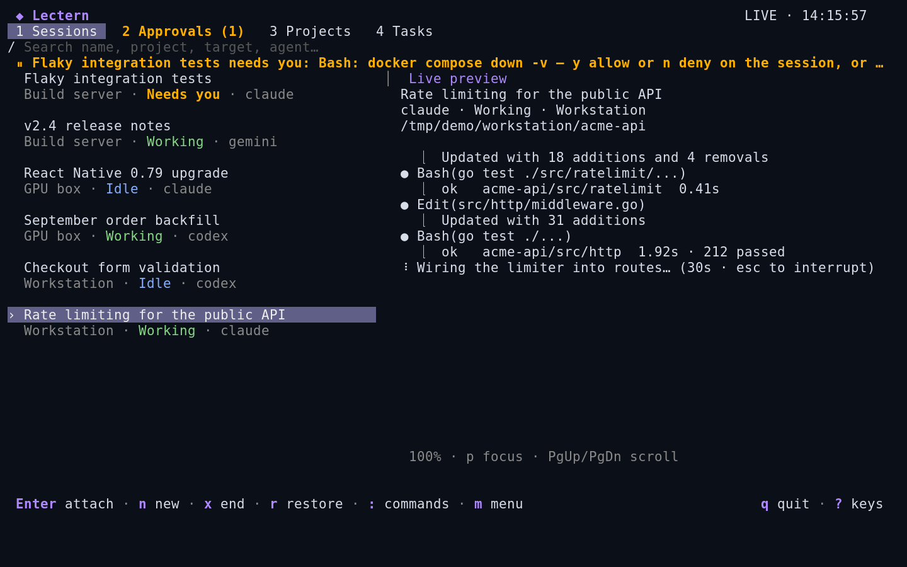
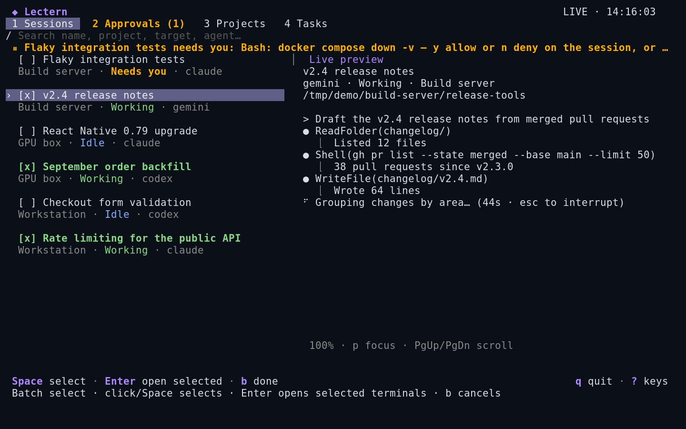
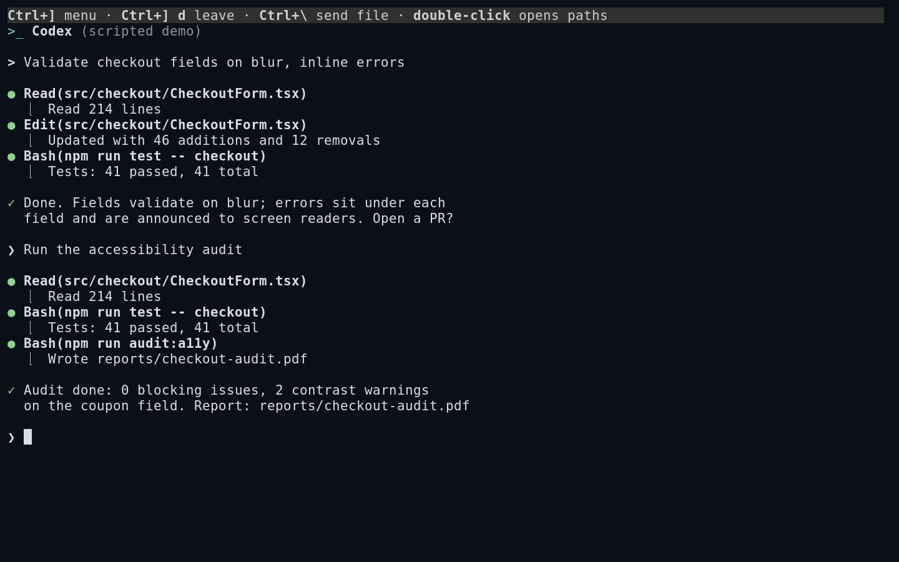

# Use Lectern from a terminal

On a brand-new install, follow [Getting started](getting-started.md): run `lectern up` first. It starts a private local
runtime, detects the agent CLIs on PATH, adds the current git repository as a
project, and opens your browser, signed in, on Start an agent. `lectern
doctor` checks what Lectern needs and can use, and whether agents can reach it
to report status and ask for approval; every problem comes with its fix.
Optional things (other agents, the terminal viewer, push alerts) are WARN or
`--` lines, and doctor exits 0 when an agent can run.

`lectern help` lists the commands by group, and `lectern help COMMAND` or
`lectern COMMAND --help` shows one with examples. `lectern update` installs
the latest release in place, after checking its checksum.

### One command, any folder: `lectern claude` / `lectern codex`

`lectern claude [args...]` and `lectern codex [args...]` are the fastest way
into a tracked session, matching Happy's `happy claude`: no dashboard, no
picking a project first.

```
$ cd ~/projects/lectern
$ lectern claude
Session #14 "lectern · one-command" — also in your browser: run lectern up to open it.
```

Run it in any folder. It starts (or reuses) Lectern exactly like every other
client command — an explicit `LECTERN_API`/`LECTERN_AUTH_TOKEN`, else a
Lectern service running on this machine, else the private local runtime,
started automatically if it isn't already up (see
[Which server](#which-server)) — then:

- Creates a session for `agent=claude` (or `codex`) and `workdir=$PWD`.
- Names it after the folder, plus the checked-out git branch when there is
  one: `lectern · one-command`.
- Attaches it to the project whose registered repository contains `$PWD`.
  On the private local runtime, a git folder with no project yet becomes one
  (named after the repository); elsewhere the session just has a workdir.
- Refuses a built-in agent that is not installed where Lectern runs, naming
  the ones that are, instead of opening a pane that says `command not found`.
- If a live session already exists for that same agent and folder, an
  interactive terminal asks `Attach to existing session 'x' (#id)? [Y/n]`
  (default yes). `--new` always starts a fresh one; `--attach` always reuses
  (and errors if there is nothing to reuse). A non-interactive caller (a
  script, a pipe) defaults to reuse.
- Attaches your terminal to it with the same native attach `lectern attach
  session ID` uses. The bar at the top says `Ctrl+] menu · Ctrl+] d leave ·
  Ctrl+\\ send file · double-click opens paths`. **Ctrl+], then d** leaves
  and returns you to your shell; the session keeps running and stays
  reachable from the dashboard and your phone. (Ctrl-b, then d, still works.)

Extra arguments are the documented subset the session API actually accepts:
`--model NAME` and `--resume`. Anything else is a clear error rather than a
silently dropped argument, since there is no field for arbitrary pass-through
CLI flags.

Run `lectern` in an interactive terminal, or `lectern console`, for the live
dashboard. It opens on Sessions, groups by project, and refreshes automatically.
A single left-click on a session row attaches in the current terminal.
Click a group heading to fold it; use arrows/j/k to select a session for preview
without attaching. **Ctrl+], then d** comes back to the same selection.
Mouse reporting is restored after returning, including inside tmux.
Use `lectern serve` to start the server explicitly. Existing systemd/container
launches with no arguments and no terminal still start the server. Either way
it listens only on 127.0.0.1 unless a token or Tailscale identity protects it
(see [Remote access](remote-access.md#where-lectern-listens)).



*Demo projects with scripted agent responses.*

The bottom line is the **key bar**: it shows only the keys that work for the
pane and row you are on, most useful first, with `q quit` and `? keys` always
at the right. `?` opens every key for the current view; it scrolls, and `/`
filters it. The panes are numbered: **1 Sessions · 2 Approvals · 3 Projects ·
4 Tasks**. The Approvals tab shows how many are waiting, and a line above the
list says when something needs you.

Status words are the same as on the web: **Working**, **Needs you** (only
when a person is actually needed: an approval, or a permission prompt),
**Idle** (at its prompt; your turn) and **Ended**, sometimes with a reason
such as "Ended · interrupted"; an agent that exited while its terminal stays
open is **Stopped**.

| Keys | Action |
| --- | --- |
| ↑/↓ or j/k | Move |
| Enter / click | Attach here; Ctrl+] then d comes back to the same selection |
| o / right-click | Open the session in a new terminal window; the list stays open |
| b | Select several sessions: click/Space marks them, Enter opens all of them |
| n | New session (on Projects: new project; on Tasks: new task) |
| x / d / Delete | End the session, after a confirmation. An adopted session is released (it keeps running) instead |
| r | Restore: start an agent that exited again, track an ended row again, or open the Restore list |
| y / a | On a session that needs you: allow once / allow for this session (asks first) |
| y / a / n | On the Approvals pane: allow once / allow for this session / deny |
| v | Review changes; `c` in the review commits |
| / | Filter the list (start with @ ! # & for at-its-prompt / running / quiet / failed) |
| m | Short menu for the selected row (at most eight items), each with its key |
| : or Ctrl+K | Every command, searched by plain words; Enter runs the highlighted one |
| 1–4, Tab / Shift+Tab, ←/→ | Switch panes |
| p, PgUp/PgDn | Focus / scroll the preview |
| Esc | Back one level; never quits |
| q | Back in a sub-view; quits at the top (agents keep running) |
| ? | Every key for this view |
| Ctrl+R | Refresh now (the list also refreshes every 3 seconds) |

Everything else is in the palette (`:`): Routines and Machines, find and
track running agents, search past conversations, saved conversations, blank
shells, launch profiles, agent runners, notification settings, usage, the API
explorer, grouping, the archive and including ended sessions.

**Keys that moved in this release.** The old key still works unless noted:
`C` → `r` (Restore list); `R` → `r` on a session whose agent exited; `r`
(refresh) → Ctrl+R, since `r` now restores; `Tab` (focus preview) → `p`, since
Tab now switches panes; `2 3 4` now open Approvals, Projects and Tasks
(Routines moved to the palette), while `5` still opens Machines and `6`
Approvals; `q` in a review goes back instead of quitting. `U F H O P Q S G A`,
`7 8 9`, `e h u s f g w z` keep working and are also listed in the palette.

**New session** is one screen: **Where** (the project that contains the folder
you started `lectern` in, or that folder itself, or a new empty folder),
**Agent** (only agents installed on that machine; the project's default agent
when it is installed, otherwise the first installed one), **Approvals** (ask
before running commands, recommended; the server's default setting is
respected) and an optional **First message**. Enter moves to the next question
and starts the session on the last one; Ctrl+S starts it from anywhere. **More
options…** holds the rest: name, launch profile, model, machine, a separate
Git worktree, extra repositories, resume, the project brief and a group. The
new session is selected and attached, like `lectern claude`.

In **Projects** (key **3**), select a project and press **Enter** to open a
persistent shell in its repository on the project's machine. No agent is
launched. You can inspect files and run commands directly; **Ctrl+]**, then
**d** returns to the project list. A configured tmux `default-command` does
not replace this shell with an agent launcher.

### Open several terminals quickly

Press **o** or right-click a session to open a separate terminal window while
keeping the dashboard open. On Linux desktops Lectern launches Kitty, Konsole,
Alacritty, GNOME Terminal or xterm. The desktop client may connect to a remote
Lectern server; each new window attaches through its configured SSH connection.

Press **b** to select several sessions. Click or press **Space** to toggle each
checkbox: selected rows show **[x]**, and the header counts the selections.
Selections survive searching/filtering. **Enter** opens one terminal per selected
session, then clears the successfully completed selection. **b** cancels selection
mode. Ordinary Enter and left-click still attach in place outside selection mode.
Right-click always opens just that session immediately.



A terminal launched on a server through plain SSH cannot create desktop windows
on your laptop without a client-side launcher. When no desktop display is available,
Lectern uses tmux workspace tabs instead: a private workspace uses **Ctrl-g n/p**
and **Ctrl-g 0** for Sessions, or adds windows to an existing tmux workspace.
Use the locally installed desktop client for separate laptop terminal windows.

**Ctrl-] d** closes an attached view without stopping its agent. Closing a desktop
window or quitting the dashboard leaves the other desktop windows and agents running.
Quitting a private tmux workspace closes its views but preserves underlying agents.

For optional workflow packs, use **Projects → Actions → Workflows (Spec Kit /
Maestro)**. Choose the provider and pack, then Enable or Disable and save with
**Ctrl-s**. Each provider's availability is shown in the picker. Start a new
session to load changes; disabling preserves generated documents. In the plain
console, use the project's **workflows** action and select a pack to toggle it.

The wide layout shows a live preview beside the list. Narrow terminals keep one
focused pane visible; Tab switches between the list and preview. Forms use named
project/target choices, accept multiline prompts, and keep your draft after an
API error. Tab changes fields, arrows choose options, Enter moves on and
submits on the last field, Ctrl-s submits from anywhere, Esc cancels.
Task creation can dispatch into an isolated worktree; Tasks → Actions also offers
routine takeover, follow-up, diff review, completion and cancellation.

For a live unassigned native session, open Actions → Promote conversation. The
preview proves the exact agent, process, directory, terminal, and conversation
before offering compatible existing projects or a new project name. The final
confirmation keeps the same session, terminal, and native history. The same
flow is available from a terminal with `lectern promote SESSION-ID`.

`lectern console --plain` retains the line-oriented menu. Redirected input or
output selects it automatically, so scripts keep working. The JSON API commands
below are unchanged. The TUI polls the existing API; it does not run another
agent collector or maintain a second session database.

Use `lectern shell [MACHINE]` when you want to work directly in a machine's
shell. With no machine argument, an interactive client shows a searchable
picker; scripts should pass the target name or numeric ID. The shell is tracked
as a durable session and starts the target user's interactive shell in a fresh
Lectern scratch directory. It does not select a project, agent, model, launch
profile, memory, or worktree.

## Install on another Linux machine

Use an existing SSH alias for the Lectern server. Download
`/desktop/install-lectern-cli.sh` from your Lectern instance, then run:

```sh
bash install-lectern-cli.sh --server lectern --api https://YOUR_SERVER:8443
lectern
```

The installer copies the client from your server over SSH, checks the machine
architecture, preserves any previous client, and installs into `~/.local/bin`.
The installed launcher opens the console by default. Re-run it to update.
The server and client must use the same Linux architecture for this installer;
other architectures can build the Go binary from source.

For Windows, download `/desktop/install-lectern-cli.ps1` and run it with
`-Server YOUR_SSH_ALIAS` (and `-Api http://127.0.0.1:9110` when the server uses
a non-default API address). It installs an OpenSSH launcher on your user PATH;
management runs on the server with an explicit hosted API environment.
`lectern upload` stages local files over SCP.
The native Windows launcher requires OpenSSH, with your existing host/key setup.

For a terminal workspace that runs entirely on the current computer, follow
[Getting started](getting-started.md) instead: it needs no control-plane URL
or SSH server.

This client works in your existing terminal. The
separate desktop URI installers enable opening an attachment from the web UI.

## Attached terminal controls

A native attachment (`lectern attach`, `lectern claude`, Enter in the
dashboard, or `lectern shell`) gets the same key bar and keys whether or not
tmux is installed:

- **With tmux on this machine**, the attachment runs inside a private tmux
  server Lectern owns for that one attachment. The agent's session, the
  control plane's tmux, and your own tmux config and server are untouched:
  the wrapper binds its own socket in a private `0700` directory and removes
  it when the attachment ends.
- **Without tmux** (the usual case on macOS, Windows and minimal Linux, where
  sessions live on Lectern's own PTY host), the `lectern` client draws the
  session itself in a terminal emulator, with the key bar on the bottom row.
  Set `LECTERN_NATIVE_BARE=1` to use it even where tmux is installed.

The bar reads `Ctrl+] menu · Ctrl+] d leave · Ctrl+\\ send file ·
double-click opens paths`. Below 60 columns it keeps `Ctrl+] menu · Ctrl+] d
leave`. When the session is waiting for an approval, the bar starts with
`⏸ Needs you · Ctrl+] y allow · Ctrl+] m more`, then what it asks; the keys
come first so a narrow terminal cuts the request, not the way to answer it.



Pressing **Ctrl+]** turns the bar into the list of keys that can follow it,
until you press one: `m actions · d leave · u send file · | shell right ·
- shell below · e open a link · ? all keys`. **Ctrl+] ?** opens a menu with
every attach key, which you can also click; clicking the bar does the same
without tmux.

| Keys while attached | Action |
| --- | --- |
| Ctrl+] then d | Leave; the session keeps running and you return where you started. This is Lectern's own key, so it also works inside your own tmux |
| Ctrl+\\ | Send a file from this machine to the agent as context (one chord). Always taken by Lectern: it never reaches the agent as SIGQUIT, which would end it |
| Double-click a path or link | Open it on this machine (see below) |
| Right-click a path or link | Its menu: open, download, copy, send to the agent, web viewer |
| Ctrl+] then y | Allow the request the bar says is waiting, once |
| Ctrl+] then m | Lectern actions for this session. When it needs you, the first items answer the approval (y allow once, a allow for this session) and the popup closes back to the agent |
| Ctrl+] then e | Label every path and link on screen; type a label to open it, Shift+label for its menu |
| Ctrl+] then u | Same file sender as Ctrl+\\ |
| Ctrl+] then \| | A shell on the session's machine, in the agent's directory, beside the agent |
| Ctrl+] then - | The same shell, below the agent (Ctrl+] % and " split the same way; Ctrl+] c opens it in a new window) |
| Ctrl+] then o / x | Without tmux: move to the next pane / close a shell pane (its shell session keeps running) |
| Ctrl+] then [ | Scroll back (↑↓ PgUp PgDn; q or Esc returns). Without tmux, the wheel does the same when the program does not use the mouse |
| Drag | Without tmux: select text and copy it to your clipboard (OSC 52) |
| Ctrl+] then ? | Every attach key in a menu |
| Ctrl+] then Ctrl+] | Send a literal Ctrl+] to the agent |
| Ctrl-b … | Everything the agent's own tmux normally does, unchanged; Ctrl-b then d also leaves |

Direct SSH launchers also get this bar from the server;
updated clients that provide their own controls mark the connection to avoid
a second wrapper. Update an older installed native client and reattach to use
the current behavior. The Ctrl+] m menu is the dashboard's own short menu for
the current session or task, with its key beside each item, and `:` inside it
searches every command. Native attach actions are hidden there, because the
popup never nests another terminal inside itself. Esc from that menu closes
the popup; Esc from a form or a code review returns to the menu. A popup
opened for one action (Ctrl+\\ to send a file) closes back to the agent when
that action is done or cancelled.

Without tmux, a program that turns on mouse reporting gets clicks in its own
coordinates (hold Shift to select text instead), keyboard protocols the agent
asks for (kitty keys, modifyOtherKeys) are passed through, and a copy the
agent makes (OSC 52) reaches your clipboard; a request to read the clipboard
is never passed on. Ctrl-b keys go to the session as typed: on the PTY host
there is no agent-side tmux, so leave with Ctrl+] d.

The popup runs on the machine where the native client runs, so upload paths refer to files on that machine. Reviews still show the agent's
workspace on its target. When a direct SSH launcher uses the server-provided
controls bar, upload paths are on that server; a native client running locally
can upload files from the laptop. Authentication reuses the
client's own API base and token, handed to the private tmux server through its
environment only — never through a command line, a config file, or the status
line.

When the upload finishes, the popup types the stored **remote** path back into
the attached terminal, shell-quoted, without pressing Enter — the same behavior
as the browser's **Attach files** action. This holds whether the upload was
opened with `Ctrl+\` (or `Ctrl-] u`) or chosen from the `Ctrl-] m` controls
menu. The path refers to the agent's workspace on its target, so it stays
usable wherever the agent is running; submit it yourself when your prompt is
ready. If the client cannot reach the attached pane, or the path cannot be
typed literally, the popup reports the path instead of inserting it.

### A shell beside the agent

Split an attachment into **[the agent | a shell where the agent is]**: the
shell runs on the session's machine (this one, an SSH host or a container), in
the directory the agent's pane is in now (tmux's `pane_current_path` there;
the session's workdir if that cannot be read). Each one is a new tracked
Lectern shell session on that machine, so it also appears in the web UI and
keeps running if its pane closes. Three ways in:

- **Ctrl+] |** side by side, **Ctrl+] -** stacked. Ctrl+] % and " do the same,
  and so does Ctrl+] c for a new window.
- **Right-click → Split: shell in project** (or **… (stacked)**), in the link
  menu and at the top of tmux's own menu off a link.
- **`lectern split`** from a split of your own terminal:

  ```
  lectern split [--session current|ID|KIND/ID] [--dir agent|workdir] [--pick]
  ```

  It finds the session attached in the neighbouring window: every native
  attachment leaves a small record (no credential) in a private directory
  (`$XDG_RUNTIME_DIR/lectern-attachments-UID`), its window's focus marks it
  as the latest, and one in the same kitty or WezTerm instance wins. When two
  were focused within a second of each other, or with `--pick`, it asks. The
  shell opens with the same Ctrl+] controls. Bind it to your terminal's split:

  kitty (`kitty.conf`; the `splits` layout must be enabled):

  ```
  enabled_layouts splits,stack
  map ctrl+shift+backslash launch --location=vsplit lectern split
  map ctrl+shift+minus     launch --location=hsplit lectern split
  ```

  WezTerm (`wezterm.lua`):

  ```lua
  config.keys = {
    { key = '|', mods = 'CTRL|SHIFT', action = wezterm.action.SplitHorizontal { args = { 'lectern', 'split' } } },
  }
  ```

  Ghostty's split keys (`new_split:right`) start your shell and cannot run a
  command; type `lectern split` in the new split.

Behind all three, the private tmux server's `default-command` is a small
Lectern script that asks the server for the shell
(`POST /api/term/KIND/ID/split`) and becomes it; through an SSH alias
(`LECTERN_ATTACH_HOST`) the hosted server resolves it, exactly as for attach.
Your own tmux and its configuration are untouched; `Ctrl-b %` inside the
agent's own tmux still splits that tmux as it always has. A split with an
explicit command of its own runs that command here. If the server cannot be
reached, the pane says why and waits for Enter.

### Copying to your clipboard

Copies reach the clipboard of the terminal you are sitting at, over SSH too,
through OSC 52:

- **An agent's copy.** Claude Code copies inside tmux with
  `tmux load-buffer -w`; the session's tmux sends it on to the attached
  client as OSC 52 (with tmux's default `set-clipboard external`), and this
  attachment's private server passes it through to your terminal
  (`set-clipboard on` there).
- **A selection here.** Dragging to select in copy mode (where the agent does
  not use the mouse itself) copies to the clipboard the same way.

The terminal must accept OSC 52 writes. kitty, WezTerm, Ghostty, foot and
iTerm2 do by default; xterm needs `allowWindowOps`. The private server
declares the clipboard feature for every terminal, and a terminal that cannot
take OSC 52 ignores it. Because the private server passes OSC 52 on, a program
in the attachment can set your clipboard, the same as it could in your
terminal without tmux. Your own tmux configuration is not touched; if your
tmux on the session's machine has `set-clipboard off`, agents' copies stop
there.

### Paths and links the agent prints

Double-click a path or web address in an attached terminal and it opens **on
the machine you are sitting at**, even when the session runs on a server: a
web address in your default browser, a file (a PDF, an image, a report) in its
default app. The file is fetched read-only through the Lectern API into a
private folder (`0700`) under its own name, and swept after a day. It works
for paths outside the workspace (`/home/you/reports/report.pdf`, `~/notes/x.md`)
and for paths an agent's TUI wrapped across rows: detection is the Go port of
the web terminal's (`internal/filelinks`), run on the same test vectors. A bare
name (`report.md`) counts only if the workspace has that file. Double-clicking
anything else still selects the word, as tmux always does. This holds for
agents that track the mouse too (Claude Code's full-screen view, for one): the
link check always runs first, and only a click that is not on a path or link
goes to the agent. Single clicks, drags and the wheel are the agent's as
before.

The path flashes (every row of a wrapped one) and the status line says what
happened: `Opening report.pdf…`, `Opened report.pdf`, `Downloaded to
~/Downloads/report.pdf`, or `Couldn't open: <reason>`. While the flash shows,
what you type still reaches the agent.

**`Ctrl+] e`** — hints. tmux tells nothing about the pointer until you click,
so there is no hover: instead this labels every path and link on screen with
a letter or two, the way a terminal's hints mode does, drawn over the pane
(which is otherwise dimmed; nothing is sent to the agent). Type a label to
open that link as a double-click would; type it with Shift to get its menu at
the bottom (open, download, copy, send to the agent, web viewer). Esc leaves.
It works over the remote attach and on tmux 3.4 to 3.7.

Right-click one for a menu:

| Item | What it does |
| --- | --- |
| Open on this machine | The same as a double-click |
| Download to ~/Downloads | Saves it there (a second copy gets ` (1)`), and says where |
| Copy path | The full path, to your clipboard (OSC 52, so it works over SSH too) |
| Send path to the agent | Types it at the prompt, quoted, without pressing Enter |
| Open in web viewer | The session's page in your browser, with the file open |

A web address offers **Open in browser** and **Copy link**. Right-clicking
anything else shows tmux's own menu.

Where nothing can open on "this machine" — the client runs on a server over
SSH (`SSH_CONNECTION` is set), or a Linux machine without a desktop session —
a web address is copied to your clipboard with a note to open it in your
browser, and a file opens in a viewer popup instead: text in a pager, a PDF
as its text (`pdftotext`). The menu offers **View here** in place of Open and
Download. Opening uses `open` on macOS, `wslview` (or `explorer.exe`) in WSL,
`xdg-open` on Linux, and the default handler on Windows. Files an OS would
run rather than show (`.sh`, `.desktop`, `.exe`, `.bat`, `.js`, `.py`, `.app`
and the like, or no extension at all) are not opened; download or view them.

Safety:

- The bindings live only on this attachment's private tmux server. Your own
  tmux and its configuration are not changed, and in copy mode both clicks
  keep tmux's meaning.
- The only way in is a mouse event on that private pane. Output an agent
  prints — including escape sequences that imitate a mouse report — is output,
  not input, and cannot open anything. There is no "open on the client" API:
  the click is handled on your machine, which asks the server for the file.
- Reading outside the workspace needs a person (a token holder or your signed-in
  identity): with Tailscale sign-in, a process on the Lectern machine is
  refused. The API credential lives only in the private tmux server's
  environment; the attachment inside it (and so the agent) runs without it.
- OSC 8 hyperlinks count when tmux passes them to the private pane
  (`#{mouse_hyperlink}`, tmux 3.4+); otherwise the text of the path is used.

`lectern controls [KIND ID]` opens the same control-only dashboard directly
(`session`, `task`, `attempt`, or `project`). An attempt resolves to its owning
task; when the requested row is not in the current list — an ended or archived
session, a task from another view — the popup says so instead of acting on a
different row.

The wrapper needs a working `tmux` on the machine where the native client runs
(Linux and macOS native clients). Set `LECTERN_NATIVE_CONTROLS=0`, or run where
`tmux` is missing or stdin/stdout is not a terminal, to keep the older behavior
with every key going to the agent. A missing tmux or non-interactive terminal
prints a note that controls are unavailable.

### Claude Code and the mouse

Claude Code's fullscreen mode (`"tui": "fullscreen"`) turns on full mouse
tracking, so the terminal forwards every click to Claude: selection, copying,
clicking links, and the double-click and right-click actions above all stop
working in its sessions (tmux shows `mouse_any_flag` 1 for the pane). Lectern
therefore starts Claude Code, and OpenClaude, with `CLAUDE_CODE_DISABLE_MOUSE=1`:
fullscreen rendering stays, the mouse stays with the terminal. Claude then keeps its
transcript to itself (tmux has no history for the pane), so the browser terminal
turns the wheel and finger drags into Claude's own Page Up and Page Down keys
whenever the pane is a full-screen program that has not asked for the mouse. Exporting the
variable in `~/.bashrc` does not reach these sessions, because Lectern launches
through a non-interactive `bash -c` that reads no rc file.

It applies to every launch, resume, fork, restore and account swap. Turn it
off under **Settings → Workspace & terminal** if you prefer Claude's own mouse
scrolling; a project can override it in its settings, and an explicit
`CLAUDE_CODE_DISABLE_MOUSE` in the project, agent or launch-profile environment
always wins. Sessions already running keep what they started with until they
are resumed or restored.

In the browser terminal, **Ctrl+] then m** opens **Tools**, and **Esc** returns
to typing. The shortcut is visible beside Tools on desktop. Phone controls omit
hardware-keyboard hints; tap Tools there. **Ctrl+] twice** sends a literal Ctrl+] here too.

## Scripting and context files

```sh
lectern api GET /launch-profiles
lectern agent list
lectern agent save @agents.json
lectern api POST /sessions '{"name":"Work","profile_id":7,"scratch":true}'
lectern api GET /sessions
lectern api POST /sessions '{"name":"Scratch","agent":"codex","scratch":true}'
lectern shell build-box
lectern api POST /tasks/12/takeover '{}'
lectern api PATCH /routines/3 '{"enabled":false}'
lectern api POST /sessions/4/send '{"text":"Run the tests"}'
lectern api POST /sessions/4/setup/cancel '{}'  # request checkout cancellation; retain files
lectern api POST /sessions/4/worktree/recover '{}'  # validate interrupted allocation; keep files
lectern upload session 4 ./requirements.pdf
lectern files session 4
lectern download session 4 reports/result.txt ./result.txt
lectern post ./demo.mp4 --title "Checkout flow passing"
lectern attach session 4
lectern promote 4
```

`lectern agent save` accepts the runner fields shown in Settings → Agents:
`name`, required `command`, optional `args`, `model_flag`, provider endpoint
environment, `prompt_arg`, `resume_args`, `yolo_args`, and `env`. The command
starts the runner; provider URLs and models configure that runner through its
environment contract.

Uploads print the stored remote path. They do not submit a message: mention the
path in your prompt, or paste it in the attached terminal. Upload also accepts
`task`, `attempt`, and `project`. Files/download use `session`, `attempt`, or
`project`. Downloads preserve an existing destination file.

## Media: agents showing their work

An agent can put evidence in front of you instead of describing it. The
`post_media` MCP tool and `lectern post` both publish to the **Media** view: a
screen recording of the feature working, a screenshot, a generated report, a
log, or a link to the dev server the agent started.

```bash
lectern post ./demo.mp4 --title "Checkout flow passing" --note "Watch the total"
lectern post ./report.html --title "Test report"
lectern post http://127.0.0.1:5173 --title "Dev server"
lectern post ./trace.zip --title "Playwright trace" --session 4
```

Inside a Lectern session the post attaches itself to that session: the
poster reads the tmux session it is running in, so an agent never needs to know
its own id. `--session` (or the tool's `session_id`) is for scripts running
somewhere else. A post from outside any session still lands, unattributed.

Files are copied into Lectern's media store, so a recording outlives the
worktree that produced it. Video and audio play in place and seek, images and
PDFs render inline, HTML renders in a sandboxed frame that cannot act as the
Lectern origin, and text files preview on demand. A link posted as
`127.0.0.1` or `localhost` opens on the address you reached Lectern at, since
that is the machine the agent meant — the site has to listen on `0.0.0.0` for
that to work from another device.

`LECTERN_MEDIA_DIR` moves the store (default: `lectern-media` beside the
database) and `LECTERN_MEDIA_MAX_MB` caps one file (default 1024).

## Scratch directories and the sweep

Every blank shell and every session started without a project gets its own
directory under the target's scratch root (`~/lectern-scratch`, or
`LECTERN_SCRATCH_ROOT`). Once an hour the server sweeps them. A directory is
removed only when all of this is true: no session is running in it, no session
there belongs to a project, it holds no files and no commits, no conversation
was recorded there, and it has been idle for `LECTERN_SCRATCH_DAYS` (default 7;
`0` turns the sweep off). Each directory it takes is named in the server log.

A conversation counts as work even when the directory is empty: Claude's
history is looked up by directory, a session's recorded conversation identity is
checked, and Codex's dated history is searched for the path. That last search is
run only for directories that already pass every other test, and a search that
fails counts as a hit. Symlinks are never followed, so a scratch name that now
points at a promoted project is left alone.

The Sessions view keeps the two kinds of scratch apart. **Sessions and projects**
lists agent sessions; **Scratch terminals** lists the blank shells — the quick
shells with no project or agent opened from Terminal's **New terminal**,
`lectern shell`, or the native dashboard's **S** action. Both headings stay visible when
their list is empty, search covers both, and **Group by** and the show-scope
filter apply to each. A project-less *agent* session is work, not a terminal, so
it stays in **Sessions and projects**. **Make a project** on a scratch card (or
**More → Make a project** on a project-less agent session) uses the same
promotion endpoint: the directory and the running terminal are neither moved nor
restarted, and the card moves to **Sessions and projects** on the next refresh.

Removal is a move into `.trash` inside the scratch root (or
`LECTERN_SCRATCH_TRASH`), purged after `LECTERN_SCRATCH_TRASH_DAYS` (default
14). Anything the sweep will not decide — work that no project claims — is listed
under **Sessions → Scratch directory cleanup**, where you keep it for good or
discard it.

```bash
lectern api GET /scratch                       # what the sweep sees; changes nothing
lectern api POST /scratch/sweep '{"dry_run":true}'
lectern api POST /scratch/keep '{"target_id":1,"name":"shell-20260918-qfEK6Y"}'
lectern api POST /scratch/discard '{"target_id":1,"name":"codex-20260909-Y7AYgu"}'
```

## Live views: a machine's localhost, and a desktop on it

An agent's dev server, an admin console, a browser automation in headed mode:
they all live on the machine the agent runs on, bound to its `127.0.0.1` or
drawing to a display nobody can see. Two things in **Media → Live** bring them
to the device you are actually using.

**Expose a port.** A link posted as `http://127.0.0.1:5173` gets an *Expose*
button; so does any port you type, on any machine. Lectern opens a port of its
own and carries the TCP connection to that machine's loopback — over the SSH
connection it already holds, for a remote one. It is the port that is forwarded,
not a path, so absolute asset URLs, redirects and websockets all work and the
application never knows.

**A live desktop.** *＋ Live desktop* starts a private virtual display on the
machine, with noVNC in front of it, and shows it in the page. The card gives its
`DISPLAY`: anything started with that in its environment draws there, so
`DISPLAY=:90 your-tool --headed` is all it takes to watch a run. The address bar
opens a browser on that desktop, and that browser sees the machine's own
localhost — no forward needed. You watch by default; *Take control* passes your
mouse and keyboard through. An agent can ask for one with the `open_live_view`
tool, which returns the `DISPLAY` for it to use. With computer use allowed, the
agent can also screenshot, click and type on that desktop itself; see
[Browser](browser.md#computer-use), which also covers the session Browser pane.

```bash
lectern expose 5173 --title "Dev server"            # this session's machine
lectern expose 8080 --machine lxc-104-work
lectern live http://127.0.0.1:18080 --title "Watching the replay"
lectern live list
lectern live stop 3
```

Live views are **off by default**: start the server with `LECTERN_LIVE=1` to
turn them on. They open listening ports of their own, and `open_live_view` lets
an agent start a desktop that can be driven from the network, which is not
something an upgrade should hand anyone. With it off, Media offers none of this
and the API and the tool say how to enable it.

Both make something loopback-only reachable by whoever can reach Lectern, so
even when enabled neither happens on its own: a posted localhost link is never exposed until you
press the button, every open view is listed with an *exposed* badge, and each
one closes when its session ends, after four hours (`ttl_minutes`, at most a
day), when you stop it, or when the server restarts. Forwards only ever reach
the target's `127.0.0.1`. A forwarded port cannot check a bearer token, so a
server with `LECTERN_AUTH_TOKEN` set refuses to open one unless
`LECTERN_LIVE_UNAUTHENTICATED=1`. `LECTERN_LIVE_PORTS` sets the range
Lectern listens on (default `19200-19299`).

A desktop needs `Xvfb`, `x11vnc`, `websockify` and `novnc` on the machine that
hosts it (`apt install xvfb x11vnc novnc websockify`); a machine without them
says which are missing. A browser is optional — a tool that brings its own, as
Playwright does, only needs the `DISPLAY`. Targets reached through a command
prefix or `pct` cannot forward, because their loopback is not the SSH host's.

## Project skills

Claude Code, Codex, Gemini CLI, Qwen Code, OpenCode, GitHub Copilot CLI, Kilo,
MiMo Code, Muse, Devin, Command Code, Pi and Amp can discover skills on the
selected target and attach them to a project (the `--agent` names are `claude`,
`codex`, `gemini`, `qwen`, `opencode`, `copilot`, `kilo`, `mimo`, `muse`,
`devin`, `command-code`, `pi`, `amp`). Configure additional target-local source directories with the project
API; repository skills are discovered by walking up from the project's Git root:

```sh
lectern api PATCH /projects/7 '{"skill_sources":["/srv/agent-skills"]}'
lectern skill list 7 --agent codex
lectern skill attach 7 'configured:<source-hash>/lint' --agent codex
lectern skill attached 7 --agent codex
lectern skill detach 7 12
```

The web and terminal dashboards provide the same discovery and attach/detach
actions. Sources are read on the target and linked into `.claude/skills` (Claude)
or the shared `.agents/skills` (every other supported agent) in the project and
any selected worktree; source files are not copied. Discovery also lists each
agent's own user skill directories (`~/.gemini/skills`, `~/.qwen/skills`,
`~/.config/opencode/skills`, `~/.copilot/skills`, and `~/.agents/skills`).
Gemini CLI 0.61, Qwen Code 0.24, OpenCode 1.18 and Copilot CLI 1.0.88 were each
checked to load a symlinked skill from `.agents/skills`. Other catalog agents
(Aider, Goose, Amp, Cursor, Crush, Kimi, Cline) are refused: Lectern has not
confirmed a skills directory they read, so it does not write files they would
ignore. Custom agents get skills only when saved under one of the names above. Detach removes only links proven to be Lectern-owned. Native
repository skills and changed or foreign destinations are preserved.

`api` writes JSON to stdout and failures to stderr with a nonzero exit code.
Bodies accept inline JSON, `@filename`, or `-` for stdin. Every web operation is
available through the same API; specialized menus cover frequent operations,
and Full API accepts the remainder without opening a browser.

| Resource | Operations |
| --- | --- |
| `/sessions` | GET list, POST create; GET/PATCH/DELETE `/{id}` |
| `/shells` | POST create a tracked blank shell on a target (`target_id` or `machine`) |
| `/sessions/discover`, `/sessions/adopt` | GET running agents, POST track |
| `/sessions/{id}/send`, `/handoff`, `/promote` | POST message/key, handoff, associate project (promotion requires the exact preview identity) |
| `/sessions/{id}/reader`, `/wraps` | GET conversation, handoff records |
| `/tasks` | GET list, POST create; GET/PATCH/DELETE `/{id}` |
| `/tasks/{id}/dispatch`, `/takeover`, `/followup`, `/complete`, `/cancel`, `/commit`, `/cleanup` | POST actions |
| `/tasks/{id}/messages`, `/events`, `/diff` | GET; messages also POST |
| `/tasks/clear` | POST completed-task cleanup |
| `/routines`, `/projects`, `/targets` | GET list, POST create; PATCH/DELETE `/{id}` |
| `/routines/{id}/run`, `/targets/{id}/check` | POST run/probe |
| `/projects/import/scan`, `/projects/import` | GET scan with target_id/root; POST import |
| `/projects/{id}/brief`, `/notes`, `/wraps`, `/capability` | GET project context; DELETE `/notes/{noteID}` |
| `/approvals`, `/approvals/{id}/decision` | GET queue, POST approved/denied decision |
| `/agents`, `/templates`, `/settings` | GET or PUT configuration |
| `/models`, `/stats`, `/health`, `/projects/usage` | GET available models, usage and health |
| `/settings/test-notification`, `/admin/janitor` | POST test or maintenance |

Configure `LECTERN_API` and `LECTERN_AUTH_TOKEN` for HTTP. Set
`LECTERN_ATTACH_HOST` to the server's SSH alias on a remote Linux client;
attachment is resolved on the server, where its tmux sessions and SSH targets
exist. The Linux installer sets the URL and alias in its launcher.

Inside an existing tmux workspace, native attachment opens a full-size popup
(tmux 3.2 or newer). The attachment owns its keyboard input; Ctrl+] d closes it
and returns to the same dashboard selection without detaching the outer workspace.

## Which server

With `LECTERN_API` set, every client command uses that server. Without it, a
command uses the Lectern service running on this machine when one answers on
`127.0.0.1` at `LECTERN_PORT` (default 9110), and the private local runtime
otherwise; see [local.md](local.md) for the details. `lectern local COMMAND`
always uses the private runtime. `lectern doctor` prints the choice on its
`server` line, and an interactive command prints one line when both are
running:

```
lectern: using the Lectern service on :9110; `lectern local …` uses your private runtime
```

## Review live code changes

On a session or project, press `v` for live Git review. Left/right changes files,
`s` switches working-tree versus staged changes, PgUp/PgDn scrolls, `r` refreshes
the current file, and Esc or `q` returns. `c` commits every change in a
session's workspace with the message you type. On a session that works
directly on `main` (or `master`), the form offers a new branch first; choosing
the branch itself asks once more. Tasks retain their captured diff on `v`; their
actions menu also offers **Review live changes** for an existing attempt.

The same review is available on the web through a session's **More → Review
changes** or an attached terminal's **Tools → Review changes**. It includes file
search, line numbers, mobile wrapping, and separate staged/working counts. It
reads a snapshot when opened/refreshed; the agent can continue editing. Large
patches are explicitly truncated at 512 KiB. Git and Python 3 run on the target,
including SSH targets; there is no local-checkout assumption and no staging or
checkout mutation.

## Restoring sessions

Anything that closed can come back from one list: sessions you ended (from the
web, the dashboard or a chat's `end_session`), archived ones, ones that exited
on their own, and ones a host restart interrupted. Each row says why it closed,
shows its last message, and names what reopening does:

| Action | When | What comes back |
| --- | --- | --- |
| Resume | a Claude/Codex conversation is bound to the record | the conversation, under the same name; not the old scrollback |
| Track again | tracking was stopped but the terminal kept running | the running terminal, untouched |
| Relaunch | a restart interrupted it and no conversation was bound | a fresh agent in the same folder and record, primed with its last handoff if any |
| New shell here | a shell | a new shell in the same folder; scrollback is gone |
| Continue from handoff | no conversation, but a handoff was written | a new session primed with it |
| Choose history | Claude/Codex with no bound conversation | the saved-conversation picker for its folder |
| Start fresh here | nothing was saved | a new session in the same folder |

An archived record is unarchived first, and archived again if reopening
fails. A record another session already continued is not listed again.

- **Web and phone**: **Sessions → ↺ Restore**, with search and project groups.
  **Other agent…** opens the Switch picker and continues the session in the
  agent, model or saved provider you pick, primed with its last handoff or the
  end of its conversation (native conversations do not carry across agents).
  Ending, stopping tracking or stopping and archiving a session shows a toast
  with **Undo** for ten seconds.
- **Terminal dashboard**: `r` opens the list (`/` filters it, Enter restores,
  `h` opens history, Esc returns); `x` ends the selected session after a
  confirmation, and "Undo: reopen the session ended last" in the `:` palette
  (or `U`) reopens it without attaching.
- **CLI**: `lectern restore` lists; `lectern restore QUERY` restores the one
  match (several matches are listed, not guessed); `lectern restore ID`,
  `--last`, `--agent NAME`, `--model M`, `--profile ID`, `--no-attach`.
- **Chat connector / MCP**: `restore_session`, see [sessions-mcp.md](sessions-mcp.md).
- **API**: `GET /api/sessions/restorable?q=&limit=&all=true` and
  `POST /api/sessions/{id}/reopen` with an optional `agent`, `model`,
  `profile_id` or `name`. A 409 with `needs_history: true` means pick a
  conversation from the history picker.

**An agent that exits but leaves its terminal open** (the pane drops to a shell
prompt) is shown as **Stopped**, not idle — on its card, in the Now strip,
in the terminal view and in the dashboard. Lectern checks each pane's root
process about every ten seconds: a Lectern launch runs the agent under
`bash -c "…; exec bash"`, so a bare `bash` there means the agent returned. For
an adopted session it looks for a shell in the foreground and no agent left on
the terminal. **↻ Revive** (web, phone terminal, `r` on that session in the dashboard,
`POST /api/sessions/{id}/revive`) resumes the saved conversation in a new
terminal, or starts the agent fresh in the same folder when none was saved.
An adopted session's shell is yours, so Revive releases it and leaves it open
instead of closing it.

After a host restart, a Lectern-launched session with a bound conversation is
relaunched with it automatically on the next poll. Sessions then shows
**Relaunched N sessions after a restart**, naming each one, until you dismiss it
(`GET /api/sessions/relaunched`, `POST /api/sessions/relaunched/dismiss`); the
dashboard shows the same line once when it opens. Sessions it cannot bring back
(shells, agents without a saved conversation, or a failed relaunch) stay
**interrupted**: their cards show **↺ Restore**, and Sessions shows a banner that
restores them all. Adopted sessions you started yourself are not relaunched; they
appear in the list as exited. When one ends, Lectern looks for the single saved
Claude/Codex conversation in its folder whose last write falls within five
minutes before, to two minutes after, the session's last observed activity, and
that no other session holds. If exactly one qualifies, Restore offers **Resume**
marked *likely match*; if none or several do, it keeps **Choose history**.

## Saved native conversations and forks

On a Claude or Codex session, press `H` (or Actions → Saved conversations / fork)
to choose a saved conversation from that workspace on its target. Read it in the
preview, use `O` for the preceding page, or choose **Fork** in the picker. The
confirmation names the exact conversation ID. Choose **Use the same files** or
**New isolated Git worktree** in Workspace for forks. Isolation creates a branch
from the selected committed base (HEAD by default); uncommitted changes stay in
the parent workspace. A blank branch name gets a unique name. The original
conversation is unchanged, and forking submits no new prompt.

The web offers **Saved conversations** in the session's More menu and the
attached terminal's Tools menu. Choose a conversation explicitly; messages are
grouped by role, tool activity folds away, and **Load earlier messages** pages
back without replacing the messages already on screen. Codex's saved thread
names are used when present. Long messages and discovery limits are labelled.

The web fork confirmation offers the same Workspace, branch and base controls.
The confirmation uses the dialog space; Cancel returns to the transcript.
Scripts pass an optional worktree object to POST /sessions/ID/fork, for example
{"conversation_id":"UUID","worktree":{"branch":"experiment","base":"HEAD"}}.
Omitting worktree keeps the shared-files behavior. Resume always continues in
the recorded directory; it does not allocate another worktree. A removed or
unavailable directory produces an error until the workspace is restored.

History reads native JSONL stores using the target's `CODEX_HOME` or
`CLAUDE_CONFIG_DIR` (including configured agent environment overrides), and
checks the stored working directory. It never guesses that a directory's most
recent conversation belongs to the selected terminal. Other agents retain the
terminal history/reader. Native history is currently limited to these two agent
formats; private reasoning/system/developer records are omitted.

`GET /sessions/{id}/conversations` lists candidates;
`GET /sessions/{id}/conversations/{uuid}?before=BYTE_OFFSET` reads a page;
`POST /sessions/{id}/fork` accepts `conversation_id` and an optional `name`.
Custom Claude/Codex definitions can provide `fork_args` with an `{id}` placeholder.
Without it, the picker offers reading only. A fork is a conversation branch, not
a Git worktree; interactive worktree isolation is a separate remaining feature.

Optional installed-CLI checks (no new prompt/model turn):
`python3 tests/native_codex_fork.py` verifies a distinct persisted Codex ID,
copied fixture history, and unchanged original; `python3 tests/native_claude_fork.py`
verifies Claude loads fixture history with its native fork flag and leaves the
original unchanged. Claude need not write the new transcript before a new turn.
The regular suite tests target lookup, pagination, workspace boundaries and
actual tmux launch with scripted agents, without requiring either paid CLI.

## Interactive Git worktrees

In **New session**, select a project and enable **Isolate in a new Git worktree**
(under **Advanced options**).
The terminal dashboard's `n` form has the same choice and also accepts an
explicit repository directory. Choose a base branch/tag/commit (blank means
committed `HEAD`) and a new branch name, or let Lectern allocate a unique name.
The agent starts in a separate directory beside the repository. Uncommitted
source edits are not copied; this mode starts a fresh conversation.

Both interfaces show the branch, allocation state and working directory. On
the web, expand the worktree line to see its path/base. After ending a session,
use **Include ended and untracked sessions** (web) or `z` (TUI) to find it again.
**More/Actions → Remove worktree** removes the directory only after its sessions
and tmux terminals have left, and only when Git reports no changed, untracked
or ignored files. The branch and committed work remain. There is no force-delete
option. Cleanup checks the recorded repository, branch and ownership marker.

`POST /api/sessions` accepts `"worktree":{"base":"main","branch":"feature/example"}`;
it can use a project or an absolute `workdir` on a local/SSH target. Session
responses include `workspace`. `DELETE /api/sessions/{id}/worktree` performs
checked removal; ending/dismissing a session never removes its worktree.
Allocation is recorded before Git runs; failed allocations remain in ended
sessions with their planned path. A launch failure does not erase files.

This is separate from saved-conversation forking: native conversation forks
currently share their original directory. Interactive worktrees are not yet a
multi-repository workspace, and setup hooks/profile templates remain separate
work on the parity roadmap.

## Named session groups

Groups organize sessions across projects and targets. Press `G` or choose
**Actions → Move to group**; use a path such as `Work/Client`, or clear it to
ungroup. `g` cycles project, target, none and named-group ordering. Search also
matches group paths and worktree branches/directories. New-session forms accept
a group, and conversation forks and handoff successors inherit it.

On the web, **More → Move to group** offers existing names and keeps a failed
edit open for correction. **Group by** selects named group, project, target or
none. Named groups form collapsible nested sections with session/waiting counts.
The selected grouping and collapsed sections survive reloads in that browser
tab; searching opens matching sections. The API's `group_path` is shared across
clients, while these display preferences are local to the browser.

`PATCH /api/sessions/{id}` accepts `{"group_path":"Work/Client"}` or
`{"group_path":""}`. Names are normalized by trimming each level; empty levels,
control characters and more than eight levels are rejected. Moving a group
label does not move files, change the project, or restart the agent.

When a live Claude or Codex conversation can be verified, **Saved conversations**
marks it **Current terminal** and selects it initially. The web reader opens its
saved messages immediately; the terminal dashboard defaults its conversation
choice to that entry. Refresh preserves a different conversation you selected.

Identification is read-only and currently uses Linux process information, including
on SSH/WSL targets. Claude supplies a runtime record tied to its process start;
Codex must hold its transcript open in the native `codex` process. The active tmux
pane and its identity must remain stable. Ambiguous, unavailable or stale evidence
leaves manual selection available. A new Claude conversation can be identified
before it has saved any readable messages; it becomes readable after persistence.
Older active terminals are checked through their current pane without changing
their tracking metadata. Renamed Codex binaries may require manual selection.


### Find commands without memorizing shortcuts

The key bar always shows the keys that work where you are. **m** opens a short
menu for the selected row, with each item's key beside it, so the menu teaches
the shortcuts; pressing an item's key runs it. **:** (or Ctrl+K) opens every
command, searched by plain words: try `end`, `past conversation`, `running
agents` or `closed`. A label word that starts with what you typed ranks first,
so `end` finds End session before Send message. **Enter** runs the highlighted
item; arrow keys move the highlight. **Esc** clears the search, then closes.
