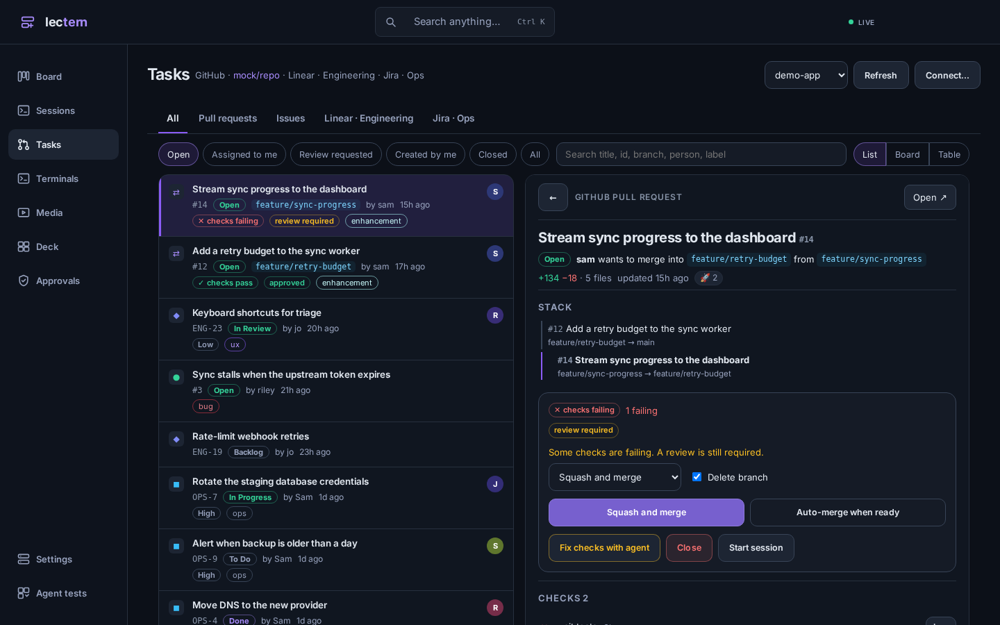
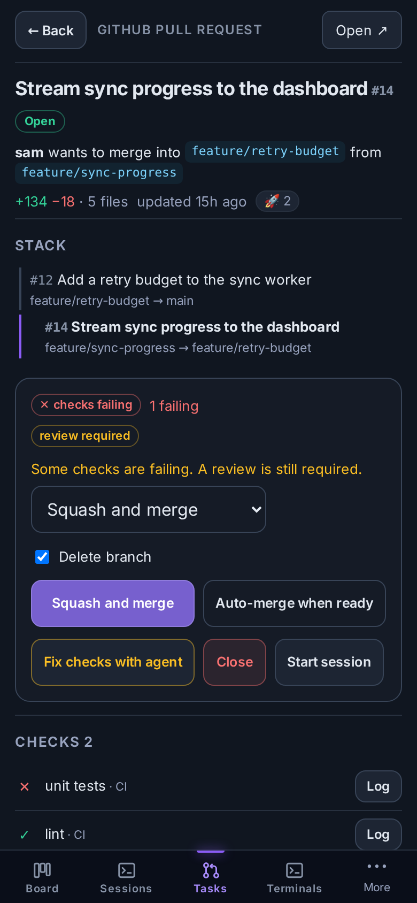
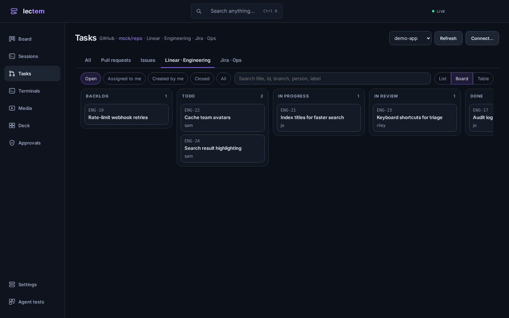
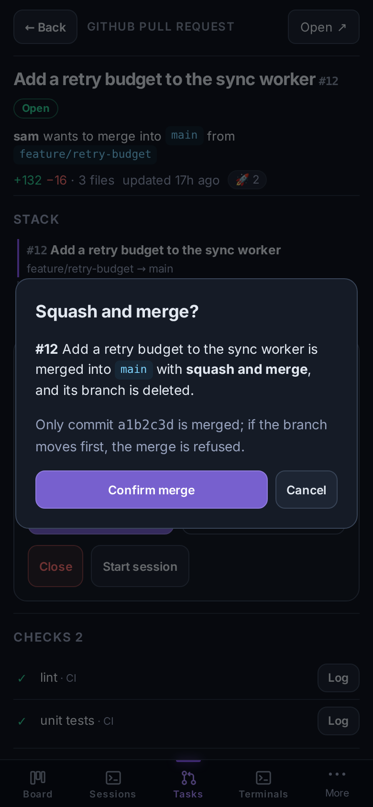

# Tasks hub: pull requests and issues

The **Tasks** page lists a project's pull requests and issues from its GitHub
or GitLab repository, and its issues from Linear and Jira, in one place. Open
an item to read it, act on it, or start an agent on it. It works the same on
a desktop (list and item side by side) and a phone (the item opens over the
list), including the Android app.

Implementation: `internal/trackers` (adapters), `internal/api/trackers*.go`
(HTTP), `frontend/src/trackers` (UI). Screenshots are in
[`media/trackers/`](media/trackers/).

| Desktop | Phone |
|---|---|
|  |  |
|  |  |

## Where items come from

| Source | How Lectern reaches it | Credential |
|---|---|---|
| GitHub (incl. Enterprise) | the project machine's `gh`, through the project's target | that machine's `gh auth login` |
| GitLab (gitlab.com or self-managed) | the project machine's `glab api` | that machine's `glab auth login` |
| Linear | GraphQL API, from the Lectern server | API key |
| Jira Cloud | REST v3, from the Lectern server | account email + API token |
| Jira Server / Data Center | REST v2, from the Lectern server | personal access token |

The repository is read from the clone's `origin` remote. A host whose name
does not contain `github` or `gitlab`, or a repository that is not the origin,
is set in **Settings → the project → Tasks hub** (`+ GitHub repository` /
`+ GitLab repository`). Linear and Jira are added there too.

Bitbucket, Gitea and Azure DevOps are not supported.

### Credentials

- Forge calls use the target's own CLI login, exactly as the Commit/PR button
  and the CI loop already do. Lectern stores no GitHub or GitLab token.
- Linear and Jira keys are stored like trigger-source secrets: in Lectern's
  database, sent only to that tracker, and never returned by the API — the
  settings page only sees whether each one is set. Nothing tracker-related is
  exposed as a tool to the chat connector.
- A Linear or Jira connection with no key of its own reuses the key of the
  project's Linear trigger, or of a Jira trigger for the same site.

## Lists

Tabs: All, Pull requests, Issues, and one per Linear/Jira connection.
Filters: Open, Assigned to me, Review requested, Created by me, Closed, All.
Search narrows instantly as you type, then asks each tracker. Views: List,
Board (columns by status — a Linear team's own workflow states, a Jira
status, or a pull request's review/CI state) and Table.

A source that fails (a machine where `gh` is not signed in, a revoked key)
shows its error above the list; the other sources still load.

Deep links: `#tasks/<project>/<github|gitlab|linear|jira>/<pr|issue>/<id>[/<connection>]`.

## Pull request page

- Header: state, branches, diff size, reactions.
- **Stack**: when the PR's base is another open PR's head, the whole chain
  (parents and children) with the current PR marked; each opens in place.
- **Checks** with drill-down: a GitHub Actions job's log is fetched with the
  CI loop's own fetcher (`gh run view --log-failed`, whole job if nothing
  failed), cleaned and redacted the same way. GitLab jobs, including child
  pipelines started by trigger jobs, read `jobs/<id>/trace`. Other CI systems
  link out.
- **Reviewers**: requested and reviewed, request (picker of assignable users,
  or type a name) and remove.
- **Labels**: add from the repository's labels, remove.
- **Conversation**: comments, reviews, commits and events in order, with a
  comment box.
- **Merge**: method (only those the repository allows), delete branch,
  auto-merge (GitHub auto-merge, GitLab merge-when-pipeline-succeeds; with a
  GitHub merge queue the button says **Add to merge queue**). Every merge goes
  through a confirmation that names the method and the head commit, and the
  server passes that commit to the host (`--match-head-commit` / `sha`), so a
  branch that moved after you confirmed is not merged. Close and reopen are
  confirmed too.
- **Conflicts**: the files a conflicting PR conflicts on, worked out in the
  project's own clone with `git merge-tree --write-tree` (git 2.38+) after
  fetching the base and `refs/pull/N/head` (`refs/merge-requests/N/head` on
  GitLab). No checkout or working tree is touched.
- **Resolve with agent**: a new session in a worktree cut from the PR's head,
  told which files conflict, to merge the base in, run the checks, and push
  with `git push origin HEAD:<branch>`.
- **Fix checks with agent**: a new session on the PR's head whose opening
  message is the CI loop's own failure report (failing jobs, trimmed and
  redacted logs). On GitHub the CI loop then watches the PR as if it had sent
  that report: later failures go to the same session, and a green run
  notifies your phone ([ci-loop.md](ci-loop.md)). GitLab pipelines are not
  watched by the loop; the session gets the report once.
- **Start session**: a session on the PR's branch with the PR as context.

## Issues

Any tracker's issue page shows the description, comments (with a comment
box), sub-issues and parent, labels (editable on GitHub/GitLab), and status:
a Linear team's workflow states, or the Jira transitions available from the
issue's current status. GitHub/GitLab issues can be closed and reopened.

**Start session or task** starts an agent with the issue — title,
description, labels, sub-issues and the last ten comments — as its context:

- a **session** in its own worktree on a suggested branch (Linear's own
  branch name; otherwise `<id>-<title-slug>`, editable), or
- a **task** on the board, optionally dispatched at once.

The item is read by the server; the browser only says which one.

## Who may do what

Reading needs an authenticated caller, like the rest of the API. Anything
that changes a tracker — merge, auto-merge, reviewers, labels, comments,
close/reopen, status changes — and adding or editing a connection, needs a
signed-in human (the same rule as deciding approvals). An agent or another
process on the host gets 403. Starting a session or task from an item needs
only an authenticated caller, like any other launch; the two PR agents also
arm or use the CI loop, so they need a human.

## Jira trigger

Jira is also a trigger source, next to GitHub, Slack and Linear — see
[triggers.md](triggers.md#jira).

## API

| Route | |
|---|---|
| `GET /api/projects/{id}/trackers` | detected repository and connections (secrets redacted) |
| `POST /api/projects/{id}/trackers`, `PATCH/DELETE /api/trackers/{tid}`, `POST /api/trackers/{tid}/test` | manage connections |
| `GET /api/projects/{id}/work?state=&mine=&q=&kind=&source=` | the hub list, with per-source status |
| `GET /api/projects/{id}/forge/prs/{n}` | pull request page |
| `GET .../prs/{n}/conflicts`, `GET .../prs/{n}/log?check=` | conflicting files, one check's log |
| `POST .../prs/{n}/merge` | `{method, delete_branch, auto, head_sha, confirm: true}` |
| `DELETE .../prs/{n}/auto-merge` | turn auto-merge off |
| `POST .../prs/{n}/reviewers` | `{add, remove}` |
| `POST .../{prs\|issues}/{n}/labels`, `/comments`, `/state` | labels, comment, close/reopen |
| `POST .../prs/{n}/resolve`, `POST .../prs/{n}/fix-checks` | the two PR agents |
| `GET /api/projects/{id}/forge/issues/{n}`, `GET .../forge/meta` | issue page; labels and users for pickers |
| `GET /api/trackers/{tid}/issues[/{key}]`, `/teams`, `/states` | Linear/Jira lists and issues |
| `POST /api/trackers/{tid}/issues/{key}/status`, `/comments` | status change, comment |
| `POST /api/projects/{id}/work/start` | `{source, kind, id, connection_id, mode: session\|task, agent, branch, base, note, dispatch}` |

## Testing

- `internal/trackers`: recorded `gh` / `glab` output through a fake executor,
  `httptest` servers for Linear and Jira (Cloud and Server auth and API
  versions, ADF), and a real-git test of the conflict listing.
- `internal/triggers/jira_test.go`: the Jira trigger dispatching through the
  manager's tick, allowlist, rate limit, dedup, postback and transitions.
- `internal/api/trackers_test.go`: the API against the mock target's scripted
  GitHub repository (`internal/executor/mock_forge.go`, also what demo mode
  shows); `trackers_perm_test.go` for the human-only rule;
  `trackers_real_test.go` runs Resolve with agent end to end on a real local
  target with a fake `gh`, a real bare origin and a real worktree.
- `e2e/test_trackers.py`: the pages in a real browser at phone and desktop
  widths, including the confirmed merge.
