# Workspace, terminal, keyboard and appearance

The Terminals view is a workspace: every open pane — attached terminals,
a session's chat, its changes, its browser, and any pane type another
feature registers — sits in one tab strip and can be arranged in nested splits.
Preferences that belong to you rather than to a device (theme, shortcuts,
saved layouts, quick commands, terminal scheme) are stored on the server and
follow you to every device.

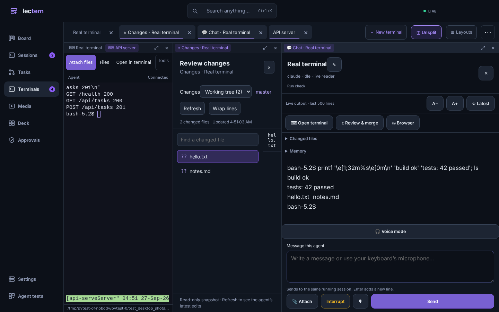

## Layout

- **Split**: drag a tab onto the edge of a pane to put it beside or below
  that pane; drop it in the middle to join the pane's tabs. Splits nest to any
  depth. **◫ Split** (or Split right / Split down in the **⋯** menu) does the
  same without dragging, using the most recent tab not already on screen.
  **◫ Unsplit** joins everything back into one pane.
- **Resize** by dragging a boundary, or focus it and use the arrow keys.
  Double-click a boundary to even the sizes.
- **Maximize** a pane from its header (⤢) or by double-clicking the header.
- **Tabs**: drag a tab along the strip to reorder it, or Alt+Shift+←/→ on a
  focused tab. **Ctrl+Tab** (or **Alt+`**, since browsers keep Ctrl+Tab in an
  ordinary tab) opens the recent-tab switcher; release the modifier to go.
  Alt+Shift+T reopens the last closed tab.
- **Chat, changes and browser beside a terminal**: **⋯ → Open chat beside /
  Open changes beside / Open browser beside**. In a pane they are part of the
  layout, not a dialog or sheet over it.
- Moving a pane never reloads it: every pane is positioned over its slot
  rather than re-parented, so terminals keep their connection.
- **Phone**: the layout is kept but one pane shows at a time; the tab strip
  or a sideways swipe switches between them.

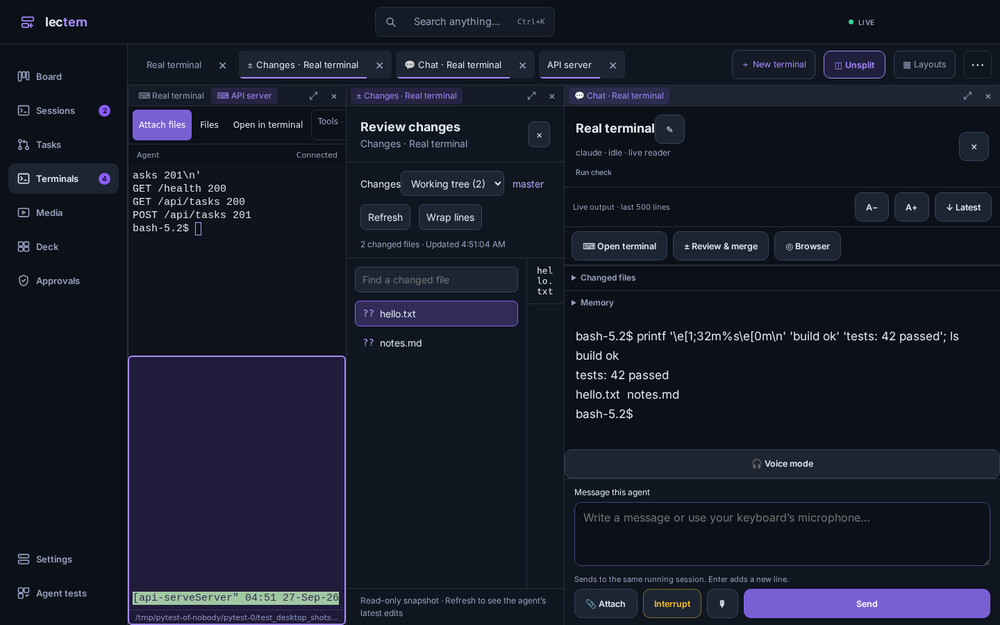
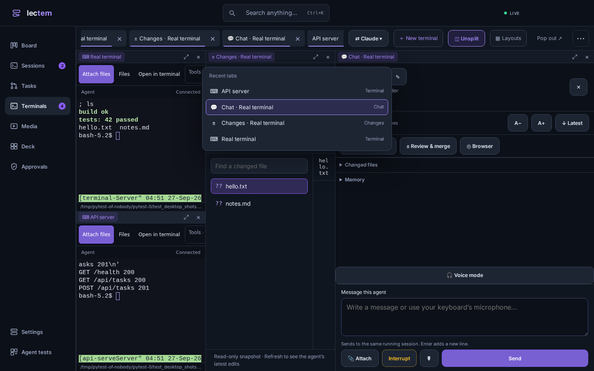

### Saved layouts

The current layout is saved on this device and restored on reload. A device
with no layout of its own opens the one you used last elsewhere.
**▦ Layouts** saves the current arrangement under a name, optionally only for
the current project, and restores it later; panes that are already open and
not in the layout stay open, and terminals of sessions that have ended are
left out. Saved layouts are listed, renamed and deleted in
**Settings → Workspace & terminal**.

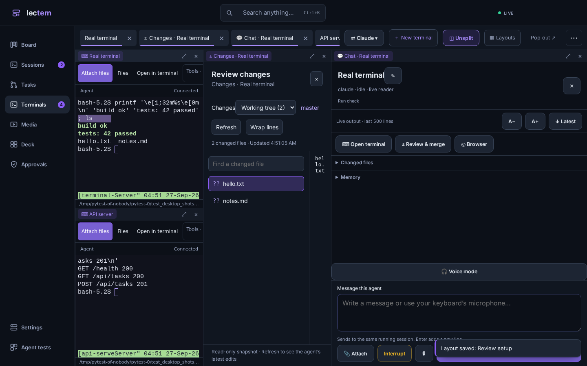

### Adding a pane type

`frontend/src/workspace/registry.tsx` is the whole contract; the built-in
types in `workspace/builtin-panes.tsx` (terminal, chat, changes, browser) use
nothing else:

```tsx
registerPaneType({
  kind: "browser",
  label: "Browser",
  icon: "◎",
  check: (ref) => (/^\d+$/.test(ref.params.session || "") ? ref : null),
  render: ({ pane, services, close }) => <BrowserPane ... onClose={close} />,
});
services.openPane({ id: "browser:session:7", kind: "browser", title: "Browser", params: { session: "7" } }, { beside: activePaneId, edge: "right" });
```

`check` validates a restored or shared layout; a pane whose kind is not
registered is dropped from it. A component that is a `<dialog>` on its own can
read `PaneEmbedContext` and call `show()` instead of `showModal()`, as
`Modal` and the changes view do. When a `file` pane type is registered, the
command palette also searches the front session's files
(`workspace/files-provider.ts`).

## Floating terminal

**Ctrl+`** shows or hides a terminal over whatever view is open. It is not
tied to a session: its tabs are scratch shells, it keeps them across reloads,
and **⇲** moves the front one into the workspace. On a desk it can be moved,
resized and maximized; on a phone it is a bottom sheet.

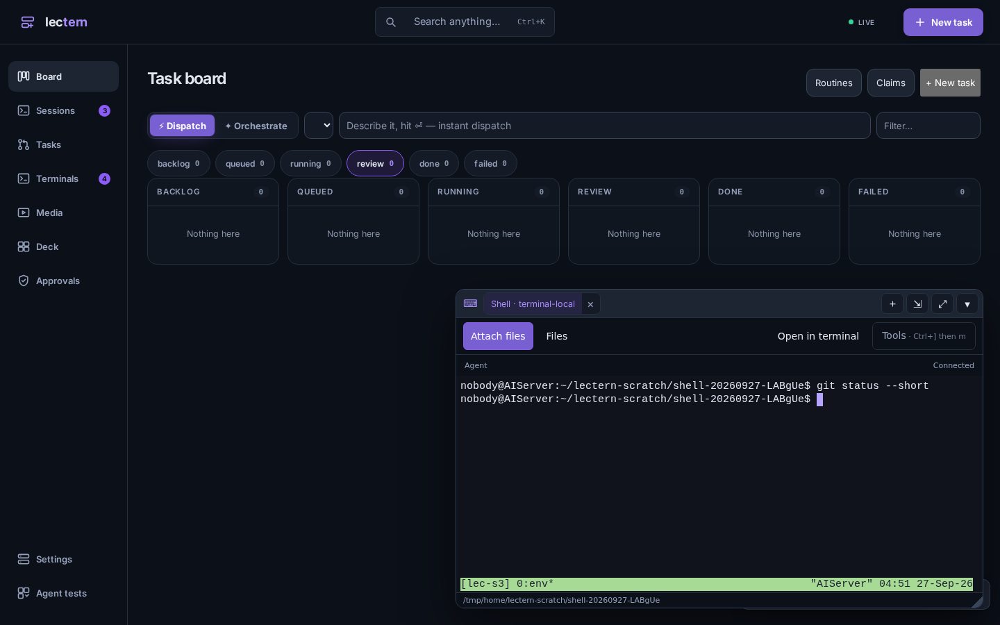
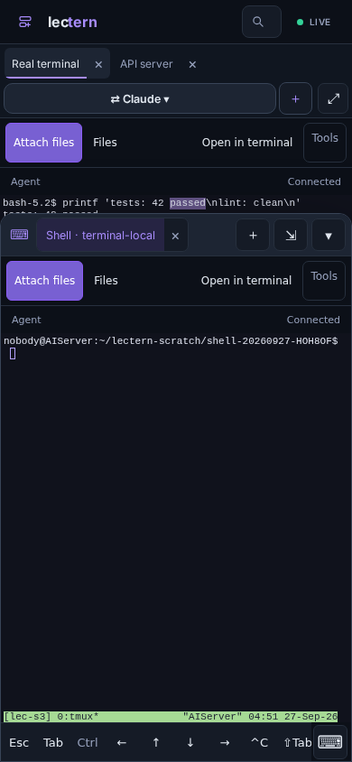

## Terminal

- **Find** (Ctrl/⌘+F, or ⌕ on the phone key bar): match case, whole word and
  regular expression switches, a match count, Enter / Shift+Enter or F3 /
  Shift+F3 for next and previous. The switches are remembered. Ctrl+F is a
  shell key too; remap Find in Settings → Shortcuts to give it back.
- **Themes**: 27 built-in schemes, 10 of them light, plus import of Windows
  Terminal JSON, iTerm2 `.itermcolors`, kitty, Ghostty, Alacritty, foot and
  Xresources files. With no scheme chosen, the terminal follows the app theme.
  Font size stays per device; scheme and line spacing follow you.
- **OSC 52**: programs may set the clipboard (tmux's own copies, `tmux
  set-buffer -w`, and vim or remote shells when tmux passes them on with
  `set-clipboard on`). Reading the clipboard is never allowed. It can be
  switched off in Settings.
- **Kitty keyboard protocol**: pending. xterm.js 6.0 has been stable since
  December 2025 but does not include it; it arrives in 6.1, still in beta
  (6.1.0-beta.304, August 2026). Lectern stays on 5.5 until 6.1 is stable,
  since moving to 6.0 alone would bring the renderer and add-on changes
  without the protocol.

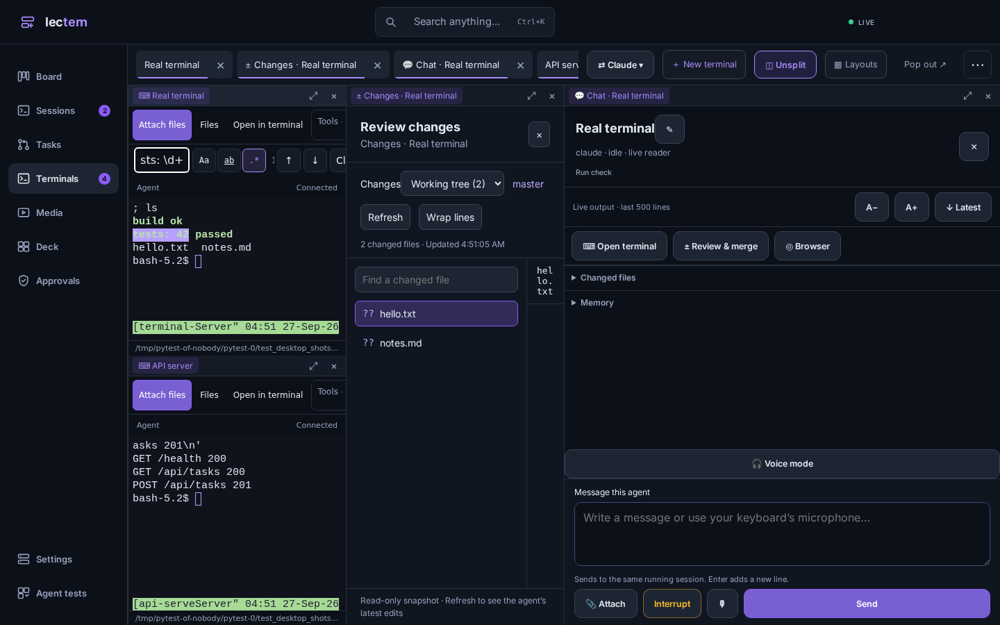
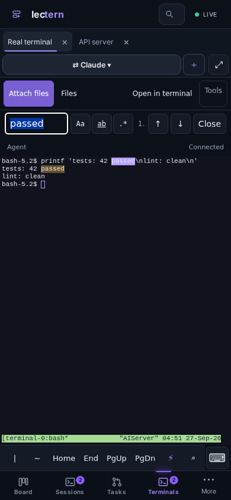

## Quick commands

Saved text sent to a terminal with one tap: from **⚡** on the key bar, the
Snippets sheet (Ctrl/⌘+Shift+Space), or *Send quick command 1–9* once given
keys. Commands are either **everywhere** or for **one project**; a project's
own come first in its terminals. They are edited in the Snippets sheet and in
Settings → Workspace & terminal, and existing per-device snippets are carried
over the first time. Writing them needs a signed-in person: an agent cannot
plant text for you to send.

## Keyboard shortcuts

One registry (`frontend/src/shortcuts/registry.ts`) lists 114 actions across
general, appearance, navigation, settings, workspace, floating terminal and
terminal. **Settings → Shortcuts** searches them, records a new chord, removes
or resets one, and flags conflicts, and warns about chords a browser tab keeps
for itself. A terminal keeps chords a shell or TUI could use; app chords that
no program needs (⌘, Ctrl+Shift, Alt+Shift, F-keys, Ctrl+Tab, Ctrl/Alt+`)
still work while a terminal has focus.

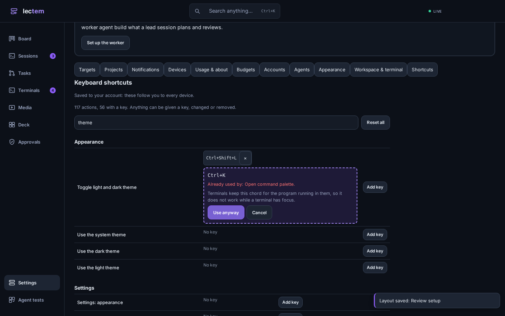

## Command palette

Ctrl/⌘+K ranks sessions, tasks, projects, settings sections, individual
personal settings and every available action (with its chord); letters typed
out of order still find a title. Other features add results with
`registerPaletteProvider` (`shell/palette-providers.ts`).

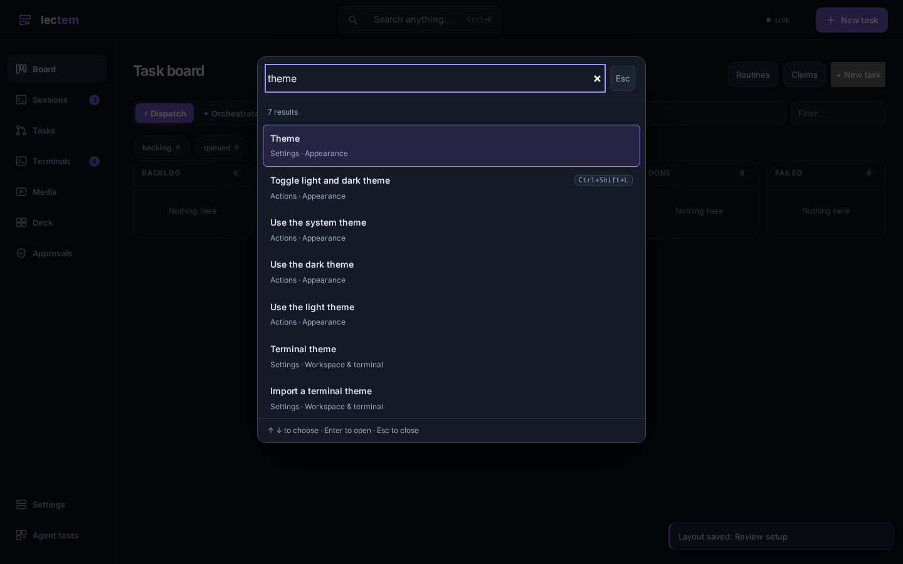

## Appearance

Settings → Appearance: **System / Dark / Light** for the whole app (dark
remains the default), an accent colour (presets or any colour; an illegible
one is darkened or lightened until it reads), UI zoom from 80% to 150%, and
language.

Colours are tokens. `frontend/src/theme/tokens.css` holds the dark values for
the first paint and is the only stylesheet allowed to name a colour;
`frontend/src/theme/app-theme.ts` holds both themes and sets the active one on
`<html>`. Every other stylesheet uses `var(--token)` or `color-mix()` of
tokens (a tinted panel is `color-mix(in srgb, var(--red) 12%, var(--bg))`, a
translucent layer `color-mix(in srgb, var(--scrim) 60%, transparent)`), so one
rule is right in both themes. Three tests hold this:

- `theme/no-hardcoded-colours.test.ts` fails when a stylesheet outside the
  token file names a colour (hex, `rgb()`/`hsl()`/…, or a colour keyword).
- `theme/theme.test.ts` holds every text token to WCAG AA (4.5:1) on every
  surface in both modes and with every accent, and checks button and badge
  text on their fills.
- `e2e/test_light_mode_sweep.py` opens every screen — board, task sheet and
  diff, sessions, a live chat, the workspace with chat and changes panes, the
  terminal page and its dialogs, find, the floating terminal, media, deck,
  approvals, agent tests, the palette, every Settings section — in light and
  dark, at desk and phone width, and checks every visible piece of text
  against what it is actually drawn on.

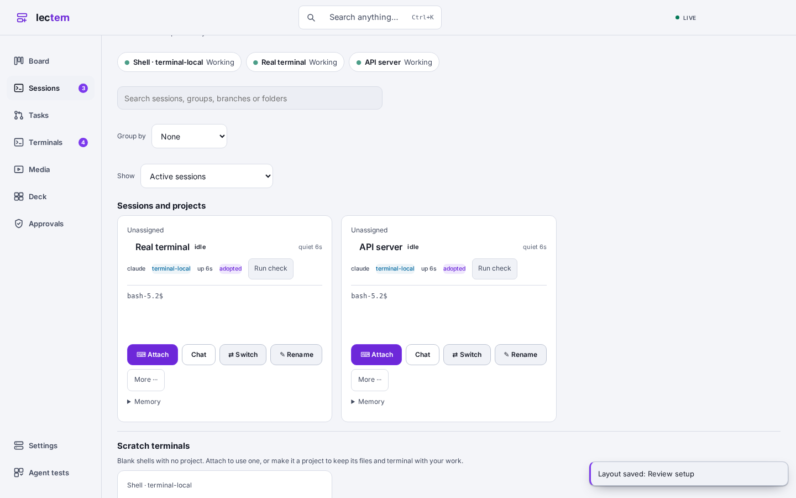
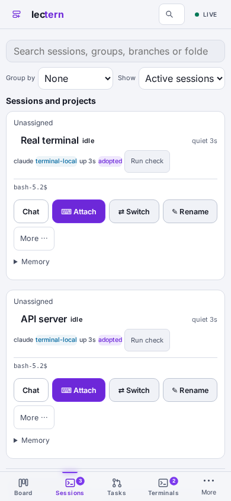

## Settings search

The search box at the top of Settings finds individual controls in every
section, including each shortcut, opens the section and brings the control
into view. The command palette reaches the personal settings the same way.

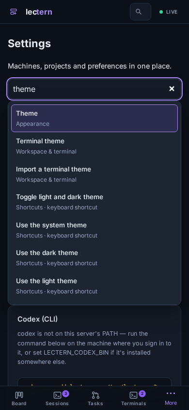

## Translation

The whole web app — board, sessions, chat, review, the Tasks hub, settings,
the workspace, the terminal page and the browser pane — takes its text from
catalogs through `t()` (`frontend/src/i18n`). It ships in **English, 简体中文,
日本語, 한국어, Español and Français**. Settings → Appearance → Language picks one;
the default follows the browser's language (Traditional Chinese browsers get
English rather than Simplified). Only the chosen language's catalog is
downloaded.

- English is the source, one file per area in `i18n/en/`; each language has
  the same files in `i18n/<lang>/`. Product terms follow one glossary per
  language (session, task, worktree, board, approval…).
- `i18n/i18n.test.ts` fails when code asks for a key English lacks, when a
  key is defined twice, when any language misses a key, has an extra one or
  changes a `{placeholder}`, or when a language leaves whole sentences in
  English.
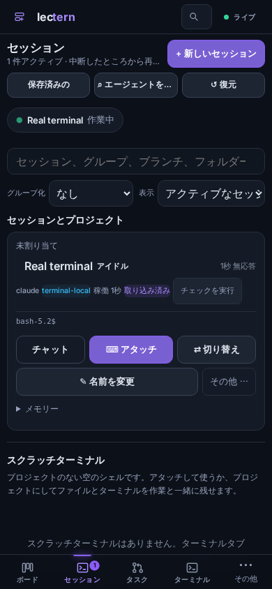
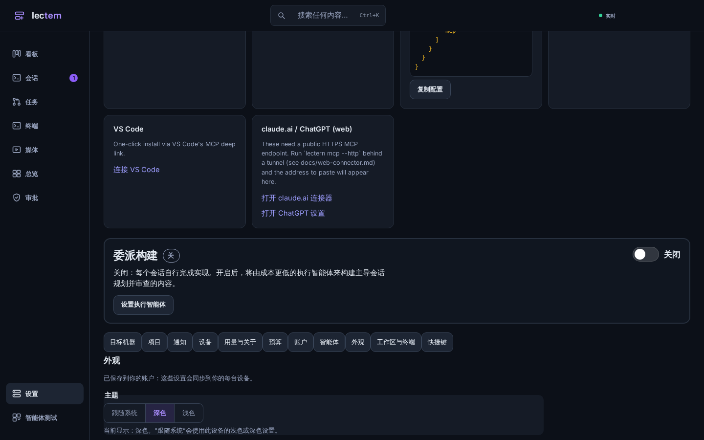

- The pseudo-locale in the same menu accents every string that goes through
  `t()`, which shows at a glance any that do not.
- Not translated: text that comes from the server or from trackers (error
  details, issue titles, agent output), product names, commands and key names,
  spoken voice-mode commands (recognised in English only), the keyboard layout
  report (a diagnostic to paste back), and notification text sent by the
  server and service worker.

## Storage and API

`GET /api/ui/prefs` returns the caller's own preferences;
`PUT`/`DELETE /api/ui/prefs/{key}` change one (JSON value, at most 256 KiB,
at most 200 keys). Rows are per signed-in login (`operator` when there is no
identity). Writes need a signed-in person; a caller that cannot write keeps
changes on its own device and Settings says so. Changes are cached locally,
survive a reload until the server confirms them, and other devices refetch
on the `ui_prefs` event.

## Tests

- Unit: `workspace/layout.test.ts` (tree operations, serialization and
  restore), `shortcuts/shortcuts.test.ts` (registry, conflicts, remap),
  `theme/theme.test.ts` (WCAG AA, theme import), `i18n`, `prefs`, `quick`.
- Go: `internal/api/ui_prefs_test.go`.
- End to end: `e2e/test_workspace_layout.py`,
  `e2e/test_workspace_terminal_features.py`, `e2e/test_personal_settings.py`.
- Screenshots: `e2e/doc_screenshots_workspace.py` (see its docstring).
